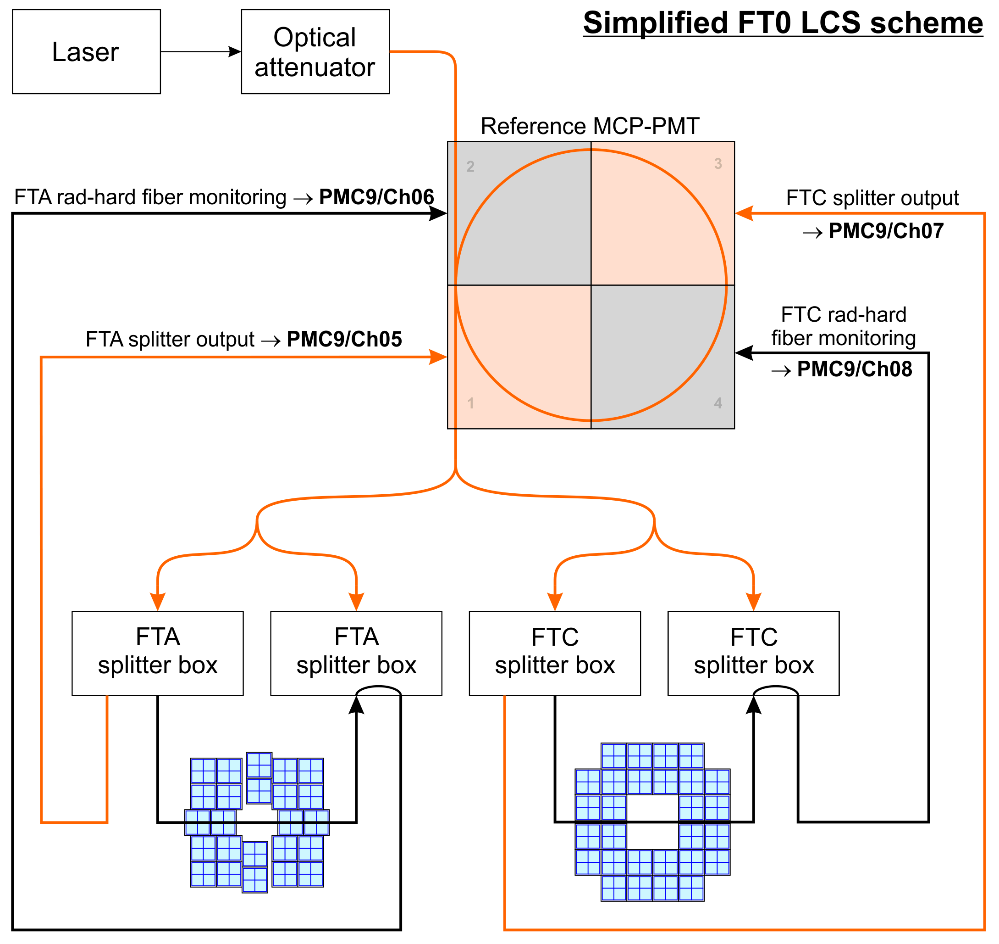

# FT0 quality control

# Aging monitoring

_The following documentation consern FT0 aging **monitoring**. Software to deduce the aging **correction** will come later._

The aging monitoring of FT0 is performed by 1 minute long laser runs that are launched after each beam dump.

Dedicated QC tasks analyze the data:

- `o2::quality_control_modules::ft0::AgingLaserTask` - raw collection of the data
- `o2::quality_control_modules::ft0::AgingLaserPostProc` - post processing of the data
- `o2::quality_control::postprocessing::SliceTrendingTask` - trending of the post processing data

At the moment, the QC task is adapted to the FT0 laser calibration system (LCS) and the monitoring of the FT0 aging. If needed, the task can be generalized to work with other FIT detectors.

## Monitoring principles

The schematics of the LCS is shown below. Per laser pulse, there will be two signals in each reference channel and one signal in each detector channel. The signals are separated in time by well defined delays, so one can identify them by BC ID.



The basic idea is to monitor the amplitudes seen in the detector during the laser runs. The reference channels don't age and the amplitudes in these are used as a normalization factor for the detector channel amplitudes.

More information about the LCS and the hardware side of the aging monitoring can be found [here](https://indico.cern.ch/event/1229241/contributions/5172798/attachments/2561719/4420583/Ageing-related%20tasks.pdf).

---

## Aging monitoring QC tasks

### AgingLaserTask

The `AgingLaserTask` task collects the raw data from the laser runs.

**Procedure:**

* Selects laser events with specific BC IDs
* Separately identifies:
  * detector channel laser signals
  * reference channel signals, separating the two signals per laser pulse
* Fills per-channel **amplitude** and **time** histograms, both ADCs together as well as separated by ADC
* (Optional) produces a rich set of debug histograms

This task is the *producer* of the raw per-channel spectra used later in post-processing.

#### Input

* Digits and channel streams, specified in the config as

  ```json
  "dataSource": {
    "type": "direct",
    "query": "digits:FT0/DIGITSBC/0;channels:FT0/DIGITSCH/0"
  },
  ```

#### Configuration

An example configuration can be found in [etc/ft0-aging-laser.json](https://github.com/AliceO2Group/QualityControl/blob/master/Modules/FIT/FT0/etc/ft0-aging-laser.json). The task parameters are listed in the table below.

| Key                      |         Type |           Default | Meaning                                                         |
| ------------------------ | -----------: | ----------------: | --------------------------------------------------------------- |
| `detectorChannelIDs`     | list `uint8` |                   | Detector channels to monitor, omit to use all                   |
| `referenceChannelIDs`    | list `uint8` | `208,209,210,211` | Reference channels to monitor                                  |
| `detectorAmpCut`         |          int |               `0` | Minimum amplitude for detector channels (**currently not applied**)  |
| `referenceAmpCut`        |          int |             `100` | Minimum amplitude for reference channels (suppress noise cross-talk) |
| `laserTriggerBCs`        |   list `int` |          `0,1783` | BCs where the laser is fired                              |
| `detectorBCdelay`        |          int |             `131` | BC delay from laser pulse to detector signal                      |
| `referencePeak1BCdelays` |   list `int` | `115,115,115,115` | BC delay from laser pulse to the first reference channel signal             |
| `referencePeak2BCdelays` |   list `int` | `136,142,135,141` | BC delay from laser pulse to the second reference channel signal             |
| `debug`                  |         bool |           `false` | Enable extra (heavy) debug histograms.                         |

> The BC delays and channel ID ranges are stable and set by hardware; adjust only if the LCS changes.

#### Output

| Name                     | Type | Description                                                      |
|--------------------------|------|------------------------------------------------------------------|
| `AmpPerChannel`          | TH2I | Amplitude distribution per channel (both ADCs)                   |
| `AmpPerChannelADC0`      | TH2I | Amplitude distribution per channel for ADC0                      |
| `AmpPerChannelADC1`      | TH2I | Amplitude distribution per channel for ADC1                      |
| `AmpPerChannelPeak1ADC0` | TH2I | Amplitude distribution per channel for the first peak with ADC0  |
| `AmpPerChannelPeak1ADC1` | TH2I | Amplitude distribution per channel for the first peak with ADC1  |
| `AmpPerChannelPeak2ADC0` | TH2I | Amplitude distribution per channel for the second peak with ADC0 |
| `AmpPerChannelPeak2ADC1` | TH2I | Amplitude distribution per channel for the second peak with ADC1 |
| `TimePerChannel`         | TH2I | Time distribution per channel (both ADCs)                        |
| `TimePerChannelPeak1`    | TH2I | Time distribution per channel for the first peak (both ADCs)     |
| `TimePerChannelPeak2`    | TH2I | Time distribution per channel for the second peak (both ADCs)    |

> A set of debug histograms can be set if the `debug` parameter is set to `true`. See the task header file for the definition of these histograms.

#### TODO

- The MO's should be distinguished by:
  - Gain setting (number of ADC channels per MIP)
      - In the future we will fetch this from CCDB, but at the moment we pass the value via the QC config.
  - The gain could be stored in the MO metadata. This can then be used as we wish in the post processing.
  - B field -> We decided not to care about this (???)
      - Can be fetched from GRP in CCDB (?)
- Should we have some out-of-bunch checking as part of a LCS sanity check?

### AgingLaserPostProcTask

The `AgingLaserPostProc` task reads the output from the `AgingLaserTask` and produces output suitable for aging monitoring.

#### Input

* From the QC repository path `FT0/MO/AgingLaser`:
  * `AmpPerChannel` (TH2): amplitude (ADC) vs channel

#### Algorithm

1. **Reference normalization**
   * For each configured reference channel:
     * Project its slice amplitude distribtion `AmpPerChannel` → `TH1`
     * Find the maximum `x_max`
     * Fit a Gaussian in `[(1−fracWindowLow)·x_max, (1+fracWindowHigh)·x_max]` → mean `μ_ref`.
   * `norm = average(μ_ref)` over all successful fits.
2. **Per-channel value**
   * For **every** detector channel:
     * Find the global maximum `x_max`.
     * In the same fractional window around `x_max`, compute **weighted mean**
       `⟨x⟩ = Σ w_i x_i / Σ w_i` with weights `w_i = bin content`.
     * Store `value = ⟨x⟩ / norm`.
     * Store `value_corrected = value / value_after_last_aging_correction`
3. **Publish four TH1F MOs**
   * `AmpPerChannelNormWeightedMeanA`: 96 bins, channels 0–95.
   * `AmpPerChannelNormWeightedMeanC`: 112 bins, channels 96–207.
   * `AmpPerChannelNormWeightedMeanCorrectedA`: 96 bins, channels 0–95. Normalized with amplitudes from the last aging correction.
   * `AmpPerChannelNormWeightedMeanCorrectedC`: 112 bins, channels 96–207. Normalized with amplitudes from the last aging correction.
4. **In case of a "reset" run - publish two more TH1F MOs**
   * `AmpPerChannelNormWeightedMeanAfterLastCorrectionA`:  96 bins, channels 0–95. Used as normalization to deduce relative aging since last aging correction.
   * `AmpPerChannelNormWeightedMeanAfterLastCorrectionC`:  112 bins, channels 96–207. Used as normalization to deduce relative aging since last aging correction.

> Tip: when booking the C-side histogram use upper edge **208** (exclusive) with 112 bins to avoid off-by-one bin widths.

#### Configuration

| Key                      |          Type |                     Default | Meaning                                                                                                                                                                   |
|--------------------------|--------------:|----------------------------:|---------------------------------------------------------------------------------------------------------------------------------------------------------------------------|
| `reset`                  |          bool |                       false | To be set true (only) on the scans following aging corrections. The amplitudes are stored in an additional path, and are used for normalization in following laser scans. |
| `useDeadChannelMap`      |          bool |                        true | If true, channels marked dead in the dead channel map are not processed                                                                                                   |
| `ignoreDetectorChannels` | list `uint_8` |                             | Detector channels to ignore                                                                                                                                               |
| `ignoreRefChannels`      |  list `uint8` |                             | Reference channels to ignore                                                                                                                                              |
| `fracWindowLow`          |        double |                      `0.25` | Low fractional window for the Gaussian fits                                                                                                                               |
| `fracWindowHigh`         |        double |                      `0.25` | High fractional window for the Gaussian fits                                                                                                                              |
| `agingLaserTaskPath`     |        string |         `FT0/MO/AgingLaser` | Path to the AgingLaser task output in QCDB                                                                                                                                |
| `agingLaserPostProcPath` |        string | `FT0/MO/AgingLaserPostProc` | Path to the AgingLaserPostProc task output in QCDB                                                                                                                        |

#### Output

| Name | Type | Description |
| ---- | ---- | ----------- |
| `AmpPerChannelNormWeightedMeanA` | TH1F | Weighted means of A-side amplitudes normalized with reference channel amplitudes |
| `AmpPerChannelNormWeightedMeanC` | TH1F | Weighted means of C-side amplitudes normalized with reference channel amplitudes |
| `AmpPerChannelNormWeightedMeanCorrectedA` | TH1F | AmpPerChannelNormWeightedMeanA normalized with the same values from last aging correction |
| `AmpPerChannelNormWeightedMeanCorrectedC` | TH1F | AmpPerChannelNormWeightedMeanC normalized with the same values from last aging correction |
| `AmpPerChannelNormWeightedMeanAfterLastCorrectionA` | TH1F | AmpPerChannelNormWeightedMeanA from the last aging correction |
| `AmpPerChannelNormWeightedMeanAfterLastCorrectionC` | TH1F | AmpPerChannelNormWeightedMeanC from the last aging correction |

#### Trending

Having four output MOs from the `AgingLaserPostProcTask`, allows us to create four time series, one per side. An example QC configuration that accomplishes this is in [`etc/ft0-aging-laser-postproc.json`](https://github.com/AliceO2Group/QualityControl/blob/master/Modules/FIT/FT0/etc/ft0-aging-laser-postproc.json).

#### Notes & gotchas

* **Off-by-one binning (C side)**: for channels `96–207` you need **112 bins** and an **exclusive** upper edge at `208`. Using `207` with 112 bins yields non-unit bin width and will trip histogram helpers.
* **Reference fits**: if all Gaussian fits fail, the post-processing update exits early and publishes nothing for that cycle.

