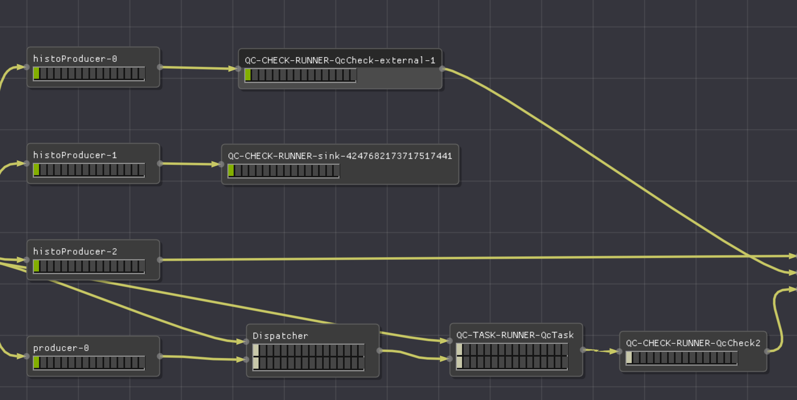
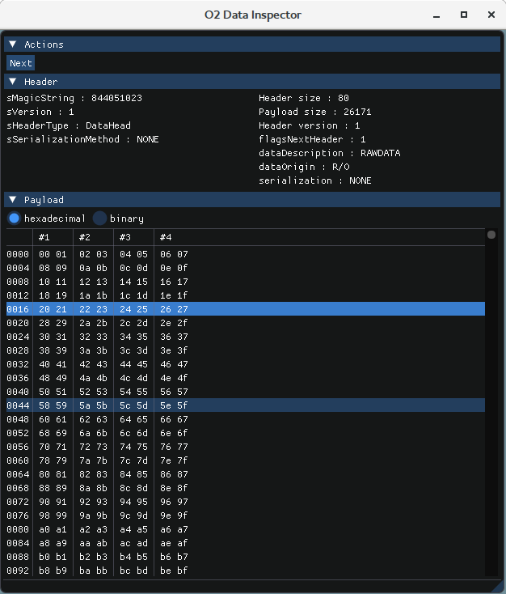

# Advanced topics

<!--TOC generated with https://github.com/ekalinin/github-markdown-toc-->
<!--./gh-md-toc --insert /path/to/README.md-->
<!--ts-->
   * [Advanced topics](#advanced-topics)
      * [Plugging the QC to an existing DPL workflow](#plugging-the-qc-to-an-existing-dpl-workflow)
      * [Production of QC objects outside this framework](#production-of-qc-objects-outside-this-framework)
         * [Configuration](#configuration)
         * [Example 1: basic](#example-1-basic)
         * [Example 2: advanced](#example-2-advanced)
         * [Limitations](#limitations)
      * [Multi-node setups](#multi-node-setups)
      * [Writing a DPL data producer](#writing-a-dpl-data-producer)
      * [Access run conditions and calibrations from the CCDB](#access-run-conditions-and-calibrations-from-the-ccdb)
      * [Definition and access of task-specific configuration](#definition-and-access-of-task-specific-configuration)
      * [Custom QC object metadata](#custom-qc-object-metadata)
      * [Canvas options](#canvas-options)
      * [QC with DPL Analysis](#qc-with-dpl-analysis)
         * [Getting AODs directly](#getting-aods-directly)
         * [Merging with other analysis workflows](#merging-with-other-analysis-workflows)
         * [Enabling a workflow to run on Hyperloop](#enabling-a-workflow-to-run-on-hyperloop)
      * [Data Inspector](#data-inspector)
         * [Prerequisite](#prerequisite)
         * [Compilation](#compilation)
         * [Execution](#execution)
         * [Configuration](#configuration-1)
      * [Details on the data storage format in the CCDB](#details-on-the-data-storage-format-in-the-ccdb)
         * [Data storage format before v0.14 and ROOT 6.18](#data-storage-format-before-v014-and-root-618)
      * [Local CCDB setup](#local-ccdb-setup)
      * [Local QCG (QC GUI) setup](#local-qcg-qc-gui-setup)
      * [Developing QC modules on a machine with FLP suite](#developing-qc-modules-on-a-machine-with-flp-suite)
      * [Use MySQL as QC backend](#use-mysql-as-qc-backend)
      * [Configuration files details](#configuration-files-details)
         * [Global configuration structure](#global-configuration-structure)
         * [Common configuration](#common-configuration)
         * [QC Tasks configuration](#qc-tasks-configuration)
         * [QC Checks configuration](#qc-checks-configuration)
         * [QC Aggregators configuration](#qc-aggregators-configuration)
         * [QC Post-processing configuration](#qc-post-processing-configuration)
         * [External tasks configuration](#external-tasks-configuration)

<!-- Added by: bvonhall, at:  -->

<!--te-->


[← Go back to Post-processing](PostProcessing.md) | [↑ Go to the Table of Content ↑](../README.md) | [Continue to Frequently Asked Questions →](FAQ.md)

## Plugging the QC to an existing DPL workflow

Your existing DPL workflow can simply be considered a publisher. Therefore, replace `o2-qc-run-producer` with your own workflow. 

For example, if TPC wants to monitor the output `{"TPC", "CLUSTERS"}` of the workflow `o2-qc-run-tpcpid`, modify the config file to point to the correct data and do : 
```
o2-qc-run-tpcpid | o2-qc --config json://${QUALITYCONTROL_ROOT}/etc/tpcQCPID.json
```

## Production of QC objects outside this framework
QC objects (e.g. histograms) are typically produced in a QC task. 
This is however not the only way. Some processing tasks such as the calibration 
might have already processed the data and produced histograms that should be 
monitored. Instead of re-processing and doing twice the work, one can simply
push this QC object to the QC framework where it will be checked and stored.

### Configuration

Let be a device in the main data flow that produces a histogram on a channel defined as `TST/HISTO/0`. To get this histogram in the QC and check it, add to the configuration file an "external device": 
```yaml
    "externalTasks": {
      "External-1": {
        "active": "true",
        "query": "External-1:TST/HISTO/0",  "": "Query specifying where the objects to be checked and stored are coming from. Use the task name as binding. The origin (e.g. TST) is used as detector name for the objects."
      }
    },
    "checks": {
```
The "query" syntax is the same as the one used in the DPL and in the Dispatcher. It must match the output of another device, whether it is in the same workflow or in a piped one. 
The `binding` (first part, before the colon) is used in the path of the stored objects and thus we encourage to use the task name to avoid confusion. Moreover, the `origin` (first element after the colon) is used as detectorName. 

### Example 1: basic

As a basic example, we are going to produce histograms with the HistoProducer and collect them with the QC. The configuration is in [basic-external-histo.json](https://github.com/AliceO2Group/AliceO2/tree/dev/Framework/basic-external-histo.json). An external task is defined and named "External-1" (see subsection above). It is then used in the Check QCCheck : 
```yaml
      "QcCheck": {
        "active": "true",
        "className": "o2::quality_control_modules::skeleton::SkeletonCheck",
        "moduleName": "QcSkeleton",
        "policy": "OnAny",
        "detectorName": "TST",
        "dataSource": [{
          "type": "ExternalTask",
          "name": "External-1",
          "MOs": ["hello"]
        }]
      }
```
When using this feature, make sure that the name of the MO in the Check definition matches the name of the object you are sending from the external device.

To run it, do:
```yaml
o2-qc-run-histo-producer | o2-qc --config  json://${QUALITYCONTROL_ROOT}/etc/basic-external-histo.json
```

The object is visible in the QCG or the CCDB at `qc/TST/MO/External-1/hello_0`. In general we publish the objects of an external device at `qc/<detector>/MO/<binding>/object`. 

The check results are stored at `qc/<detector>/QO/<binding>/object`.

### Example 2: advanced

This second, more advanced, example mixes QC tasks and external tasks. It is defined in [advanced-external-histo.json](https://github.com/AliceO2Group/AliceO2/tree/dev/Framework/advanced-external-histo.json). It is represented here:



First, it runs 1 QC task (QC-TASK-RUNNER-QcTask) getting data from a data producer (bottom boxes, typical QC worfklow). 

On top we see 3 histogram producers. `histoProducer-2` is not part of the QC, it is not an external device defined in the configuration file. The two other histogram producers are configured as external devices in the configuration file. 

`histoProducer-0` produces an object that is used in a check (`QcCheck-External-1`). `histoProducer-1` objects are not used in any check but we generate one automatically to take care of the storage in the database.

To run it, do: 
```yaml
o2-qc-run-producer | o2-qc-run-histo-producer --producers 3 --histograms 3 | o2-qc --config  json://${QUALITYCONTROL_ROOT}/etc/advanced-external-histo.json 
```

### Limitations

1. Objects sent by the external device must be either a TObject or a TObjArray. In the former case, the object will be sent to the checker encapsulated in a MonitorObject. In the latter case, each TObject of the TObjArray is encapsulated in a MonitorObject and is sent to the checker.

## Multi-node setups

During the data-taking Quality Control runs on a distributed computing system. Some QC Tasks are
executed on dedicated QC servers, while others run on FLPs and EPNs. In the first case, messages
coming from Data Sampling should reach QC servers where they are processed. In the latter case,
locally produced Monitor Objects should be merged on QC servers and then have Checks run on them.
By **remote QC tasks** we mean those which run on QC servers (**remote machines**), while **local QC Tasks**
run on FLPs and EPNs (**local machines**).

While it is responsibility of the run operators to run all the processing topologies during the
data taking, here we show how to achieve such multinode workflows on development setups, running
them just with DPL driver. Note that for now we support cases with one or more local machines,
but just only one remote machine.

In our example, we assume having two local processing nodes (`localnode1`, `localnode2`) and one
QC node (`qcnode`). There are two types of QC Tasks declared:
- `MultiNodeLocal` which are executed on the local nodes and their results are merged and checked
 on the QC server.
- `MultiNodeRemote` which runs on the QC server, receiving a small percent of data from
`localnode2` only. Mergers are not needed in this case, but there is a process running Checks against
 Monitor Objects generated by this Task.

We use the `SkeletonTask` class for both, but any Task can be used of course. Should a Task be local, all its `MonitorObject`s need to be mergeable - they should be one of the mergeable ROOT types (histograms, TTrees) or inherit [MergeInterface](https://github.com/AliceO2Group/AliceO2/blob/dev/Utilities/Mergers/include/Mergers/MergeInterface.h).

 These are the steps to follow to get a multinode setup:

1. Prepare a configuration file.

In this example we will use the `Framework/multiNode.json` config file. A config file should look
almost like the usual one, but with a few additional parameters. In case of a local task, these parameters should be
 added:

```json
    "tasks": {
      "MultiNodeLocal": {
        "active": "true",
        ...
        "location": "local",
        "localMachines": [
          "localnode1",
          "localnode2"
        ],
        "remoteMachine": "qcnode",
        "remotePort": "30132",
        "mergingMode": "delta"
      }
    },
```
List the local processing machines in the `localMachines` array. `remoteMachine` should contain the host name which
 will serve as a QC server and `remotePort` should be a port number on which Mergers will wait for upcoming MOs. Make
 sure it is not used by other service. If different QC Tasks are run in parallel, use separate ports for each. One
 also may choose the merging mode - `delta` is the default and recommended (tasks are reset after each cycle, so they
 send only updates), but if it is not feasible, Mergers may expect `entire` objects - tasks are not reset, they
 always send entire objects and the latest versions are combined in Mergers.

In case of a remote task, choosing `"remote"` option for the `"location"` parameter is enough.

```json
    "tasks": {
      ...
      "MultiNodeRemote": {
        "active": "true",
        ...
        "dataSource": {
          "type": "dataSamplingPolicy",
          "name": "rnd-little"
        },
        "taskParameters": {},
        "location": "remote"
      }
    }
```

However in both cases, one has to specify the machines where data should be sampled, as below. If data should be
 published to external machines (with remote tasks), one has to add a local port number. Use separate ports for each
  Data Sampling Policy.
```json
{
  "dataSamplingPolicies": [
    ...
    {
      "id": "rnd-little",
      "active": "true",
      "machines": [
        "localnode2"
      ],
      "port": "30333"
      ...
    }
  ]
}
```
/
2. Make sure that the firewalls are properly configured. If your machines block incoming/outgoing connections by
 default, you can add these rules to the firewall (run as sudo). Consider enabling only concrete ports or a small
  range of those.

```
# localnode1 and localnode2 :
iptables -I INPUT -p tcp -m conntrack --ctstate NEW,ESTABLISHED -s qcnode -j ACCEPT
iptables -I OUTPUT -p tcp -m conntrack --ctstate NEW,ESTABLISHED -d qcnode -j ACCEPT
# qcnode:
iptables -I INPUT -p tcp -m conntrack --ctstate NEW,ESTABLISHED -s localnode1 -j ACCEPT
iptables -I OUTPUT -p tcp -m conntrack --ctstate NEW,ESTABLISHED -d localnode1 -j ACCEPT
iptables -I INPUT -p tcp -m conntrack --ctstate NEW,ESTABLISHED -s localnode2 -j ACCEPT
iptables -I OUTPUT -p tcp -m conntrack --ctstate NEW,ESTABLISHED -d localnode2 -j ACCEPT
```

3. Install the same version of the QC software on each of these nodes. We cannot guarantee that different QC versions will talk to each other without problems. Also, make sure the configuration file that you will use is the same everywhere.

4. Run each part of the workflow. In this example `o2-qc-run-producer` represents any DPL workflow, here it is just a process which produces some random data.
```
# On localnode1:
o2-qc-run-producer | o2-qc --config json:/${QUALITYCONTROL_ROOT}/etc/multiNode.json --local --host localnode1 -b
# On localnode2:
o2-qc-run-producer | o2-qc --config json:/${QUALITYCONTROL_ROOT}/etc/multiNode.json --local --host localnode2 -b
# On qcnode:
o2-qc --config json:/${QUALITYCONTROL_ROOT}/etc/multiNode.json --remote
```

If there are no problems, on QCG you should see the `example` histogram updated under the paths `qc/TST/MO/MultiNodeLocal`
and `qc/TST/MO/MultiNodeRemote`, and corresponding Checks under the path `qc/TST/QO/`.

## Writing a DPL data producer 

For your convenience, and although it does not lie within the QC scope, we would like to document how to write a simple data producer in the DPL. The DPL documentation can be found [here](https://github.com/AliceO2Group/AliceO2/blob/dev/Framework/Core/README.md) and for questions please head to the [forum](https://alice-talk.web.cern.ch/).

As an example we take the `DataProducerExample` that you can find in the QC repository. It is produces a number. By default it will be 1s but one can specify with the parameter `my-param` a different number. It is made of 3 files : 
* [runDataProducerExample.cxx](../Framework/src/runDataProducerExample.cxx) : 
  This is an executable with a basic data producer in the Data Processing Layer. 
  There are 2 important functions here :
  * `customize(...)` to add parameters to the executable. Note that it must be written before the includes for the dataProcessing.
  * `defineDataProcessing(...)` to define the workflow to be ran, in our case the device(s) publishing the number.
* [DataProducerExample.h](../Framework/include/QualityControl/DataProducerExample.h) : 
  The key elements are : 
  1. The include `#include <Framework/DataProcessorSpec.h>`
  2. The function `getDataProducerExampleSpec(...)` which must return a `DataProcessorSpec` i.e. the description of a device (name, inputs, outputs, algorithm)
  3. The function `getDataProducerExampleAlgorithm` which must return an `AlgorithmSpec` i.e. the actual algorithm that produces the data. 
* [DataProducerExample.cxx](../Framework/src/DataProducerExample.cxx) : 
  This is just the implementation of the header described just above. You will probably want to modify `getDataProducerExampleSpec` and the inner-most block of `getDataProducerExampleAlgorithm`. You might be taken aback by the look of this function, if you don't know what a _lambda_ is just ignore it and write your code inside the accolades.
  
You will probably write it in your detector's O2 directory rather than in the QC repository. 

## Access run conditions and calibrations from the CCDB 

The MonitorObjects generated by Quality Control are stored in a dedicated
repository based on CCDB. The run conditions, on the other hand, are located
in another, separate database. One can access these conditions inside a 
Task by a dedicated method of the TaskInterface, as below:
```
TObject* condition = TaskInterface::retrieveCondition("Path/to/condition");
if (condition) {
  LOG(INFO) << "Retrieved " << condition->ClassName();
  delete condition;
}
```
Make sure to declare a valid URL of CCDB in the config file. Keep in
 mind that it might be different from the CCDB instance used for storing
 QC objects.

```
{
  "qc": {
    "config": {
     ...
      "conditionDB": {
        "url": "ccdb-test.cern.ch:8080"
      }
    },
    ...
```

## Definition and access of task-specific configuration 

A task can access custom parameters declared in the configuration file at `qc.tasks.<task_name>.taskParameters`. They are stored inside a key-value map named mCustomParameters, which is a protected member of `TaskInterface`.

One can also tell the DPL driver to accept new arguments. This is done using the `customize` method at the top of your workflow definition (usually called "runXXX" in the QC).

For example, to add two parameters of different types do : 
```
void customize(std::vector<ConfigParamSpec>& workflowOptions)
{
  workflowOptions.push_back(
    ConfigParamSpec{ "config-path", VariantType::String, "", { "Path to the config file. Overwrite the default paths. Do not use with no-data-sampling." } });
  workflowOptions.push_back(
    ConfigParamSpec{ "no-data-sampling", VariantType::Bool, false, { "Skips data sampling, connects directly the task to the producer." } });
}
```

## Custom QC object metadata

One can add custom metadata on the QC objects produced in a QC task. 
Simply call `ObjectsManager::addMetadata(...)`, like in 
```
  // add a metadata on histogram mHistogram, key is "custom" and value "34"
  getObjectsManager()->addMetadata(mHistogram->GetName(), "custom", "34");
```
This metadata will end up in the QCDB.

## Canvas options 

The developer of a Task might perfectly know how to display a plot or a graph but cannot set these options if they belong to the Canvas. This is typically the case of `drawOptions` such as `colz` or `alp`. It is also the case for canvases' properties such as logarithmic scale and grid. These options can be set by the end user in the QCG but it is likely that the developer wants to give pertinent default options. 

To do so, one can use one of the two following methods.
* `TObjectsManager::setDefaultDrawOptions(<objectname or pointer>, string& drawOptions)`
  
  `drawOptions` is a space-separated list of drawing options. E.g. "colz" or "alp lego1". 
* `TObjectsManager::setDisplayHint(<objectname or pointer>, string& hints)`
  
  `hints` is a space-separated list of hints on how to draw the object. E.g. "logz" or "gridy logy". 
  
  Currently supported by QCG: logx, logy, logz, gridx, gridy, gridz.

## QC with DPL Analysis

It is possible to attach QC to the Run 3 Analysis Tasks, as they use Data Processing Layer, just as
QC. AOD tables can be requested as direct data sources and then read by a QC task with
TableConsumer. One can also request AOD tables directly from an AOD file.

In this piece of documentation it is assumed that the users already have some idea about QC and 
[DPL Analysis](https://aliceo2group.github.io/analysis-framework), and
 they have an access to AOD files following the Run 3 data model.

### Getting AODs directly

First, let's see how to get data directly from an AOD file. To read the table, we will use TableConsumer from DPL, as in [the example of a QC analysis
task](../Modules/Example/src/AnalysisTask.cxx):
```
void AnalysisTask::monitorData(o2::framework::ProcessingContext& ctx)
{
  auto s = ctx.inputs().get<framework::TableConsumer>("aod-data");
  auto table = s->asArrowTable();
  ...
}
```
In [our QC configuration file](../Modules/Example/etc/analysisDirect.json) we will request AOD data as a direct source
, just as normal Analysis Tasks do:
```
    "tasks": {
      "AnalysisQcTask": {
        "active": "true",
        "className": "o2::quality_control_modules::example::AnalysisTask",
        "moduleName": "QcExample",
        "detectorName": "TST",
        "cycleDurationSeconds": "10",
        "maxNumberCycles": "-1",
        "dataSource": {
          "type": "direct",
          "query": "aod-data:AOD/TRACK:PAR/0"
        },
        "location": "remote"
      }
    },
```
Then we can run the processing with the following command:
```
o2-qc --config json://${QUALITYCONTROL_ROOT}/etc/analysisDirect.json -b --aod-file AO2D.root
```

### Merging with other analysis workflows

Now, let's try to subscribe to data generated in another analysis workflow - 
[`o2-analysistutorial-tracks-combinations`](https://github.com/AliceO2Group/AliceO2/tree/dev/Analysis/Tutorials/src/tracksCombinations.cxx),
which produces a new table with hash numbers generated out of tracks in AODs:
```
...
DECLARE_SOA_TABLE(Hashes, "AOD", "HASH", hash::Bin);  
...
```
Thus, in [our QC config file](../Modules/Example/etc/analysisDerived.json) we should query data described as `AOD/HASH/0`:
```
    "tasks": {
      "AnalysisQcTask": {
        "active": "true",
        "className": "o2::quality_control_modules::example::AnalysisTask",
        "moduleName": "QcExample",
        "detectorName": "TST",
        "cycleDurationSeconds": "10",
        "maxNumberCycles": "-1",
        "dataSource": {
          "type": "direct",
          "query": "aod-data:AOD/HASH/0"
        },
        "location": "remote"
      }
    },
```

Finally, we can run the example by merging the two workflows. Remember to specify the AOD file path in both workflows
, even if QC does need data directly from the file.
```
o2-analysistutorial-tracks-combinations --aod-file AO2D.root  -b | \
  o2-qc --config json://${QUALITYCONTROL_ROOT}/etc/analysisDerived.json -b --aod-file AO2D.root
```

### Enabling a workflow to run on Hyperloop

Hyperloop requires a workflow JSON dump in order to run it on Grid. To generate such a dump, in CMakeLists.txt of a
 detector libraryone should use `configure_file` to install the configuration files, then `o2_add_qc_workflow` to
 declare a QC analysis workflow. The first argument is an arbitrary workflow name, the second is the configuration
 file path in the installation directory. For example:

```
configure_file("etc/analysisDirect.json" "${CMAKE_INSTALL_PREFIX}/etc/analysisDirect.json")
configure_file("etc/analysisDerived.json" "${CMAKE_INSTALL_PREFIX}/etc/analysisDerived.json")

# ---- Workflows for analysis ----

o2_add_qc_workflow(WORKFLOW_NAME o2-qc-example-analysis-direct CONFIG_FILE_PATH ${CMAKE_INSTALL_PREFIX}/etc/analysisDirect.json)
o2_add_qc_workflow(WORKFLOW_NAME o2-qc-example-analysis-derived CONFIG_FILE_PATH ${CMAKE_INSTALL_PREFIX}/etc/analysisDerived.json)
```

## Data Inspector

This is a GUI to inspect the data coming out of the DataSampling, in
particular the Readout.



### Prerequisite

If not already done, install GLFW for your platform. On CC7 install `glfw-devel` from epel repository : `sudo yum install glfw-devel --enablerepo=epel`

### Compilation

Build the QualityControl as usual.

### Execution

To monitor the readout, 3 processes have to be started : the Readout,
the Data Sampling and the Data Inspector.

First make sure that the Data Sampling is enabled in the readout :
```
[consumer-fmq-qc]
consumerType=FairMQChannel
enableRawFormat=1
fmq-name=readout-qc
fmq-address=ipc:///tmp/readout-pipe-1
fmq-type=pub
fmq-transport=zeromq
unmanagedMemorySize=2G
memoryPoolNumberOfPages=500
memoryPoolPageSize=1M
enabled=1
```

In 3 separate terminals, do respectively

1. `readout.exe file:///absolute/path/to/config.cfg`
2. `o2-qc-run-readout-for-data-dump --batch`
3. `o2-qc-data-dump --mq-config $QUALITYCONTROL_ROOT/etc/dataDump.json --id dataDump --control static`

### Configuration

__Fraction of data__
The Data Sampling tries to take 100% of the events by default.
Edit `$QUALITYCONTROL_ROOT/etc/readoutForDataDump.json`
to change it. Look for the parameter `fraction` that is set to 1.

__Port__
The Data Sampling sends data to the GUI via the port `26525`.
If this port is not free, edit the config file `$QUALITYCONTROL_ROOT/etc/readoutForDataDump.json`
and `$QUALITYCONTROL_ROOT/etc/dataDump.json`.

## Details on the data storage format in the CCDB

Each MonitorObject is stored as a TFile in the CCDB. 
It is therefore possible to easily open it with ROOT when loaded with alienv. It also seamlessly supports class schema evolution. 

The MonitorObjects are stored at a path which is enforced by the qc framework : `/qc/<detector code>/MO/<task name>/object/name`
Note that the name of the object can contain slashes (`/`) in order to build a sub-tree visible in the GUI. 
The detector name and the taskname are set in the config file : 
```json
"tasks": {
  "QcTask": {       <---------- task name
    "active": "true",
    "className": "o2::quality_control_modules::skeleton::SkeletonTask",
    "moduleName": "QcSkeleton",
    "detectorName": "TST",       <---------- detector name
```

The quality is stored as a CCDB metadata of the object.

### Data storage format before v0.14 and ROOT 6.18

Before September 2019, objects were serialized with TMessage and stored as _blobs_ in the CCDB. The main drawback was the loss of the corresponding streamer infos leading to problems when the class evolved or when accessing the data outside the QC framework. 

The QC framework is nevertheless backward compatible and can handle the old and the new storage system. 

## Local CCDB setup

Having a central ccdb for test (ccdb-test) is handy but also means that everyone can access, modify or delete the data. If you prefer to have a local instance of the CCDB, for example in your lab or on your development machine, follow these instructions.

1. Download the local repository service from http://alimonitor.cern.ch/download/local.jar

2. The service can simply be run with
    `java -jar local.jar`

It will start listening by default on port 8080. This can be changed either with the java parameter “tomcat.port” or with the environment variable “TOMCAT_PORT”. Similarly the default listening address is 127.0.0.1 and it can be changed with the java parameter “tomcat.address” or with the environment variable “TOMCAT_ADDRESS” to something else (for example ‘*’ to listen on all interfaces).

By default the local repository is located in /tmp/QC (or java.io.tmpdir/QC to be more precise). You can change this location in a similar way by setting the java parameter “file.repository.location” or the environment variable “FILE_REPOSITORY_LOCATION”.

The address of the CCDB will have to be updated in the Tasks config file.

At the moment, the description of the REST api can be found in this document : https://docs.google.com/presentation/d/1PJ0CVW7QHgnFzi0LELc06V82LFGPgmG3vsmmuurPnUg

## Local QCG (QC GUI) setup

To install and run the QCG locally, and its fellow process tobject2json, please follow these instructions : https://github.com/AliceO2Group/WebUi/tree/dev/QualityControl#run-qcg-locally

## FLP Suite

The QC is part of the FLP Suite. The Suite is installed on FLPs through RPMs and is configured with ansible. As a consequence a few things are different in this context compared to a pure development setup. 

### Developing QC modules on a machine with FLP suite

__Option 1__: Rebuild everything locally and use the QC module library that is generated

Simply build as you would do on your development machine with aliBuild. 
To load a development library in a setup with FLP suite, specify its full
path in the config file (e.g. `/etc/flp.d/qc/readout.json`):
```
    "tasks": {
      "QcTask": {
        "active": "true",
        "className": "o2::quality_control_modules::skeleton::SkeletonTask",
        "moduleName": "/home/myuser/alice/sw/BUILD/QualityControl-latest/QualityControl/libQcTstLibrary",
        ...
```
Make sure that:
- The name "QcTask" stays the same, as changing it might break the 
workflow specification for AliECS
- The library is compiled with the same QC, O2, ROOT and GCC version as the 
ones which are installed with the FLP suite. Especially, the task and check
interfaces have to be identical. A good way to achieve that is to use the alidist branch matching the version of flp suite (e.g. `flp-suite-v0.12.0`).

__Option 2__: Build on your development setup and scp the library

1. Switch alidist to the branch corresponding to the flp-suite you installed, e.g. `flp-suite-v0.12.0`. 
2. Rebuild QC using alibuild
3. Backup the library (/opt/alisw/el7/QualityControl/<version>/lib)
3. scp from development setup alice/sw/slc7_x86-64/QualityControl/latest/lib/yourlib* to /opt/alisw/el7/QualityControl/<version>/lib on the FLP.
4. Rebuild the aliECS environment. 

__Option 3__: Rebuild only the QC reusing the installed software

NOT WORKING YET, follow it up here: https://alice.its.cern.ch/jira/browse/O2-1896

### Switch detector in the workflow _readout-dataflow_

The workflow readout-dataflow works by default with the detector code TST. To run with another detector (e.g. EMC) do:

2. Replace all instances of `TST` in the QC config file in consul with the one of the detector (e.g. `EMC`).
2. Set the variable `detector` in aliECS to the detector (e.g. `EMC`).

## Use MySQL as QC backend

WARNING. We do not actively support MySQL as QC database anymore. The interface might not work as expected anymore.

1. Install the MySQL/MariaDB development package
       * CC7 : `sudo yum install mariadb-server`
       * Mac (or download the dmg from Oracle) : `brew install mysql`

2. Rebuild the QualityControl (so that the mysql backend classes are compiled)

3. Start and populate database :

   ```
   sudo systemctl start mariadb # for CC7, check for your specific OS
   alienv enter qcg/latest
   o2-qc-database-setup.sh
   ```

## Configuration files details

The QC requires a number of configuration items. An example config file is
provided in the repo under the name _example-default.json_. This is a quick reference for all the parameters.

### Global configuration structure

This is the global structure of the configuration in QC.

```json
{
  "qc": {
    "config": {

    },
    "tasks": {
      
    },
    "externalTasks": {
    
    },
    "checks": {
      
    },
    "postprocessing": {
      
    }
  },
  "dataSamplingPoliciesFile": "json:///path/to/data/sampling/config.json",
  "dataSamplingPolicies": [

  ]
}
```

There are four QC-related components:
 - "config" - contains global configuration of QC which apply to any component. It is required in any configuration
  file.
 - "tasks" - contains declarations of QC Tasks. It is mandatory for running topologies with Tasks and
 Checks.
 - "externalTasks" - contains declarations of external devices which sends objects to the QC to be checked and stored.
 - "checks" - contains declarations of QC Checks. It is mandatory for running topologies with
  Tasks and Checks.
 - "postprocessing" - contains declarations of PostProcessing Tasks. It is only needed only when Post-Processing is
  run.

The configuration file can also include a path to Data Sampling configuration ("dataSamplingPoliciesFile") or the
 list of Data Sampling Policies. Please refer to the [Data Sampling documentation](https://github.com/AliceO2Group/AliceO2/tree/dev/Framework/Core#data-sampling) to find more information. 
 
 ### Common configuration

This is how a typical "config" structure looks like. Each configuration element is described with a relevant comment
 afterwards. The `"": "<comment>",` formatting is to keep the JSON structure valid. Please note that these comments
  should not be present in real configuration files.

```json
{
  "qc": {
    "config": {
      "database": {                       "": "Configuration of a QC database (the place where QC results are stored).",
        "username": "qc_user",            "": "Username to log into a DB. Relevant only to the MySQL implementation.",
        "password": "qc_user",            "": "Password to log into a DB. Relevant only to the MySQL implementation.",
        "name": "quality_control",        "": "Name of a DB. Relevant only to the MySQL implementation.",
        "implementation": "CCDB",         "": "Implementation of a DB. It can be CCDB, or MySQL (deprecated).",
        "host": "ccdb-test.cern.ch:8080", "": "URL of a DB."
      },
      "Activity": {                       "": ["Configuration of a QC Activity (Run). This structure is subject to",
                                               "change or the values might come from other source (e.g. AliECS)." ],
        "number": "42",                   "": "Activity number.",
        "type": "2",                      "": "Arbitrary activity type."
      },
      "monitoring": {                     "": "Configuration of the Monitoring library.",
        "url": "infologger:///debug?qc",  "": ["URI to the Monitoring backend. Refer to the link below for more info:",
                                               "https://github.com/AliceO2Group/Monitoring#monitoring-instance"]
      },
      "consul": {                         "": "Configuration of the Consul library (used for Service Discovery).",
        "url": "http://consul-test.cern.ch:8500", "": "URL of the Consul backend"
      },
      "conditionDB": {                    "": ["Configuration of the Conditions and Calibration DataBase (CCDB).",
                                               "Do not mistake with the CCDB which is used as QC repository."],
        "url": "ccdb-test.cern.ch:8080",  "": "URL of a CCDB"
      },
      "infologger": {                     "": "Configuration of the Infologger (optional).",
        "filterDiscardDebug": "false",    "": "Set to 1 to discard debug and trace messages (default: false)",
        "filterDiscardLevel": "2",        "": "Message at this level or above are discarded (default: 21 - Trace)" 
      }
    }
  }
}
```

 ### QC Tasks configuration

Below the full QC Task configuration structure is described. Note that more than one task might be declared inside in
 the "tasks" path.
 
 ```json
{
  "qc": {
    "tasks": {
      "QcTaskName": {                       "": "Name of the QC Task. Less than 14 character names are preferred.",
        "active": "true",                   "": "Activation flag. If not \"true\", the Task will not be created.",
        "className": "namespace::of::Task", "": "Class name of the QC Task with full namespace.",
        "moduleName": "QcSkeleton",         "": "Library name. It can be found in CMakeLists of the detector module.",
        "detectorName": "TST",              "": "3-letter code of the detector.",
        "cycleDurationSeconds": "10",       "": "Duration of one cycle (how often MonitorObjects are published).",
        "maxNumberCycles": "-1",            "": "Number of cycles to perform. Use -1 for infinite.",
        "dataSource": {                     "": "Data source of the QC Task.",
          "type": "dataSamplingPolicy",     "": "Type of the data source, \"dataSamplingPolicy\" or \"direct\".",
          "name": "tst-raw",                "": "Name of Data Sampling Policy. Only for \"dataSamplingPolicy\" source.",
          "query" : "raw:TST/RAWDATA/0",    "": "Query of the data source. Only for \"direct\" source."
        },
        "taskParameters": {                 "": "User Task parameters which are then accessible as a key-value map.",
          "myOwnKey": "myOwnValue",         "": "An example of a key and a value. Nested structures are not supported"
        },
        "location": "local",                "": ["Location of the QC Task, it can be local or remote. Needed only for",
                                                 "multi-node setups, not respected in standalone development setups."],
        "localMachines": [                  "", "List of local machines where the QC task should run. Required only",
                                            "", "for multi-node setups.",
          "o2flp1",                         "", "Hostname of a local machine.",
          "o2flp2",                         "", "Hostname of a local machine."
        ],
        "remoteMachine": "o2qc1",           "": "Remote QC machine hostname. Required ony for multi-node setups.",
        "remotePort": "30432",              "": "Remote QC machine TCP port. Required ony for multi-node setups.",
        "mergingMode": "delta",             "": "Merging mode, \"delta\" (default) or \"entire\" objects are expected"
      }
    }
  }
}
```

### QC Checks configuration

Below the full QC Checks configuration structure is described. Note that more than one check might be declared inside in
 the "checks" path. Please also refer to [the Checks documentation](doc/ModulesDevelopment.md#configuration) for more details.
 
 ```json
{
  "qc": {
    "checks": {
      "MeanIsAbove": {                "": "Name of the Check. Less than 12 character names are preferred.",
        "active": "true",             "": "Activation flag. If not \"true\", the Check will not be run.",
        "className": "ns::of::Check", "": "Class name of the QC Check with full namespace.",
        "moduleName": "QcCommon",     "": "Library name. It can be found in CMakeLists of the detector module.",
        "detectorName": "TST",        "": "3-letter code of the detector.",
        "policy": "OnAny",            "": ["Policy which determines when MOs should be checked. See the documentation",
                                           "of Checks for the list of available policies and their behaviour."],
        "dataSource": [{              "": "List of data source of the Check.",
          "type": "Task",             "": "Type of the data source, \"Task\", \"ExternalTask\" or \"PostProcessing\"", 
          "name": "myTask_1",         "": "Name of the Task",
          "MOs": [ "example" ],       "": ["List of MOs to be checked. "
                                            "Can be omitted to mean \"all\"."]
        }],
        "checkParameters": {          "": "User Check parameters which are then accessible as a key-value map.",
          "myOwnKey": "myOwnValue",   "": "An example of a key and a value. Nested structures are not supported"
        }
      }
    }
  }
}
```

### QC Aggregators configuration

Below the full QC Aggregators configuration structure is described. Note that more than one aggregator might be declared inside in
 the "aggregators" path. Please also refer to [the Aggregators documentation](doc/ModulesDevelopment.md#quality-aggregation) for more details.

```json
{
  "qc": {
    "aggregators": {
      "MyAggregator1": {              "": "Name of the Aggregator. Less than 12 character names are preferred.",
        "active": "true",             "": "Activation flag. If not \"true\", the Aggregator will not be run.",
        "className": "ns::of::Aggregator", "": "Class name of the QC Aggregator with full namespace.",
        "moduleName": "QcCommon",     "": "Library name. It can be found in CMakeLists of the detector module.",
        "policy": "OnAny",            "": ["Policy which determines when QOs should be aggregated. See the documentation",
                                           "of Aggregators for the list of available policies and their behaviour."],
        "detectorName": "TST",        "": "3-letter code of the detector.",
        "dataSource": [{              "": "List of data source of the Aggregator.",
          "type": "Check",,           "": "Type of the data source: \"Check\" or \"Aggregator\"", 
          "name": "dataSizeCheck",    "": "Name of the Check or Aggregator",
          "QOs": ["newQuality", "another"], "": ["List of QOs to be checked.",
                                          "Can be omitted for Checks", 
                                          "that publish a single Quality or to mean \"all\"."]
        }]
      }
    }
  }
}
```

### QC Post-processing configuration

Below the full QC Post-processing (PP) configuration structure is described. Note that more than one PP Task might be
 declared inside in the "postprocessing" path. Please also refer to [the Post-processing documentation](doc/PostProcessing.md) for more details.

```json
{
  "qc": {
    "postprocessing": {
      "ExamplePostprocessing": {              "": "Name of the PP Task.",
        "active": "true",                     "": "Activation flag. If not \"true\", the PP Task will not be run.",
        "className": "namespace::of::PPTask", "": "Class name of the PP Task with full namespace.",
        "moduleName": "QcSkeleton",           "": "Library name. It can be found in CMakeLists of the detector module.",
        "detectorName": "TST",                "": "3-letter code of the detector.",
        "initTrigger": [                      "", "List of initialization triggers",
          "startofrun",                       "", "An example of an init trigger"
        ],
        "updateTrigger": [                    "", "List of update triggers",
          "10min",                            "", "An example of an update trigger"
        ],
        "stopTrigger": [                      "", "List of stop triggers",
          "endofrun",                         "", "An example of a stop trigger"
        ]
      }
    }
  }
}
```

### External tasks configuration

Below the external task configuration structure is described. Note that more than one external task might be declared inside in the "externalTasks" path.

```json
{
  "qc": {
    "externalTasks": {
      "External-1": {                       "": "Name of the task",
        "active": "true",                   "": "Activation flag. If not \"true\", the Task will not be created.",
        "query": "External-1:TST/HISTO/0",  "": "Query specifying where the objects to be checked and stored are coming from. Use the task name as binding."
      }
    }
  }
}
```

---

[← Go back to Post-processing](PostProcessing.md) | [↑ Go to the Table of Content ↑](../README.md) | [Continue to Frequently Asked Questions →](FAQ.md)
