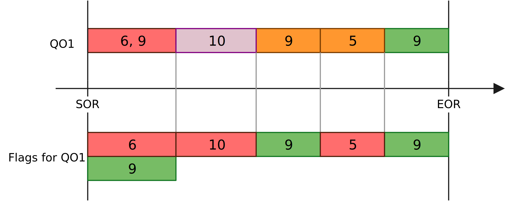
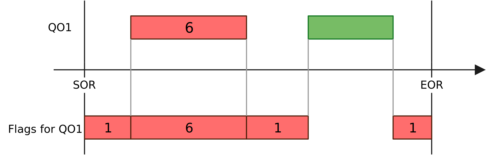
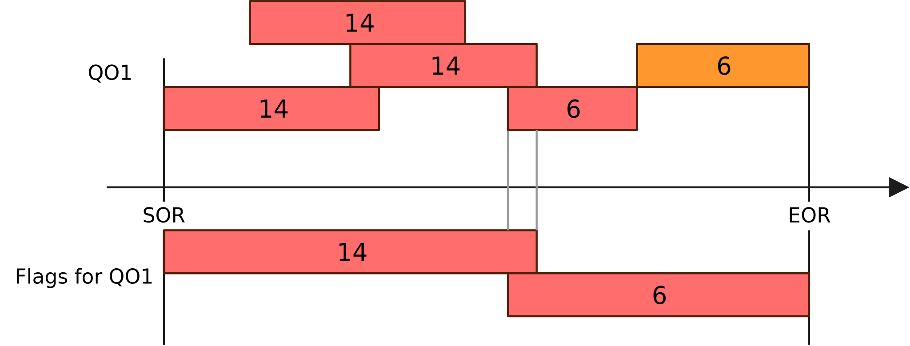
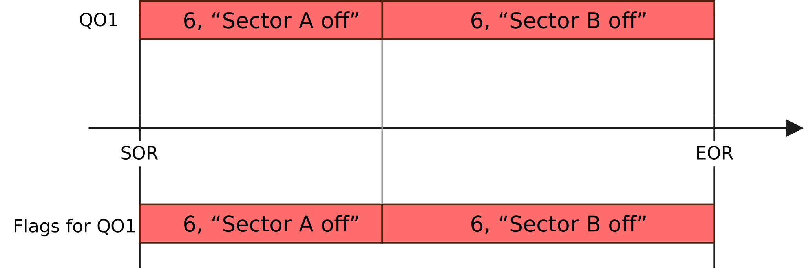
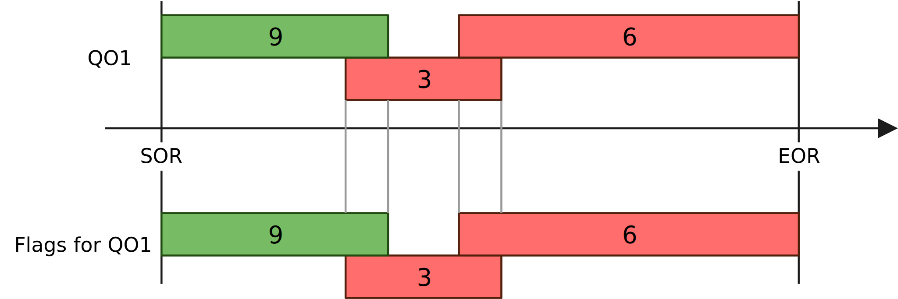
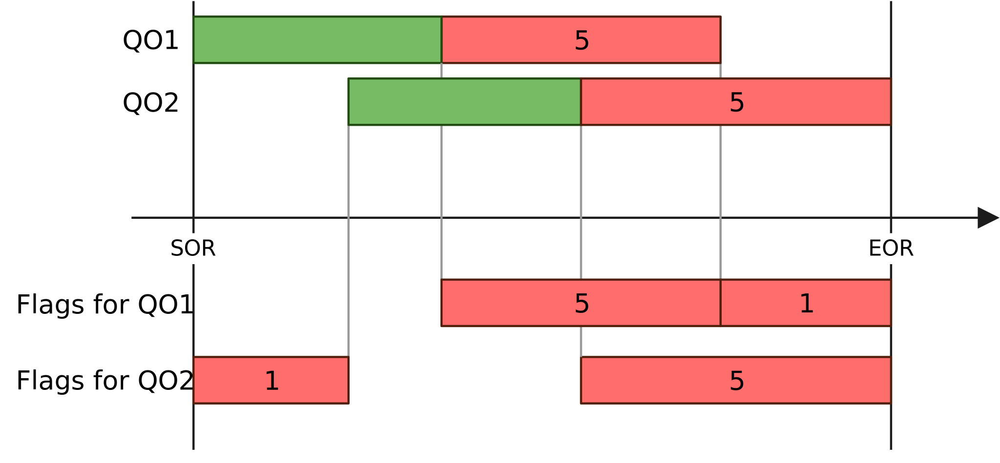

Advanced topics
---

<!--TOC generated with https://github.com/ekalinin/github-markdown-toc-->
<!--./gh-md-toc --insert --no-backup --hide-footer --indent 3 QualityControl/doc/Advanced.md -->
<!--ts-->
* [Advanced topics](#advanced-topics)
* [Framework](#framework)
  * [Plugging the QC to an existing DPL workflow](#plugging-the-qc-to-an-existing-dpl-workflow)
  * [Production of QC objects outside this framework](#production-of-qc-objects-outside-this-framework)
    * [Configuration](#configuration)
    * [Example 1: basic](#example-1-basic)
    * [Example 2: advanced](#example-2-advanced)
    * [Limitations](#limitations)
  * [Multi-node setups](#multi-node-setups)
  * [Batch processing](#batch-processing)
  * [Moving window](#moving-window)
  * [Monitor cycles](#monitor-cycles)
  * [Writing a DPL data producer](#writing-a-dpl-data-producer)
  * [Custom merging](#custom-merging)
  * [Critical, resilient and non-critical tasks](#critical-resilient-and-non-critical-tasks)
  * [QC with DPL Analysis](#qc-with-dpl-analysis)
    * [Uploading objects to QCDB](#uploading-objects-to-qcdb)
  * [Propagating Check results to RCT in Bookkeeping](#propagating-check-results-to-rct-in-bookkeeping)
    * [Conversion details](#conversion-details)
* [Solving performance issues](#solving-performance-issues)
  * [Dispatcher](#dispatcher)
  * [QC Tasks](#qc-tasks-1)
  * [Mergers](#mergers)
* [Understanding and reducing memory footprint](#understanding-and-reducing-memory-footprint)
  * [Analysing memory usage with valgrind](#analysing-memory-usage-with-valgrind)
* [CCDB / QCDB](#ccdb--qcdb)
  * [Accessing objects in CCDB](#accessing-objects-in-ccdb)
  * [Access GRP objects with GRP Geom Helper](#access-grp-objects-with-grp-geom-helper)
  * [Global Tracking Data Request helper](#global-tracking-data-request-helper)
  * [Custom metadata](#custom-metadata)
  * [Details on the data storage format in the CCDB](#details-on-the-data-storage-format-in-the-ccdb)
  * [Local CCDB setup](#local-ccdb-setup)
  * [Instructions to move an object in the QCDB](#instructions-to-move-an-object-in-the-qcdb)
* [Asynchronous Data and Monte Carlo QC operations](#asynchronous-data-and-monte-carlo-qc-operations)
* [QCG](#qcg)
  * [Display a non-standard ROOT object in QCG](#display-a-non-standard-root-object-in-qcg)
  * [Canvas options](#canvas-options)
  * [Local QCG (QC GUI) setup](#local-qcg-qc-gui-setup)
* [FLP Suite](#flp-suite)
  * [Developing QC modules on a machine with FLP suite](#developing-qc-modules-on-a-machine-with-flp-suite)
  * [Switch detector in the workflow <em>readout-dataflow</em>](#switch-detector-in-the-workflow-readout-dataflow)
  * [Get all the task output to the infologger](#get-all-the-task-output-to-the-infologger)
  * [Using a different config file with the general QC](#using-a-different-config-file-with-the-general-qc)
  * [Enable the repo cleaner](#enable-the-repo-cleaner)
* [Configuration](#configuration-1)
  * [Merging multiple configuration files into one](#merging-multiple-configuration-files-into-one)
  * [Definition and access of simple user-defined task configuration ("taskParameters")](#definition-and-access-of-simple-user-defined-task-configuration-taskparameters)
  * [Definition and access of user-defined configuration ("extendedTaskParameters")](#definition-and-access-of-user-defined-configuration-extendedtaskparameters)
  * [Definition of new arguments](#definition-of-new-arguments)
  * [Configuration files details](#configuration-files-details)
    * [Global configuration structure](#global-configuration-structure)
    * [Common configuration](#common-configuration)
    * [QC Tasks configuration](#qc-tasks-configuration)
    * [QC Checks configuration](#qc-checks-configuration)
    * [QC Aggregators configuration](#qc-aggregators-configuration)
    * [QC Post-processing configuration](#qc-post-processing-configuration)
    * [External tasks configuration](#external-tasks-configuration)
* [Miscellaneous](#miscellaneous)
  * [Data Sampling monitoring](#data-sampling-monitoring)
  * [Monitoring metrics](#monitoring-metrics)
  * [Common check IncreasingEntries](#common-check-increasingentries)
  * [Update the shmem segment size of a detector](#update-the-shmem-segment-size-of-a-detector)
<!--te-->

[← Go back to Post-processing](PostProcessing.md) | [↑ Go to the Table of Content ↑](../README.md) | [Continue to Frequently Asked Questions →](FAQ.md)

# Framework

## Plugging the QC to an existing DPL workflow

Your existing DPL workflow can simply be considered a publisher. Therefore, replace `o2-qc-run-producer` with your own workflow.

For example, if TPC wants to monitor the output `{"TPC", "CLUSTERS"}` of the workflow `o2-qc-run-tpcpid`, modify the config file to point to the correct data and do :

```
o2-qc-run-tpcpid | o2-qc --config json://${QUALITYCONTROL_ROOT}/etc/tpcQCPID.json
```

## Production of QC objects outside this framework

QC objects (e.g. histograms) are typically produced in a QC task.
This is however not the only way. Some processing tasks such as the calibration
might have already processed the data and produced histograms that should be
monitored. Instead of re-processing and doing twice the work, one can simply
push this QC object to the QC framework where it will be checked and stored.

### Configuration

Let be a device in the main data flow that produces a histogram on a channel defined as `TST/HISTO/0`. To get this histogram in the QC and check it, add to the configuration file an "external device":

```yaml
    "externalTasks": {
      "External-1": {
        "active": "true",
        "query": "External-1:TST/HISTO/0",  "": "Query specifying where the objects to be checked and stored are coming from. Use the task name as binding. The origin (e.g. TST) is used as detector name for the objects."
      }
    },
    "checks": {
```

The "query" syntax is the same as the one used in the DPL and in the Dispatcher. It must match the output of another device, whether it is in the same workflow or in a piped one.
The `binding` (first part, before the colon) is used in the path of the stored objects and thus we encourage to use the task name to avoid confusion. Moreover, the `origin` (first element after the colon) is used as detectorName.

### Example 1: basic

As a basic example, we are going to produce histograms with the HistoProducer and collect them with the QC. The configuration is in [basic-external-histo.json](https://github.com/AliceO2Group/QualityControl/blob/master/Framework/basic-external-histo.json). An external task is defined and named "External-1" (see subsection above). It is then used in the Check QCCheck :

```yaml
      "QcCheck": {
        "active": "true",
        "className": "o2::quality_control_modules::skeleton::SkeletonCheck",
        "moduleName": "QcSkeleton",
        "policy": "OnAny",
        "detectorName": "TST",
        "dataSource": [{
          "type": "ExternalTask",
          "name": "External-1",
          "MOs": ["hello"]
        }]
      }
```

When using this feature, make sure that the name of the MO in the Check definition matches the name of the object you are sending from the external device.

To run it, do:

```yaml
o2-qc-run-histo-producer | o2-qc --config  json://${QUALITYCONTROL_ROOT}/etc/basic-external-histo.json
```

The object is visible in the QCG or the CCDB at `qc/TST/MO/External-1/hello_0`. In general we publish the objects of an external device at `qc/<detector>/MO/<binding>/object`.

The check results are stored at `qc/<detector>/QO/<binding>/object`.

### Example 2: advanced

This second, more advanced, example mixes QC tasks and external tasks. It is defined in [advanced-external-histo.json](https://github.com/AliceO2Group/QualityControl/blob/master/Framework/advanced-external-histo.json). It is represented here:


First, it runs 1 QC task (QC-TASK-RUNNER-QcTask) getting data from a data producer (bottom boxes, typical QC worfklow).

On top we see 3 histogram producers. `histoProducer-2` is not part of the QC, it is not an external device defined in the configuration file. The two other histogram producers are configured as external devices in the configuration file.

`histoProducer-0` produces an object that is used in a check (`QcCheck-External-1`). `histoProducer-1` objects are not used in any check but we generate one automatically to take care of the storage in the database.

To run it, do:

```yaml
o2-qc-run-producer | o2-qc-run-histo-producer --producers 3 --histograms 3 | o2-qc --config  json://${QUALITYCONTROL_ROOT}/etc/advanced-external-histo.json 
```

### Limitations

1. Objects sent by the external device must be either a TObject or a TObjArray. In the former case, the object will be sent to the checker encapsulated in a MonitorObject. In the latter case, each TObject of the TObjArray is encapsulated in a MonitorObject and is sent to the checker.

## Multi-node setups

During the data-taking Quality Control runs on a distributed computing system. Some QC Tasks are
executed on dedicated QC servers, while others run on FLPs and EPNs. In the first case, messages
coming from Data Sampling should reach QC servers where they are processed. In the latter case,
locally produced Monitor Objects should be merged on QC servers and then have Checks run on them.
By **remote QC tasks** we mean those which run on QC servers (**remote machines**), while **local QC Tasks**
run on FLPs and EPNs (**local machines**).

Setting up a multinode setup to run standalone or with AliECS requires different amount of parameters,
as some of them are overwritten by AliECS anyway. Such parameters are marked accordingly. Please note
that for now we support cases with one or more local machines, but just only one remote machine.

In our example, we assume having two local processing nodes (`localnode1`, `localnode2`) and one
QC node (`qcnode`). There are two types of QC Tasks declared:
* `MultiNodeLocal` which are executed on the local nodes and their results are merged and checked
  on the QC server.
* `MultiNodeRemote` which runs on the QC server, receiving a small percent of data from
  `localnode2` only. Mergers are not needed in this case, but there is a process running Checks against
  Monitor Objects generated by this Task.

We use the `SkeletonTask` class for both, but any Task can be used of course. Should a Task be local,
all its `MonitorObject`s need to be mergeable - they should be one of the mergeable ROOT types (histograms, TTrees)
or inherit [MergeInterface](https://github.com/AliceO2Group/AliceO2/blob/dev/Utilities/Mergers/include/Mergers/MergeInterface.h).

These are the steps to follow to get a multinode setup:

1. Prepare a configuration file.

In this example we will use the `Framework/multiNode.json` config file. A config file should look
almost like the usual one, but with a few additional parameters. In case of a local task, these parameters should be
added:

```json
    "tasks": {
      "MultiNodeLocal": {
        "active": "true",
        ...
        "location": "local",
        "localMachines": [
          "localnode1",
          "localnode2"
        ],
        "remoteMachine": "qcnode",     "":"not needed with FLP+QC, needed with EPN+QC",
        "remotePort": "30132",         "":"not needed with FLP+QC, needed with EPN+QC",
        "localControl": "aliecs",      "":"if absent, aliecs is default",
        "mergingMode": "delta",        "":"if absent, delta is default",
        "mergersPerLayer": ["3", "1"], "":"if absent, one Merger is used" 
      }
    },
```

List the local processing machines in the `localMachines` array. `remoteMachine` should contain the host name which
 will serve as a QC server and `remotePort` should be a port number on which Mergers will wait for upcoming MOs. Make
 sure it is not used by other service. If different QC Tasks are run in parallel, use separate ports for each. The
 `localControl` parameter allows to properly configure QC with respect to the control software it is run with. It can
 be either `aliecs` (on FLPs) or `odc` (EPNs). It has no influence when running the software by hand.

One also may choose the merging mode - `delta` is the default and recommended (tasks are reset after each cycle, so they
 send only updates), but if it is not feasible, Mergers may expect `entire` objects - tasks are not reset, they
 always send entire objects and the latest versions are combined in Mergers.
 With the `delta` mode, one can cheat by specifying just one local machine name and using only that one during execution.
 This is not possible with `entire` mode, because then Mergers need identifiable data sources to merge objects correctly.
 If one merger process is not enough to sustain the input data throughput, one may define multiple Merger layers with
 `mergersPerLayer` option.

In case of a remote task, choosing `"remote"` option for the `"location"` parameter is needed. In standalone setups
and those controlled by ODC, one should also specify the `"remoteMachine"`, so sampled data reaches the right node.
Also, `"localControl"` should be specified to generate the correct AliECS workflow template.

```json
    "tasks": {
      ...
      "MultiNodeRemote": {
        "active": "true",
        ...
        "dataSource": {
          "type": "dataSamplingPolicy",
          "name": "rnd-little"
        },
        "taskParameters": {},
        "location": "remote",
        "remoteMachine": "qcnode",   "":"not needed with FLP+QC, needed with EPN+QC",
        "localControl": "aliecs",    "":"aliecs is default, not needed with FLP+QC, needed with EPN+QC"
      }
    }
```

In case the task is running remotely, data should be sampled. The minimal-effort approach requires adding a port number
 (see the example below). Use separate ports for each Data Sampling Policy. If the same configuration file will be used
 on many nodes, but only some of them should apply a given sampling policy, one should also specify the list of
 machines to match (or generalized aliases, e.g. "flp", "epn").

```json
{
  "dataSamplingPolicies": [
    ...
    {
      "id": "rnd-little",
      "active": "true",
      "machines": [        "","only needed when the policy should run on a subgroup of nodes",
        "localnode2"
      ],
      "port": "30333",     "":"compulsory on standalone and ODC setups (EPN), not needed for FLPs",
      ...
    }
  ]
}
```

By default, the channel is bound on the QC Task side. If this is not what you need, add `"bindLocation" : "local"` in
the policy configuration (`"remote"` is the default value) and make sure to use valid host names.

2. Make sure that the firewalls are properly configured. If your machines block incoming/outgoing connections by
 default, you can add these rules to the firewall (run as sudo). Consider enabling only concrete ports or a small
 range of those.

```
# localnode1 and localnode2 :
iptables -I INPUT -p tcp -m conntrack --ctstate NEW,ESTABLISHED -s qcnode -j ACCEPT
iptables -I OUTPUT -p tcp -m conntrack --ctstate NEW,ESTABLISHED -d qcnode -j ACCEPT
# qcnode:
iptables -I INPUT -p tcp -m conntrack --ctstate NEW,ESTABLISHED -s localnode1 -j ACCEPT
iptables -I OUTPUT -p tcp -m conntrack --ctstate NEW,ESTABLISHED -d localnode1 -j ACCEPT
iptables -I INPUT -p tcp -m conntrack --ctstate NEW,ESTABLISHED -s localnode2 -j ACCEPT
iptables -I OUTPUT -p tcp -m conntrack --ctstate NEW,ESTABLISHED -d localnode2 -j ACCEPT
```

If your network is isolated, you might consider disabling the firewall as an alternative. Be wary of the security risks.

```
systemctl stop firewalld     # to disable until reboot
systemctl disable firewalld  # to disable permanently
```

3. Install the same version of the QC software on each of these nodes. We cannot guarantee that different QC versions will talk to each other without problems. Also, make sure the configuration file that you will use is the same everywhere.

4. Run each part of the workflow. In this example `o2-qc-run-producer` represents any DPL workflow, here it is just a process which produces some random data.
The `--host` argument is matched against the `machines` lists in the configuration files.

```
# On localnode1:
o2-qc-run-producer | o2-qc --config json:/${QUALITYCONTROL_ROOT}/etc/multiNode.json --local --host localnode1 -b
# On localnode2:
o2-qc-run-producer | o2-qc --config json:/${QUALITYCONTROL_ROOT}/etc/multiNode.json --local --host localnode2 -b
# On qcnode:
o2-qc --config json:/${QUALITYCONTROL_ROOT}/etc/multiNode.json --remote
```

If there are no problems, on QCG you should see the `example` histogram updated under the paths `qc/TST/MO/MultiNodeLocal`
and `qc/TST/MO/MultiNodeRemote`, and corresponding Checks under the path `qc/TST/QO/`.

When using AliECS, one has to generate workflow templates and upload them to the corresponding repository. Please
contact the QC or AliECS developers to receive assistance or instructions on how to do that.

## Batch processing

In certain cases merging results of parallel QC Tasks cannot be performed in form of message passing.
An example of this are the simulation workflows, which exchange data between processing stages via files
 and produce (and process) consecutive TimeFrames in different directories in parallel.
Then, one can run QC Tasks on incomplete data and save the results to a file.
If the file already exists, the new objects will be merged with those obtained so far.
At the end, one can run the rest of processing chain (Checks, Aggregators) on the complete objects.

Here is a simple example:

```bash
# Remove any existing results
rm results.root
# Run the Tasks 3 times, merge results into the file.
o2-qc-run-producer --message-amount 100 | o2-qc --config json:/${QUALITYCONTROL_ROOT}/etc/basic.json --local-batch results.root
o2-qc-run-producer --message-amount 100 | o2-qc --config json:/${QUALITYCONTROL_ROOT}/etc/basic.json --local-batch results.root
o2-qc-run-producer --message-amount 100 | o2-qc --config json:/${QUALITYCONTROL_ROOT}/etc/basic.json --local-batch results.root
# Run Checks and Aggregators, publish results to QCDB
o2-qc --config json:/${QUALITYCONTROL_ROOT}/etc/basic.json --remote-batch results.root
```

Please note, that the local batch QC workflow should not work on the same file at the same time.
A semaphore mechanism is required if there is a risk they might be executed in parallel.

The file is organized into directories named after 3-letter detector codes and sub-directories representing Monitor Object Collections for specific tasks.
To browse the file, one needs the associated Quality Control environment loaded, since it contains QC-specific data structures.
It is worth remembering, that this file is considered as intermediate storage, thus Monitor Object do not have Checks applied and cannot be considered the final results.
The quick and easy way to inspect the contents of the file is to load a recent environment (e.g. on lxplus) and open it with ROOT's `TBrowser`:

```shell
alienv enter O2PDPSuite/nightly-20221219-1
root
TBrowser t; // a browser window will pop-up 
```

...or by browsing the file manually:

```shell
alienv enter O2PDPSuite/nightly-20221219-1
root
root [0] auto f = new TFile("QC_fullrun.root")
(TFile *) @0x7ffe84833dc8
root [1] f->ls()
TFile**  QC_fullrun.root 
 TFile*  QC_fullrun.root 
  KEY: TDirectoryFile CPV;1 CPV
  KEY: TDirectoryFile EMC;1 EMC
  KEY: TDirectoryFile FDD;1 FDD
  KEY: TDirectoryFile FT0;1 FT0
  KEY: TDirectoryFile FV0;1 FV0
  KEY: TDirectoryFile GLO;1 GLO
  KEY: TDirectoryFile ITS;1 ITS
...
root [2] f->cd("GLO")
(bool) true
root [3] f->ls()
TFile**  QC_fullrun.root 
 TFile*  QC_fullrun.root 
  TDirectoryFile*  GLO GLO
   KEY: o2::quality_control::core::MonitorObjectCollection MTCITSTPC;1 
   KEY: o2::quality_control::core::MonitorObjectCollection Vertexing;1 
  KEY: TDirectoryFile CPV;1 CPV
...
root [4] auto vtx = dynamic_cast<o2::quality_control::core::MonitorObjectCollection*>(f->Get("GLO/Vertexing"))
(o2::quality_control::core::MonitorObjectCollection *) @0x7ffe84833dc8
root [5] auto vtx_x = dynamic_cast<o2::quality_control::core::MonitorObject*>(vtx->FindObject("vertex_X"))
(o2::quality_control::core::MonitorObject *) @0x7ffe84833dc8
root [6] vtx_x->getObject()->ClassName()
(const char *) "TH1F"
```

To merge several incomplete QC files, one can use the `o2-qc-file-merger` executable.
It takes a list of input files, which may or may not reside on alien, and produces a merged file.
One can select whether the executable should fail upon any error or continue for as long as possible.
Please see its `--help` output for usage details.

## Moving window

### Moving window for all plots generated by a task

By default QC Tasks are never reset, thus the MOs they produce contain data from the full run.
However, if objects should have a shorter validity range, one may add the following options to QC Task configuration:

```json
  "MovingWindowTaskA": {
    ...
    "resetAfterCycles": "10",
  }
```

In the case above the QC Task will have the `TaskInterface::reset()` method invoked each 10 cycles.
Thus, all the plots generated by this task will by affected.

If the QC Task runs in parallel on many nodes and its results are merged, the effects will be different
depending on the chosen merging mode:
* If `"delta"` mode is used, the Merger in the last layer will implement the moving window, while the QC Tasks will
 still reset after each cycle. Please note, that QC Tasks will fall out of sync during data acquisition, so the moving
 window might contain slightly misaligned data time ranges coming from different sources. Also, due to fluctuations of
 the data transfer, objects coming from different sources might appear more frequently than others. Thus, one might
 notice higher occupancy on stave A one time, but the next object might contain less than average data for the same stave.
* In the `"entire"` mode, QC Tasks will reset MOs, while Mergers will use the latest available object version from each
 Task. Please note that if one of the Tasks dies, an old version of MO will be still used over and over. Thus, `"delta"`
 mode is advised in most use cases.

In setups with Mergers one may also extend the Mergers cycle duration, which can help to even out any data fluctuations:

```json
   "MovingWindowTaskB": {
     ...
     "cycleDurationSeconds" : "60",
     "mergingMode" : "delta",
     "mergerCycleMultiplier": "10",  "": "multiplies cycleDurationSeconds in Mergers",
     "resetAfterCycles": "1",        "": "it could be still larger than 1"
   }
 ```

In the presented case, the Merger will publish one set of complete MOs per 10 minutes, which should contain all deltas
 received during this last period. Since the QC Tasks cycle is 10 times shorter, the occupancy fluctuations should be
 less apparent. Please also note, that using this parameter in the `"entire"` merging mode does not make much sense,
 since Mergers would use every 10th incomplete MO version when merging.

### Moving windows of selected plots only

The following applies to synchronous setups which use Mergers in the delta mode and all asynchronous setups.
One can obtain objects containing data from one cycle alongside the ones covering the whole run.
These are saved in QCDB in the task subdirectory `mw` and also can be requested by Checks.
To specify which objects should get a moving window variant, add a `"movingWindows"` list to the task configuration:

```json
   "MyTask": {
     ...
     "cycleDurationSeconds" : "60",
     "mergingMode" : "delta",
     "movingWindows" : [ "plotA", "plotB" ]
   }
```

To request these objects in a Check, use `TaskMovingWindow` data source, as in the example:

```json
      "QcCheckMW": {
        "dataSource": [{
          "type": "TaskMovingWindow",
          "name": "MyTask",
          "MOs": ["plotA"], "": "MOs can be omitted if all moving windows of a task are requested" 
        }]
      }
```

It is possible to request both the integrated and single cycle plots by the same Check.

To test it in a small setup, one can run `o2-qc` with `--full-chain` flag, which creates a complete workflow with a Merger for **local** QC tasks, even though it runs just one instance of them.
Please remember to use `"location" : "local"` in such case.

In asynchronous QC, the moving window plots will appear in the intermediate QC file in the directory `mw` and will be uploaded to QCDB to `<task_name>/mw`.
When testing, please make sure to let DPL know that it has to run in Grid mode, so that QC can compute object validity based on timestamps in the data:

```
export O2_DPL_DEPLOYMENT_MODE=Grid && o2-qc --local-batch QC.root ...
```

## Monitor cycles

The QC tasks monitor and process data continuously during a so-called "monitor cycle". At the end of such a cycle they publish the QC objects that will then continue their way in the QC data flow.

A monitor cycle lasts typically between **1 and 5 minutes**, some reaching 10 minutes but never less than 1 minute for performance reasons.
It is defined in the config file this way:

```
    "tasks": {
      "dataSizeTask": {
        "cycleDurationSeconds": "60",
       ...
```

It is possible to specify various durations for different period of times. It is particularly useful to have shorter cycles at the beginning of the run and longer afterwards:

```
    "tasks": {
      "dataSizeTask": {
        "cycleDurations": [
          {"cycleDurationSeconds": 60, "validitySeconds": 300},
          {"cycleDurationSeconds": 180, "validitySeconds": 600},
          {"cycleDurationSeconds": 300, "validitySeconds": 1}
        ],
        ...
```

In this example, a cycle of 60 seconds is used for the first 5 minutes (300 seconds), then a cycle of 3 minutes (180 seconds) between 5 minutes and 10 minutes after SOR, and finally a cycle of 5 minutes for the rest of the run. The last `validitySeconds` is not used and is just applied for the rest of the run.

## Writing a DPL data producer

For your convenience, and although it does not lie within the QC scope, we would like to document how to write a simple data producer in the DPL. The DPL documentation can be found [here](https://github.com/AliceO2Group/AliceO2/blob/dev/Framework/Core/README.md) and for questions please head to the [forum](https://alice-talk.web.cern.ch/).

As an example we take the `DataProducerExample` that you can find in the QC repository. It is produces a number. By default it will be 1s but one can specify with the parameter `my-param` a different number. It is made of 3 files :

* [runDataProducerExample.cxx](../Framework/src/runDataProducerExample.cxx) :
  This is an executable with a basic data producer in the Data Processing Layer.
  There are 2 important functions here :
  * `customize(...)` to add parameters to the executable. Note that it must be written before the includes for the dataProcessing.
  * `defineDataProcessing(...)` to define the workflow to be ran, in our case the device(s) publishing the number.
* [DataProducerExample.h](../Framework/include/QualityControl/DataProducerExample.h) :
  The key elements are :
    1. The include `#include <Framework/DataProcessorSpec.h>`
    2. The function `getDataProducerExampleSpec(...)` which must return a `DataProcessorSpec` i.e. the description of a device (name, inputs, outputs, algorithm)
    3. The function `getDataProducerExampleAlgorithm` which must return an `AlgorithmSpec` i.e. the actual algorithm that produces the data.
* [DataProducerExample.cxx](../Framework/src/DataProducerExample.cxx) :
  This is just the implementation of the header described just above. You will probably want to modify `getDataProducerExampleSpec` and the inner-most block of `getDataProducerExampleAlgorithm`. You might be taken aback by the look of this function, if you don't know what a _lambda_ is just ignore it and write your code inside the accolades.

You will probably write it in your detector's O2 directory rather than in the QC repository.

## Custom merging

When needed, one may define their own algorithm to merge a Monitor Object.
To do so, inherit the [MergeInterface](https://github.com/AliceO2Group/AliceO2/blob/dev/Utilities/Mergers/include/Mergers/MergeInterface.h) class and override the corresponding methods.
Please pay special attention to delete all the allocated resources in the destructor to avoid any memory leaks.
Feel free to consult the existing usage examples among other modules in the QC repository.

Once a custom class is implemented, one should let QCG know how to display it correctly, which is explained in the subsection [Display a non-standard ROOT object in QCG](#display-a-non-standard-root-object-in-qcg).

## Critical, resilient and non-critical tasks

DPL devices can be marked as expendable, resilient or critical. Expendable tasks can die without affecting the run.
Resilient tasks can survive having one or all their inputs coming from an expendable task but they will stop the system if they themselves die.
Critical tasks (default) will stop the system if they die and will not accept input from expendable tasks.

In QC we use these `labels`.

### QC tasks

In QC, one can mark a task as critical or non-critical:

```json
    "tasks": {
      "QcTask": {
        "active": "true",
        "critical": "false",     "": "if false the task is allowed to die without stopping the workflow, default: true",
```

By default they are `critical` meaning that their failure will stop the run.
If they are not critical, they will be `expendable` and will not stop the run if they die.

### Auto-generated proxies

They adopt the criticality of the task they are proxying.

### QC mergers

Mergers are `resilient`.

### QC check runners

CheckRunners are `resilient`.

### QC aggregators

Aggregators are `resilient`.

### QC post-processing tasks

Post-processing tasks can be marked as critical or non-critical:

```json
    "postprocessing": {
      "ExamplePostprocessing": {
        "active": "true",
        "critical": "false",     "": "if false the task is allowed to die without stopping the workflow, default: true",
```

By default, they are critical meaning that their failure will stop the run.
If they are not critical, they will be `expendable` and will not stop the run if they die.

## QC with DPL Analysis

### Uploading objects to QCDB

To upload objects written to a file by an Analysis Task to QCDB, one may use the following command:

```shell script
o2-qc-upload-root-objects \
  --input-file ./QAResults.root \
  --qcdb-url ccdb-test.cern.ch:8080 \
  --task-name AnalysisFromFileTest \
  --detector-code TST \
  --provenance qc_mc \
  --pass-name passMC \
  --period-name SimChallenge \ 
  --run-number 49999
```

See the `--help` message for explanation of the arguments.
If everything went well, the objects should be accessible in [the test QCG instance](https://qcg-test.cern.ch) under
the directories listed in the logs:

```
2021-10-05 10:59:41.408998     QC infologger initialized
2021-10-05 10:59:41.409053     Input file './QAResults.root' successfully open.
...
2021-10-05 10:59:41.585893     Storing MonitorObject qc_mc/TST/MO/AnalysisFromFileTest/hMcEventCounter
2021-10-05 10:59:41.588649     Storing MonitorObject qc_mc/TST/MO/AnalysisFromFileTest/hGlobalBcFT0
2021-10-05 10:59:41.591542     Storing MonitorObject qc_mc/TST/MO/AnalysisFromFileTest/hTimeT0Aall
2021-10-05 10:59:41.594386     Storing MonitorObject qc_mc/TST/MO/AnalysisFromFileTest/hTimeT0Call
2021-10-05 10:59:41.597743     Successfully uploaded 10 objects to the QCDB.
```

Notice that by default the executable will ignore the directory structure in the input file and upload all objects to one directory.
If you need the directory structure preserved, add the argument `--preserve-directories`.

## Propagating Check results to RCT in Bookkeeping

The framework allows to propagate Quality Objects (QOs) produced by Checks and Aggregators to RCT in Bookkeeping.
The synchronisation is done once, at the end of workflow runtime, i.e. at the End of Run or in the last stage of QC merging on Grid.
Propagation can be enabled by adding the following key-value pair to Check/Aggregator configuration:

```json
    "exportToBookkeeping": "true"
```

Using it for Aggregators is discouraged, as the information on which exact Check failed is lost or at least obfuscated.

Also, make sure that the configuration file includes the Bookkeeping URL.

Check results are converted into Flags, which are documented in [O2/DataFormats/QualityControl](https://github.com/AliceO2Group/AliceO2/tree/dev/DataFormats/QualityControl).
Information about the object validity is preserved, which allows for time-based flagging of good/bad data.

### Conversion details

Below we describe some details of how the conversion is done.
Good QOs are marked with green, Medium QOs are marked with orange and Bad QOs are marked with red.
Null QOs are marked with purple.

* **Good QOs with no Flags associated are not converted to any Flags.**
  According to the preliminary design for Data Tagging, "bad" Flags always win, thus there is no need for explicit "good" Flags.
  It also implies that there is no need to explicitly add Good Flag to Good Quality.


* **Bad and Medium QOs with no Flags are converted to Flag 14 (Unknown).**
  This means that Medium Quality data is by default bad for Analysis.


* **Null QOs with no Flags are converted to Flag 1 (Unknown Quality).**


* **All QOs with Flags are converted to Flags, while the Quality is ignored.**
  As a consequence, one can customize the meaning of any Quality (Medium in particular) in terms of data usability.
  A warning is printed if a Check associates a good Flag to bad Quality or a bad Flag to good Quality.



* **Timespans not covered by a given QO are filled with Flag 1 (Unknown Quality).**
  In other words, if an object was missing during a part of the run, we can state that the data quality is not known.



* **Overlapping or adjacent Flags with the same ID, comment and source (QO name) are merged.**.
  This happens even if they were associated with different Qualities, e.g. Bad and Medium.
  Order of Flag arrival does not matter.




* **Flag 1 (Unknown Quality) is overwritten by any other Flag.**
  This allows us to return Null Quality when there is not enough statistics to determine data quality, but it can be suppressed later, once we can return Good/Medium/Bad.


* **Good and Bad flags do not affect each other, they may coexist.**



* **Flags for different QOs (QO names) do not affect each other.
  Flag 1 (Unknown Quality) is added separately for each.**



# Solving performance issues

Problems with performance in message passing systems like QC usually manifest in backpressure seen in input channels of processes which are too slow.
QC processes usually use one worker thread, thus one can also observe that they use a full CPU core when struggling to consume incoming data.
When observing performance issues with QC setups, consider the following actions to improve it.

## Dispatcher

Dispatcher will usually cause backpressure when it is requested to sample too much data.
In particular, copying many small messages takes more time than less messages of equivalent size.
To improve the performance:
* reduce the sampling rate
* disable unused sampling policies
* adapt the data format to pack data in fewer messages
* when in need of 100% data, do not use Data Sampling, but connect to the data source directly

## QC Tasks

QC Tasks are implemented by the users, thus the maximum possible input data throughput largely depends on the task implementation.
If a QC Task cannot cope with the input messages, consider:
* sampling less data
* using performance measurement tools (like `perf top`) to understand where the task spends the most time and optimize this part of code
* if one task instance processes data, spawn one task per machine and merge the result objects instead

## Mergers

The performance of Mergers depends on the type of objects being merged, as well as their number and size.
The following points might help avoid backpressure:
* increase QC tasks cycle duration
* use less or smaller objects
* if an object has its custom Merge() method, check if it could be optimized
* enable multi-layer Mergers to split the computations across multiple processes (config parameter "mergersPerLayer")

# Understanding and reducing memory footprint

When developing a QC module, please be considerate in terms of memory usage.
Large histograms could be optionally enabled/disabled depending on the context that the QC is ran.
Investigate if reducing the bin size (e.g. TH2D to TH2F) would still provide satisfactory results.
Consider loading only the parts of detector geometry which are being used by a given task.

## Analysing memory usage with valgrind

0) Install valgrind, if not yet installed

1) Run the QC workflow with argument `--child-driver 'valgrind --tool=massif'` (as well as any file reader / processing workflow you need to obtain data in QC)

2) The workflow will run and save files massif.out.<pid>

3) Generate a report for the file corresponding to the PID of the QC task:

```
ms_print massif.out.976329 > massif_abc_task.log
```

4) The generated report contains:
* the command used to run the process
* graph of the memory usage
* grouped call stacks of all memory allocations on the heap (above certain threshold) within certain time intervals.
  The left-most call contains all the calls which lead to it, represented on the right.
  For example, the call stack below means that the AbcTask created a TH2F histogram in the initalize method at the line
  AbcTask.cxx:82, which was 51,811,760B. In total, 130,269,568B worth of TH2F histograms were created in this time interval.

```
98.56% (256,165,296B) (heap allocation functions) malloc/new/new[], --alloc-fns, etc.
->50.12% (130,269,568B) 0xFCBD1A6: TArrayF::Set(int) [clone .part.0] (TArrayF.cxx:111)
| ->50.12% (130,269,568B) 0xEC1DB1C: TH2F::TH2F(char const*, char const*, int, double, double, int, double, double) (TH2.cxx:3573)
|   ->19.93% (51,811,760B) 0x32416518: make_unique<TH2F, char const (&)[16], char const (&)[22], unsigned int const&, int, unsigned int const&, int, int, int> (unique_ptr.h:1065)
|   | ->19.93% (51,811,760B) 0x32416518: o2::quality_control_modules::det::AbcTask::initialize(o2::framework::InitContext&) (AbcTask.cxx:82)
```

5) To get a lightweight and more digestible output, consider running the massif report through the following command to get the summary of the calls only within a QC module. This essentially tells you how much memory a given line allocates.

```
[O2PDPSuite/latest] ~/alice/test-rss $> grep quality_control_modules massif_abc_task.log | sed 's/^.*[0-9][0-9]\.[0-9][0-9]\% //g' | sort | uniq
(242,371,376B) 0x324166B2: o2::quality_control_modules::det::AbcTask::initialize(o2::framework::InitContext&) (AbcTask.cxx:88)
(4,441,008B) 0x3241633F: o2::quality_control_modules::det::AbcTask::initialize(o2::framework::InitContext&) (AbcTask.cxx:76)
(4,441,008B) 0x32416429: o2::quality_control_modules::det::AbcTask::initialize(o2::framework::InitContext&) (AbcTask.cxx:79)
(51,811,760B) 0x32416518: o2::quality_control_modules::det::AbcTask::initialize(o2::framework::InitContext&) (AbcTask.cxx:82)
(51,811,760B) 0x324165EB: o2::quality_control_modules::det::AbcTask::initialize(o2::framework::InitContext&) (AbcTask.cxx:85)
```

6) Consider reducing the size and number of the biggest histogram. Consider disabling histograms which will not be useful for async QC (no allocations, no startPublishing).

# CCDB / QCDB

## Accessing objects in CCDB

The MonitorObjects generated by Quality Control are stored in a dedicated repository (QCDB), which is based on CCDB.
The run conditions, on the other hand, are located in another, separate database.

The recommended way (excluding postprocessing) to access these conditions is to use a `Lifetime::Condition` DPL input, which can be requested as in the query below:

```json
  "tasks": {
    "MyTask": {
    ...
      "dataSource": {
        "type": "direct",
        "query": "randomcluster:MFT/COMPCLUSTERS/0;cldict:MFT/CLUSDICT/0?lifetime=condition&ccdb-path=MFT/Calib/ClusterDictionary"
      },
    }
  },
```

The timestamp of the CCDB object will be aligned with the data timestamp.

If a task needs both sampled input and a CCDB object, it is advised to use two data sources as such:

```json
  "tasks": {
    "MyTask": {
    ...
      "dataSources": [{
        "type": "dataSamplingPolicy",
        "name": "mftclusters"
      }, {
        "type": "direct",
        "query": "cldict:MFT/CLUSDICT/0?lifetime=condition&ccdb-path=MFT/Calib/ClusterDictionary"
      }],
    }
  },
```

The requested CCDB object can be accessed like any other DPL input in `monitorData`:

```
void QcMFTClusterTask::monitorData(o2::framework::ProcessingContext& ctx)
{
...
    auto mDictPtr = ctx.inputs().get<o2::itsmft::TopologyDictionary*>("cldict");
```

Geometry and General Run Parameters (GRP) can be also accessed with the [GRP Geom Helper](#access-grp-objects-with-grp-geom-helper).

If your task accesses CCDB objects using `UserCodeInterface::retrieveConditionAny`, please migrate to using one of the methods mentioned above.

### Accessing from a Postprocessing task

PostProcessingTasks do not take DPL inputs, so in this case `ConditionAccess::retrieveConditionAny` should be used (it's inherited by `PostProcessingInterface` and any children).

## Access GRP objects with GRP Geom Helper

To get GRP objects via a central facility, add the following structure to the task definition and set its values
according to the needs.

```json
      "myTask": {
        ...
        "grpGeomRequest" : {
          "geomRequest": "None",     "": "Available options are \"None\", \"Aligned\", \"Ideal\", \"Alignements\"",
          "askGRPECS": "false",
          "askGRPLHCIF": "false",
          "askGRPMagField": "false",
          "askMatLUT": "false",
          "askTime": "false",
          "askOnceAllButField": "false",
          "needPropagatorD":  "false"
        }
      }
```

The requested objects will be available via [`GRPGeomHelper::instance()`](https://github.com/AliceO2Group/AliceO2/blob/dev/Detectors/Base/include/DetectorsBase/GRPGeomHelper.h) singleton.

## Global Tracking Data Request helper

To retrieve tracks and clusters for specific detectors or detector combinations, one can use the [`DataRequest`](https://github.com/AliceO2Group/AliceO2/blob/dev/DataFormats/Detectors/GlobalTracking/include/DataFormatsGlobalTracking/RecoContainer.h) helper.
By adding the following structure to a QC task, the corresponding `InputSpecs` will be automatically added to the task.

```json
      "myTask": {
        ...
        "globalTrackingDataRequest": {
            "canProcessTracks" : "ITS,ITS-TPC",
            "requestTracks" : "ITS,TPC-TRD",
            "canProcessClusters" : "TPC",
            "requestClusters" : "TPC",
            "mc" : "false"
        }
      }
```

Then, the corresponding tracks and clusters can be retrieved in the code using `RecoContainer`:

```c++
void MyTask::monitorData(o2::framework::ProcessingContext& ctx)
{
  o2::globaltracking::RecoContainer recoData;
  if (auto dataRequest = getGlobalTrackingDataRequest()) {
    recoData.collectData(ctx, *dataRequest);
  }
}
```

## Custom metadata

One can add custom metadata on the QC objects produced in a QC task.
Simply call `ObjectsManager::addMetadata(...)`, like in

```
  // add a metadata on histogram mHistogram, key is "custom" and value "34"
  getObjectsManager()->addMetadata(mHistogram->GetName(), "custom", "34");
```

This metadata will end up in the QCDB.

It is also possible to add or update metadata of a MonitorObject directly:

```
  MonitorObject* mo = getMonitorObject(objectName);
  mo->addOrUpdateMetadata(key, value);
```

## Details on the data storage format in the CCDB

Each MonitorObject is stored as a TFile in the CCDB.
It is therefore possible to easily open it with ROOT when loaded with alienv. It also seamlessly supports class schema evolution.

The MonitorObjects are stored at a path which is enforced by the qc framework : `/qc/<detector code>/MO/<task name>/object/name`
Note that the name of the object can contain slashes (`/`) in order to build a sub-tree visible in the GUI.
The detector name and the taskname are set in the config file :

```json
"tasks": {
  "QcTask": {       <---------- task name
    "active": "true",
    "className": "o2::quality_control_modules::skeleton::SkeletonTask",
    "moduleName": "QcSkeleton",
    "detectorName": "TST",       <---------- detector name
```

The quality is stored as a CCDB metadata of the object.

### Data storage format before v0.14 and ROOT 6.18

Before September 2019, objects were serialized with TMessage and stored as _blobs_ in the CCDB. The main drawback was the loss of the corresponding streamer infos leading to problems when the class evolved or when accessing the data outside the QC framework.

The QC framework is nevertheless backward compatible and can handle the old and the new storage system.

## Local CCDB setup

Having a central ccdb for test (ccdb-test) is handy but also means that everyone can access, modify or delete the data. If you prefer to have a local instance of the CCDB, for example in your lab or on your development machine, follow these instructions.

1. Download the local repository service from <http://alimonitor.cern.ch/download/local.jar>

2. The service can simply be run with
   `java -jar local.jar`

It will start listening by default on port 8080. This can be changed either with the java parameter “tomcat.port” or with the environment variable “TOMCAT_PORT”. Similarly the default listening address is 127.0.0.1 and it can be changed with the java parameter “tomcat.address” or with the environment variable “TOMCAT_ADDRESS” to something else (for example ‘*’ to listen on all interfaces).

By default the local repository is located in /tmp/QC (or java.io.tmpdir/QC to be more precise). You can change this location in a similar way by setting the java parameter “file.repository.location” or the environment variable “FILE_REPOSITORY_LOCATION”.

The address of the CCDB will have to be updated in the Tasks config file.

At the moment, the description of the REST api can be found in this document : <https://docs.google.com/presentation/d/1PJ0CVW7QHgnFzi0LELc06V82LFGPgmG3vsmmuurPnUg>

## Instructions to move an object in the QCDB

The script `o2-qc-repo-move-objects` lets the user move an object, and thus all the versions attached to it. E.g.:

```
python3 o2-qc-repo-move-objects --url http://ccdb-test.cern.ch:8080 --path qc/TST/MO/Bob --new-path qc/TST/MO/Bob2 --log-level 10 
```

# Asynchronous Data and Monte Carlo QC operations

QC can accompany workflows reconstructing real and simulated data asynchronously.
Usually these are distributed among thousands of nodes which might not have access to each other, thus partial results are stored and merged in form of files with mechanism explained in [Batch processing](#batch-processing).

QC workflows for asynchronous data reconstructions are listed in [O2DPG/Data/production/qc-workflow.sh](https://github.com/AliceO2Group/O2DPG/blob/master/DATA/production/qc-workflow.sh).
The script includes paths to corresponding QC configuration files for subsystems which take part in the reconstruction.
All the enabled files are merged into a combined QC workflow.
Thus, it is crucial that unique keys are used in `tasks`, `checks` and `aggregators` structures, as explained in [Merging multiple configuration files into one](#merging-multiple-configuration-files-into-one).
Post-processing tasks can be added in the script [O2DPG/DATA/production/o2dpg_qc_postproc_workflow.py](https://github.com/AliceO2Group/O2DPG/blob/master/DATA/production/o2dpg_qc_postproc_workflow.py).
Please see the included example and the in-code documentation for further guidelines in this matter.

Generating and reconstructing simulated data is ran by a framework which organizes specific workflows in a directed acyclic graph and executes them in an order which satisfies all the dependencies and allocated computing resources.
In contrast to data reconstruction, here, QC workflows are executed separately and pick up corresponding input files.
For further details, please refer to [Adding QC Tasks to the simulation script](https://github.com/AliceO2Group/O2DPG/tree/master/MC#adding-qc-tasks-to-the-simulation-script).

Data and simulation productions are typically executed on Grid and EPNs, and the outcomes can be inspected in [MonALISA](http://alimonitor.cern.ch/).
In both cases, QC runs alongside of each subjob and incomplete QC results are stored in files.
For asynchronous data reconstruction, one file `QC.root` is created.
Simulation subjobs contain a `QC` directory with separate files for each QC workflow.
Relevant logs can be found in files like `stdout`, `stderr` as well as archives `debug_log_archive.zip` and `log_archive.zip`.

Once an expected percentage of subjobs completes, several QC merging stages are executed, each producing a merged file for certain range of subjobs.
The last stage produces the complete file for given masterjob.
This file is read by the `o2-qc --remote-batch` executable to run Checks on the complete objects and all the results to the QCDB.
Post-Processing Tasks and associated Checks are executed right after.

Some runs contain too much data to be processed with one masterjob.
In such case, several masterjobs are run in parallel.
Each produces a `QC.root` file which contains all the statistics for a masterjob.
The last masterjob to complete recognizes this fact and merges all `QC.root` into `QC_fullrun.root` and only then uploads the results to QCDB.
To find it, one can use `alien_find`:

```
> alien_find /alice/data/2022/LHC22m/523897/apass1_epn QC_fullrun.root
/alice/data/2022/LHC22m/523897/apass1_epn/0750/QC/001/QC_fullrun.root
```

TODO explain how a connection to QCDB is made from Grid sites.

# QCG

## Display a non-standard ROOT object in QCG

Users can publish objects inheriting from a custom class, e.g. not a TH2F but a MyCustomClass, as long as a dictionary is available. By default, JSROOT and in turn the QCG won't be able to display such objects.

The solution depends on the strategy to adopt to display the object.

1. The custom class has multiple inheritance and one of them is a standard ROOT object which the QCG can display (e.g. a histogram). In such case, add a member `mTreatMeAs` to your custom class and set it to the name of the class that should be used to interpret and display the data. There is an example in the Example module :

```c++
  std::string mTreatMeAs = "TH2F"; // the name of the class this object should be considered as when drawing in QCG.
```

2. [Not ready yet] The class encapsulates the object that should actually be drawn. Contact us if you need this feature, we can easily add it.
3. [Not ready yet] The class cannot be drawn in the ways outlined above and need a custom piece of JS to actually do it. Contact us if you need this feature, it is not a trivial thing to do.

## Canvas options

The developer of a Task might perfectly know how to display a plot or a graph but cannot set these options if they belong to the Canvas. This is typically the case of `drawOptions` such as `colz` or `alp`. It is also the case for canvases' properties such as logarithmic scale and grid. These options can be set by the end user in the QCG but it is likely that the developer wants to give pertinent default options.

To do so, one can use one of the two following methods.

* `getObjectsManager()->setDefaultDrawOptions(<objectname or pointer>, string& drawOptions)` where
  `drawOptions` is a space-separated list of drawing options. E.g. "colz" or "alp lego1".
* `getObjectsManager()->setDisplayHint(<objectname or pointer>, string& hints)` where
  `hints` is a space-separated list of hints on how to draw the object. E.g. "logz" or "gridy logy".
  Currently supported by QCG: logx, logy, logz, gridx, gridy, gridz.

These methods must be called after the objects has been published, i.e. after the call to `getObjectsManager()->startPublishing(<pointer to object>)

## Local QCG (QC GUI) setup

To install and run the QCG locally please follow these instructions : <https://github.com/AliceO2Group/WebUi/tree/dev/QualityControl#installation>

# FLP Suite

The QC is part of the FLP Suite. The Suite is installed on FLPs through RPMs and is configured with ansible. As a consequence a few things are different in this context compared to a pure development setup.

## Developing QC modules on a machine with FLP suite

Development RPMs are available on the FLPs. Start by installing them, then compile QC and finally tell aliECS to use it.

**Installation**

As root do:

```
yum install o2-QualityControl-devel git -y
```

**Compilation**

As user `flp` do:

```
git clone https://github.com/AliceO2Group/QualityControl.git
cd QualityControl
git checkout <release> # use the release included in the installed FLP suite
mkdir build
cd build
mkdir /tmp/installdir
cmake -DCMAKE_INSTALL_PREFIX=/tmp/installdir -G Ninja -DCLANG_EXECUTABLE=/opt/o2/bin-safe/clang -DCMAKE_BUILD_TYPE=RelWithDebugInfo ..
ninja -j16 install 
```

_**Compilation on top of a local O2**_

If you want to build also O2 locally do

```
# O2
git clone https://github.com/AliceO2Group/AliceO2.git
cd AliceO2
git checkout <release> # use the release included in the installed FLP suite
mkdir build
cd build
cmake -DCMAKE_INSTALL_PREFIX=/tmp/installdir -G Ninja -DCLANG_EXECUTABLE=/opt/o2/bin-safe/clang -DCMAKE_BUILD_TYPE=RelWithDebugInfo ..
ninja -j8 install

# QC
git clone https://github.com/AliceO2Group/QualityControl.git
cd QualityControl
git checkout <release> # use the release included in the installed FLP suite
mkdir build
cd build
cmake -DCMAKE_INSTALL_PREFIX=/tmp/installdir -G Ninja -DCLANG_EXECUTABLE=/opt/o2/bin-safe/clang -DCMAKE_BUILD_TYPE=RelWithDebugInfo -DO2_ROOT=/tmp/installdir ..
ninja -j8 install
```

_**Important step in case several nodes are involved**_

In case the workflows will span over several FLPs and/or QC machines, one should `scp` the `installdir` to the other machines in the same directory.

**Use it in aliECS**

In the aliECS gui, in the panel "Advanced Configuration", et an extra variable `extra_env_vars` and set it to

```
PATH=/tmp/installdir/bin/:$PATH; LD_LIBRARY_PATH=/tmp/installdir/lib/:/tmp/installdir/lib64/:$LD_LIBRARY_PATH; QUALITYCONTROL_ROOT=/tmp/installdir/; echo
```

Replace `/tmp/installdir` with your own path. Make sure that the directory is anyway readable and traversable by users `flp` and `qc`

## Switch detector in the workflow _readout-dataflow_

The workflow readout-dataflow works by default with the detector code TST. To run with another detector (e.g. EMC) do:

2. Replace all instances of `TST` in the QC config file in consul with the one of the detector (e.g. `EMC`).
2. Set the variable `detector` in aliECS to the detector (e.g. `EMC`).
  
## Get all the task output to the infologger
  
Set the variable log_task_output=all
  
## Using a different config file with the general QC
  
One can set the `QC URI` to a different config file that is used by the general QC when enabled. However, this is not the recommended way. One must make sure that the name of the task and the check are left untouched and that they are both enabled.

## Enable the repo cleaner

If the CCDB used in an FLP setup is the local one, the repo cleaner might be necessary as to avoid filling up the disk of the machine.

By defaults there is a _disabled_ cron job :

```shell
*/10 * * * * /opt/o2/bin/o2-qc-repo-cleaner --config /etc/flp.d/ccdb-sql/repocleaner.yaml --dry-run > /dev/null 2>> /tmp/cron-errors.txt
```

1. copy the config file /etc/flp.d/ccdb-sql/repocleaner.yaml
2. modify the config file to suit your needs
3. run by hand the repo-cleaner to check that the config file is ok
3. update the cron job to use the modified config file
4. uncomment the cron job
  
# Configuration

## Merging multiple configuration files into one

To merge multiple QC configuration files into one, one can use `jq` in the following way:

```
jq -n 'reduce inputs as $s (input; .qc.tasks += ($s.qc.tasks) | .qc.checks += ($s.qc.checks)  | .qc.externalTasks += ($s.qc.externalTasks) | .qc.postprocessing += ($s.qc.postprocessing)| .dataSamplingPolicies += ($s.dataSamplingPolicies))' $QC_JSON_GLOBAL $JSON_FILES > $MERGED_JSON_FILENAME
```

However, one should pay attention to avoid duplicate task definition keys (e.g. having RawTask twice, each for a different detector), otherwise only one of them would find its way to a merged file.
In such case, one can add the `taskName` parameter in the body of a task configuration structure to use the preferred name and change the root key to a unique id, which shall be used only for the purpose of navigating a configuration file.
If `taskName` does not exist, it is taken from the root key value.
Please remember to update also the references to the task in other actors which refer it (e.g. in Check's data source).

These two tasks will **not** be merged correctly:

```json
      "RawTask": {
        "className": "o2::quality_control_modules::abc::RawTask",
        "moduleName": "QcA",
        "detectorName": "A",
        "dataSource": {
          "type": "dataSamplingPolicy",
          "name": "raw-a"
        }
      }
```

```json
      "RawTask": {
        "className": "o2::quality_control_modules::xyz::RawTask",
        "moduleName": "QcB",
        "detectorName": "B",
        "dataSource": {
          "type": "dataSamplingPolicy",
          "name": "raw-b"
        }
      }
```

The following tasks will be merged correctly:

```json
      "RawTaskA": {
        "taskName": "RawTask",
        "className": "o2::quality_control_modules::abc::RawTask",
        "moduleName": "QcA",
        "detectorName": "A",
        "dataSource": {
          "type": "dataSamplingPolicy",
          "name": "raw-a"
        }
      }
```

```json
      "RawTaskB": {
        "taskName": "RawTask"
        "className": "o2::quality_control_modules::xyz::RawTask",
        "moduleName": "QcB",
        "detectorName": "B",
        "dataSource": {
          "type": "dataSamplingPolicy",
          "name": "raw-b"
        }
      }
```

The same approach can be applied to other actors in the QC framework, like Checks (`checkName`), Aggregators(`aggregatorName`), External Tasks (`taskName`) and Postprocessing Tasks (`taskName`).

## Templating config files

> [!WARNING]  
> Templating only works when using aliECS, i.e. in production and staging.

The templating is provided by a template engine called `jinja`. You can use any of its feature. A couple are described below and should satisfy the vast majority of the needs.

### Preparation

> [!IMPORTANT]
> Workflows have already been migrated to apricot. This should not be needed anymore.

To template a config file, modify the corresponding workflow in `ControlWorkflows`. This is needed because we won't use directly `Consul`  but instead go through `apricot` to template it.

1. Replace `consul-json` by `apricot`
2. Replace `consul_endpoint` by `apricot_endpoint`
3. Make sure to have single quotes around the URI

Example:

```
o2-qc --config consul-json://{{ consul_endpoint }}/o2/components/qc/ANY/any/mch-qcmn-epn-full-track-matching --remote -b
```

becomes

```
o2-qc --config 'apricot://{{ apricot_endpoint }}/o2/components/qc/ANY/any/mch-qcmn-epn-full-track-matching' --remote -b
```

Make sure that you are able to run with the new workflow before actually templating.

### Include a config file

To include a config file (e.g. named `mch_digits`) add this line :

```

```

The content of the file `mch_digits` is then copied into the config file. Thus make sure that you include all the commas and stuff.

#### Configuration files organisation

Once you start including files, you must put the included files inside the corresponding detector subfolder (that have already been created for you).

Common config files includes are provided in the `COMMON` subfolder.

### Conditionals

The `if` looks like

```
 …  
```

The condition probably requires some external info, such as the run type or a detectors list. Thus you must pass the info in the ControlWorkflows.

It could look like this

```
o2-qc --config 'apricot://{{ apricot_endpoint }}/o2/components/qc/ANY/any/tpc-pulser-calib-qcmn?run_type={{ run_type }}' ...
```

or

```
o2-qc --config 'apricot://{{ apricot_endpoint }}/o2/components/qc/ANY/any/mch-qcmn-epn-full-track-matching?detectors={{ detectors }}' ...
```

Then use it like this:

```

...

```

or like this respectively:

```

...

```

### Test and debug

To see how a config file will look like once templated, simply open a browser at this address: `{{apricot_endpoint}}/components/qc/ANY/any/tpc-pulser-calib-qcmn?process=true`
Replace `{{apricot_endpoint}}` by the value you can find in Consul under `o2/runtime/aliecs/vars/apricot_endpoint` (it is different on staging and prod).
_Note that there is no `o2` in the path!!!_

### Example

We are going to create in staging a small example to demonstrate the above.
First create 2 files if they don't exist yet:

**o2/components/qc/ANY/any/templating_demo**

```
{
  "qc": {
    "config": 
     ,"aggregators": "included"  
  }
}
```

Here we simply include 1 file from a subfolder and add a piece if a certain condition is successful.

**o2/components/qc/ANY/any/TST/templating_included**

```
{
  bookkeeping": {
    "url": "alio2-cr1-hv-web01.cern.ch:4001"
  }
}
```

And now you can try it out:

```
http://alio2-cr1-hv-mvs00.cern.ch:32188/components/qc/ANY/any/templating_demo?process=true
```

--> the file is included inside the other.

```
[http://alio2-cr1-hv-mvs00.cern.ch:32188/components/qc/ANY/any/templating_demo?process=true](http://alio2-cr1-hv-mvs00.cern.ch:32188/components/qc/ANY/any/templating_demo?process=true&run_type=PHYSICS)
```

--> the file is included and the condition is true thus we have an extra line.

## Definition and access of simple user-defined task configuration ("taskParameters")

The new, extended, way of defining such parameters, not only in Tasks but also in Checks, Aggregators and PP tasks,
is described in the next section.

A task can access custom parameters declared in the configuration file at `qc.tasks.<task_id>.taskParameters`. They are stored inside an object of type `CustomParameters` named `mCustomParameters`, which is a protected member of `TaskInterface`.

The syntax is

```json
    "tasks": {
      "QcTask": {
        "taskParameters": {
          "myOwnKey1": "myOwnValue1"
        },
```

It is accessed with : `mCustomParameters["myOwnKey"]`.

## Definition and access of user-defined configuration ("extendedTaskParameters")

User code, whether it is a Task, a Check, an Aggregator or a PostProcessing task, can access custom parameters declared in the configuration file.
They are stored inside an object of type `CustomParameters` named `mCustomParameters`, which is a protected member of `TaskInterface`.

The following table gives the path in the config file and the name of the configuration parameter for the various types of user code:

| User code      | Config File item                                       |
|----------------|--------------------------------------------------------|
| Task           | `qc.tasks.<task_id>.extendedTaskParameters`            |
| Check          | `qc.checks.<check_id>.extendedCheckParameters`         |
| Aggregator     | `qc.aggregators.<agg_id>.extendedAggregatorParameters` |
| PostProcessing | `qc.postprocessing.<pp_id>.extendedTaskParameters`     |

The new syntax is

```json
    "tasks": {
      "QcTask": {
        "extendedTaskParameters": {
          "default": {
            "default": {
              "myOwnKey1": "myOwnValue1",
              "myOwnKey2": "myOwnValue2",
              "myOwnKey3": "myOwnValue3"
            }
          },
          "PHYSICS": {
            "default": {
              "myOwnKey1": "myOwnValue1b",
              "myOwnKey2": "myOwnValue2b"
            },
            "pp": {
              "myOwnKey1": "myOwnValue1c"
            },
            "PbPb": {
              "myOwnKey1": "myOwnValue1d"
            }
          },
          "COSMICS": {
            "myOwnKey1": "myOwnValue1e",
            "myOwnKey2": "myOwnValue2e"
          }
        },
```

It allows to have variations of the parameters depending on the run and beam types. The proper run types can be found here: [ECSDataAdapters.h](https://github.com/AliceO2Group/AliceO2/blob/dev/DataFormats/Parameters/include/DataFormatsParameters/ECSDataAdapters.h#L54). The `default` can be used
to ignore the run or the beam type.
The beam type comes from the parameter `pdp_beam_type` set by ECS and can be one of the following: `pp`, `PbPb`, `pPb`, `pO`, `OO`, `NeNe`, `cosmic`, `technical`.
See `[readout-dataflow](https://github.com/AliceO2Group/ControlWorkflows/blob/master/workflows/readout-dataflow.yaml)` to verify the possible values.

The values can be accessed in various ways described in the following sub-sections.

### Access optional values with or without activity

The value for the key, runType and beamType is returned if found, or an empty value otherwise.
However, before returning an empty value we try to substitute the runType and the beamType with "default".

```c++
// returns an Optional<string> if it finds the key `myOwnKey` for the runType and beamType of the provided activity, 
// or if it can find the key with the runType or beamType substituted with "default". 
auto param = mCustomParameters.atOptional("myOwnKey1", activity); // activity is "PHYSICS", "PbPb" , returns "myOwnValue1d"
// same but passing directly the run and beam types
auto param = mCustomParameters.atOptional("myOwnKey1", "PHYSICS", "PbPb"); // returns "myOwnValue1d"
// or with only the run type
auto param = mCustomParameters.atOptional("myOwnKey1", "PHYSICS"); // returns "myOwnValue1b"
```

### Access values directly specifying the run and beam type or an activity

The value for the key, runType and beamType is returned if found, or an exception is thrown otherwise..
However, before throwing we try to substitute the runType and the beamType with "default".

```c++
mCustomParameters["myOwnKey"]; // considering that run and beam type are `default` --> returns `myOwnValue`
mCustomParameters.at("myOwnKey"); // returns `myOwnValue`
mCustomParameters.at("myOwnKey", "default"); // returns `myOwnValue`
mCustomParameters.at("myOwnKey", "default", "default"); // returns `myOwnValue`

mCustomParameters.at("myOwnKey1", "PHYSICS", "pp"); // returns `myOwnValue1c`
mCustomParameters.at("myOwnKey1", "PHYSICS", "PbPb"); // returns `myOwnValue1d`
mCustomParameters.at("myOwnKey2", "COSMICS"); // returns `myOwnValue2e`

mCustomParameters.at("myOwnKey1", activity); // result will depend on activity
```

### Access values and return default if not found

The correct way of accessing a parameter and to default to a value if it is not there, is the following:

```c++
  std::string param = mCustomParameters.atOrDefaultValue("myOwnKey1", "1" /*default value*/, "physics", "pp");
  int casted = std::stoi(param);

  // alternatively
  std::string param = mCustomParameters.atOrDefaultValue("myOwnKey1", "1" /*default value*/, activity); // see below how to get the activity
```

### Find a value

Finally the way to search for a value and only act if it is there is the following:

```c++
  if (auto param2 = mCustomParameters.find("myOwnKey1", "physics", "pp"); param2 != cp.end()) {
    int casted = std::stoi(param);
  }
```

### Retrieve the activity in the modules

In a task, the `activity` is provided in `startOfActivity`.

In a Check, it is returned by `getActivity()`.

In an Aggregator, it is returned by `getActivity()`.

In a postprocessing task, it is available in the objects manager: `getObjectsManager()->getActivity()`

## Definition of new arguments

One can also tell the DPL driver to accept new arguments. This is done using the `customize` method at the top of your workflow definition (usually called "runXXX" in the QC).

For example, to add two parameters of different types do :

```
void customize(std::vector<ConfigParamSpec>& workflowOptions)
{
  workflowOptions.push_back(
    ConfigParamSpec{ "config-path", VariantType::String, "", { "Path to the config file. Overwrite the default paths. Do not use with no-data-sampling." } });
  workflowOptions.push_back(
    ConfigParamSpec{ "no-data-sampling", VariantType::Bool, false, { "Skips data sampling, connects directly the task to the producer." } });
}
```

## Reference data

A reference object is an object from a previous run. It is usually used as a point of comparison.

### Get a reference plot in a check

To retrieve a reference plot in your Check, use

```
  std::shared_ptr<MonitorObject> CheckInterface::retrieveReference(std::string path, Activity referenceActivity);
```
* `path` : the path of the object _without the provenance (e.g. `qc`)_
* `referenceActivity` : the activity of reference (usually the current activity with a different run number)

If the reference is not found it will return a `nullptr` and the quality is `Null`.

### Compare to a reference plot

The check `ReferenceComparatorCheck` in `Common` compares objects to their reference.

The configuration looks like

```
      "QcCheck": {
        "active": "true",
        "className": "o2::quality_control_modules::common::ReferenceComparatorCheck",
        "moduleName": "QcCommon",
        "policy": "OnAny",
        "detectorName": "TST",
        "dataSource": [{
          "type": "Task",
          "name": "QcTask",
          "MOs": ["example"]
        }],
        "extendedCheckParameters": {
          "default": {
            "default": {
              "referenceRun" : "500",
              "moduleName" : "QualityControl",
              "comparatorName" : "o2::quality_control_modules::common::ObjectComparatorChi2",
              "threshold" : "0.5"
            }
          },
          "PHYSICS": {
            "pp": {
              "referenceRun" : "551890"
            }
          }
        }
      }
```

The check needs the following parameters
* `referenceRun` to specify what is the run of reference and retrieve the reference data.
* `comparatorName` to decide how to compare, see below for their descriptions.
* `threshold` to specifie the value used to discriminate between good and bad matches between the histograms.

Three comparators are provided:

1. `o2::quality_control_modules::common::ObjectComparatorDeviation`: comparison based on the average relative deviation between the bins of the current and reference histograms; the `threshold` parameter represent in this case the maximum allowed deviation
2. `o2::quality_control_modules::common::ObjectComparatorChi2`: comparison based on a standard chi2 test between the current and reference histograms; the `threshold` parameter represent in this case the minimum allowed chi2 probability
3. `o2::quality_control_modules::common::ObjectComparatorKolmogorov`: comparison based on a standard Kolmogorov test between the current and reference histograms; the `threshold` parameter represent in this case the minimum allowed Kolmogorov probability

Note that you can easily specify different reference runs for different run types and beam types.

The plot is beautified by the addition of a `TPaveText` containing the quality and the reason for the quality.

### Generate a canvas combining both the current and reference ratio histogram

The postprocessing task ReferenceComparatorTask draws a given set of plots in comparison with their corresponding references, both as superimposed histograms and as current/reference ratio histograms.
See the details [here](https://github.com/AliceO2Group/QualityControl/blob/master/doc/PostProcessing.md#the-referencecomparatortask-class).

## Configuration files details

The QC requires a number of configuration items. An example config file is
provided in the repo under the name _example-default.json_. This is a quick reference for all the parameters.

### Global configuration structure

This is the global structure of the configuration in QC.

```json
{
  "qc": {
    "config": {

    },
    "tasks": {
      
    },
    "externalTasks": {
    
    },
    "checks": {
      
    },
    "aggregators": {

    },
    "postprocessing": {
      
    }
  },
  "dataSamplingPolicies": [

  ]
}
```

There are six QC-related components:
* "config" - contains global configuration of QC which apply to any component. It is required in any configuration
  file.
* "tasks" - contains declarations of QC Tasks. It is mandatory for running topologies with Tasks and
  Checks.
* "externalTasks" - contains declarations of external devices which sends objects to the QC to be checked and stored.
* "checks" - contains declarations of QC Checks. It is mandatory for running topologies with
  Tasks and Checks.
* "aggregators" - contains declarations of QC Aggregators. It is not mandatory.
* "postprocessing" - contains declarations of PostProcessing Tasks. It is only needed only when Post-Processing is
  run.

The configuration file can also include a list of Data Sampling Policies.
Please refer to the [Data Sampling documentation](https://github.com/AliceO2Group/AliceO2/tree/dev/Utilities/DataSampling) to find more information.

### Common configuration

This is how a typical "config" structure looks like. Each configuration element is described with a relevant comment
afterwards. The `"": "<comment>",` formatting is to keep the JSON structure valid. Please note that these comments
should not be present in real configuration files.

```json
{
  "qc": {
    "config": {
      "database": {                       "": "Configuration of a QC database (the place where QC results are stored).",
        "username": "qc_user",            "": "Username to log into a DB. Relevant only to the MySQL implementation.",
        "password": "qc_user",            "": "Password to log into a DB. Relevant only to the MySQL implementation.",
        "name": "quality_control",        "": "Name of a DB. Relevant only to the MySQL implementation.",
        "implementation": "CCDB",         "": "Implementation of a DB. It can be CCDB, or MySQL (deprecated).",
        "host": "ccdb-test.cern.ch:8080", "": "URL of a DB.",
        "maxObjectSize": "2097152",       "": "[Bytes, default=2MB] Maximum size allowed, larger objects are rejected."
      },
      "Activity": {                       "": ["Configuration of a QC Activity (Run). This structure is subject to",
                                               "change or the values might come from other source (e.g. ECS+Bookkeeping)." ],
        "number": "42",                   "": "Activity number.",
        "type": "PHYSICS",                "": "Activity type.",
        "periodName": "",                 "": "Period name - e.g. LHC22c, LHC22c1b_test",
        "passName": "",                   "": "Pass type - e.g. spass, cpass1",
        "provenance": "qc",               "": "Provenance - qc or qc_mc depending whether it is normal data or monte carlo data",
        "start" : "0",                    "": "Activity start time in ms since epoch. One can use it as a filter in post-processing",
        "end" : "1234",                   "": "Activity end time in ms since epoch. One can use it as a filter in post-processing", 
        "beamType" : "pp",                "": "Beam type: `pp`, `PbPb`, `pPb` ", 
        "partitionName" : "",             "": "Partition name", 
        "fillNumber" : "123",             "": "Fill Number"
      },
      "monitoring": {                     "": "Configuration of the Monitoring library.",
        "url": "infologger:///debug?qc",  "": ["URI to the Monitoring backend. Refer to the link below for more info:",
                                               "https://github.com/AliceO2Group/Monitoring#monitoring-instance"]
      },
      "consul": {                         "": "Configuration of the Consul library (used for Service Discovery).",
        "url": "",                        "": "URL of the Consul backend"
      },
      "conditionDB": {                    "": ["Configuration of the Conditions and Calibration DataBase (CCDB).",
                                               "Do not mistake with the CCDB which is used as QC repository."],
        "url": "ccdb-test.cern.ch:8080",  "": "URL of a CCDB"
      },
      "infologger": {                     "": "Configuration of the Infologger (optional).",
        "filterDiscardDebug": "false",    "": "Set to 1 to discard debug and trace messages (default: false)",
        "filterDiscardLevel": "2",        "": "Message at this level or above are discarded (default: 21 - Trace)",
        "filterDiscardFile": "",          "": ["If set, the discarded messages will go to this file (default: <none>)",
                                              "The keyword _ID_, if used, is replaced by the device ID."],
        "filterRotateMaxBytes": "",       "": "Maximum size of the discard file.", 
        "filterRotateMaxFiles": "",       "": "Maximum number of discard files.",
        "debugInDiscardFile": "false",    "": "If true, the debug discarded messages go to the file (default: false)."
      },
      "bookkeeping": {                    "": "Configuration of the bookkeeping (optional)",
        "url": "localhost:4001",          "": "Url of the bookkeeping API (port is usually different from web interface)"
      },
      "kafka": {
        "url": "kafka-broker:123",        "": "url of the kafka broker",
        "topicAliecsRun":"aliecs.run",    "": "the topic where AliECS publishes Run Events, 'aliecs.run' by default"
      },
      "postprocessing": {                 "": "Configuration parameters for post-processing",
        "periodSeconds": 10.0,            "": "Sets the interval of checking all the triggers. One can put a very small value",
                                          "": "for async processing, but use 10 or more seconds for synchronous operations",
        "matchAnyRunNumber": "false",     "": "Forces post-processing triggers to match any run, useful when running with AliECS"
      }
    }
  }
}
```

#### Common configuration in production

In production at P2 and in staging, some common items are defined globally in the file `QC/general-config-params`:

* QCDB
* monitoring
* consul
* conditionDB
* bookkeeping
*

It is mandatory to use them by including the file:

```
"config": {
            
      },
```

Other configuration items can still be added in your files as such (note the comma after the inclusion) :

```
      "config": {
            ,
            "infologger": {
                "filterDiscardDebug": "false",
                "filterDiscardLevel": "22"
            },
            "postprocessing": {
                "matchAnyRunNumber": "true"
            }
      },
```

Please, do not use `Activity` in production !

### QC Tasks configuration

Below the full QC Task configuration structure is described. Note that more than one task might be declared inside in
the "tasks" path.

 ```json
{
  "qc": {
    "tasks": {
      "QcTaskID": {                         "": ["ID of the QC Task. Less than 14 character names are preferred.",
                                                 "If \"taskName\" is empty or missing, the ID is used"],
        "active": "true",                   "": "Activation flag. If not \"true\", the Task will not be created.",
        "taskName": "MyTaskName",           "": ["Name of the task, used e.g. in the QCDB. If empty, the ID is used.",
                                                 "Less than 14 character names are preferred."],
        "className": "namespace::of::Task", "": "Class name of the QC Task with full namespace.",
        "moduleName": "QcSkeleton",         "": "Library name. It can be found in CMakeLists of the detector module.",
        "detectorName": "TST",              "": "3-letter code of the detector.",
        "critical": "true",                "": "if false the task is allowed to die without stopping the workflow, default: true",
        "cycleDurationSeconds": "10",       "": "Cycle duration (how often objects are published), 10 seconds minimum.",
                                            "": "The first cycle will be randomly shorter. ",
        "": "Alternatively, one can specify different cycle durations for different periods. The last item in cycleDurations will be used for the rest of the duration whatever the period. The first cycle will be randomly shorter.",
        "cycleDurations": [
          {"cycleDurationSeconds": 10, "validitySeconds": 35},
          {"cycleDurationSeconds": 12, "validitySeconds": 1}
        ],
        "maxNumberCycles": "-1",            "": "Number of cycles to perform. Use -1 for infinite.",
        "disableLastCycle": "true",         "": "Last cycle, upon EndOfStream, is not published. (default: false)",
        "dataSources": [{                   "": "Data sources of the QC Task. The following are supported",
          "type": "dataSamplingPolicy",     "": "Type of the data source",
          "name": "tst-raw",                "": "Name of Data Sampling Policy"
        }, {
          "type": "direct",                 "": "connects directly to another output",
          "query": "raw:TST/RAWDATA/0",     "": "input spec query, as expected by DataDescriptorQueryBuilder"
        }],
        "taskParameters": {                 "": "User Task parameters which are then accessible as a key-value map.",
          "myOwnKey": "myOwnValue",         "": "An example of a key and a value. Nested structures are not supported"
        },
        "resetAfterCycles" : "0",           "": "Makes the Task or Merger reset MOs each n cycles.",
                                            "": "0 (default) means that MOs should cover the full run.",
        "location": "local",                "": ["Location of the QC Task, it can be local or remote. Needed only for",
                                                 "multi-node setups, not respected in standalone development setups."],
        "localMachines": [                  "", "List of local machines where the QC task should run. Required only",
                                            "", "for multi-node setups. An alias can be used if merging deltas.",
          "o2flp1",                         "", "Hostname of a local machine.",
          "o2flp2",                         "", "Hostname of a local machine."
        ],
        "remoteMachine": "o2qc1",           "": "Remote QC machine hostname. Required only for multi-node setups with EPNs.",
        "remotePort": "30432",              "": "Remote QC machine TCP port. Required only for multi-node setups with EPNs.",
        "localControl": "aliecs",           "": ["Control software specification, \"aliecs\" (default) or \"odc\").",
                                                 "Needed only for multi-node setups."],
        "mergingMode": "delta",             "": "Merging mode, \"delta\" (default) or \"entire\" objects are expected",
        "mergerCycleMultiplier": "1",       "": "Multiplies the Merger cycle duration with respect to the QC Task cycle"
        "mergersPerLayer": [ "3", "1" ],    "": "Defines the number of Mergers per layer, the default is [\"1\"]",
        "grpGeomRequest" : {                "": "Requests to retrieve GRP objects, then available in GRPGeomHelper::instance()",
          "geomRequest": "None",            "": "Available options are \"None\", \"Aligned\", \"Ideal\", \"Alignements\"",
          "askGRPECS": "false",
          "askGRPLHCIF": "false",
          "askGRPMagField": "false",
          "askMatLUT": "false",
          "askTime": "false",
          "askOnceAllButField": "false",
          "needPropagatorD":  "false"
        },
        "globalTrackingDataRequest": {         "": "A helper to add tracks or clusters to inputs of the task",
          "canProcessTracks" : "ITS,ITS-TPC",  "": "tracks that the QC task can process, usually should not change",
          "requestTracks" : "ITS,TPC-TRD",     "": ["tracks that the QC task should process, TPC-TRD will not be",
                                                    "requested, as it is not listed in the previous parameter"],
          "canProcessClusters" : "TPC",        "": "clusters that the QC task can process",
          "requestClusters" : "TPC",           "": "clusters that the QC task should process",
          "mc" : "false",                      "": "mc boolean flag for the data request"
        }
      }
    }
  }
}
```

### QC Checks configuration

Below the full QC Checks configuration structure is described. Note that more than one check might be declared inside in
the "checks" path. Please also refer to [the Checks documentation](ModulesDevelopment.md#configuration) for more details.

 ```json
{
  "qc": {
    "checks": {
      "MeanIsAbove": {                "": ["ID of the Check. Less than 12 character names are preferred.",
                                           "If \"checkName\" is empty or missing, the ID is used"],
        "active": "true",             "": "Activation flag. If not \"true\", the Check will not be run.",
        "checkName": "MeanIsAbove",   "": ["Name of the check, used e.g. in the QCDB. If empty, the ID is used.",
                                           "Less than 12 character names are preferred."],
        "className": "ns::of::Check", "": "Class name of the QC Check with full namespace.",
        "moduleName": "QcCommon",     "": "Library name. It can be found in CMakeLists of the detector module.",
        "detectorName": "TST",        "": "3-letter code of the detector.",
        "policy": "OnAny",            "": ["Policy which determines when MOs should be checked. See the documentation",
                                           "of Checks for the list of available policies and their behaviour."],
        "exportToBookkeeping": "true","": "Flag that toggles reporting of QcFlags created by this check into BKP via gRPC.",
                                           "When not presented it equals to "false""
        "dataSource": [{              "": "List of data source of the Check.",
          "type": "Task",             "": "Type of the data source, \"Task\", \"ExternalTask\" or \"PostProcessing\"", 
          "name": "myTask_1",         "": "Name of the Task",
          "MOs": [ "example" ],       "": ["List of MOs to be checked. "
                                            "Can be omitted to mean \"all\"."]
        }],
        "checkParameters": {          "": "User Check parameters which are then accessible as a key-value map.",
          "myOwnKey": "myOwnValue",   "": "An example of a key and a value. Nested structures are not supported"
        }
      }
    }
  }
}
```

### QC Aggregators configuration

Below the full QC Aggregators configuration structure is described. Note that more than one aggregator might be declared inside in
the "aggregators" path. Please also refer to [the Aggregators documentation](ModulesDevelopment.md#quality-aggregation) for more details.

```json
{
  "qc": {
    "aggregators": {
      "MyAggregator1": {                    "": "ID of the Aggregator. Less than 12 character names are preferred.",
        "active": "true",                   "": "Activation flag. If not \"true\", the Aggregator will not be run.",
        "aggregatorName" : "MyAggregator1", "": ["Name of the Aggregator, used e.g. in the QCDB. If empty, the ID is used.",
                                                 "Less than 12 character names are preferred."],
        "className": "ns::of::Aggregator",  "": "Class name of the QC Aggregator with full namespace.",
        "moduleName": "QcCommon",           "": "Library name. It can be found in CMakeLists of the detector module.",
        "policy": "OnAny",                  "": ["Policy which determines when QOs should be aggregated. See the documentation",
                                                "of Aggregators for the list of available policies and their behaviour."],
        "exportToBookkeeping": "true",      "": "Flag that toggles reporting of QcFlags created by all of the sources into 
                                                "the BKP via gRPC. "When not presented it equals to "false""
        "detectorName": "TST",              "": "3-letter code of the detector.",
        "dataSource": [{                    "": "List of data source of the Aggregator.",
          "type": "Check",,                 "": "Type of the data source: \"Check\" or \"Aggregator\"", 
          "name": "dataSizeCheck",          "": "Name of the Check or Aggregator",
          "QOs": ["newQuality", "another"], "": ["List of QOs to be checked.",
                                          "Can be omitted for Checks", 
                                          "that publish a single Quality or to mean \"all\"."]
        }]
      }
    }
  }
}
```

### QC Post-processing configuration

Below the full QC Post-processing (PP) configuration structure is described. Note that more than one PP Task might be
declared inside in the "postprocessing" path. Please also refer to [the Post-processing documentation](PostProcessing.md) for more details.

```json
{
  "qc": {
    "postprocessing": {
      "ExamplePostprocessingID": {            "": "ID of the PP Task.",
        "active": "true",                     "": "Activation flag. If not \"true\", the PP Task will not be run.",
        "taskName": "MyPPTaskName",           "": ["Name of the task, used e.g. in the QCDB. If empty, the ID is used.",
                                                 "Less than 14 character names are preferred."],
        "className": "namespace::of::PPTask", "": "Class name of the PP Task with full namespace.",
        "moduleName": "QcSkeleton",           "": "Library name. It can be found in CMakeLists of the detector module.",
        "detectorName": "TST",                "": "3-letter code of the detector.",
        "initTrigger": [                      "", "List of initialization triggers",
          "userorcontrol",                    "", "An example of an init trigger"
        ],
        "updateTrigger": [                    "", "List of update triggers",
          "10min",                            "", "An example of an update trigger"
        ],
        "stopTrigger": [                      "", "List of stop triggers",
          "userorcontrol",                    "", "An example of a stop trigger"
        ],
        "validityFromLastTriggerOnly": "false",  "": "If true, the output objects will use validity of the last trigger,",
                                                 "": "otherwise a union of all triggers' validity is used by default.",
        "sourceRepo": {                          "": "It allows to specify a different repository for the input objects.",
          "implementation": "CCDB",
          "host": "another-test.cern.ch:8080"
        }
      }
    }
  }
}
```

### External tasks configuration

Below the external task configuration structure is described. Note that more than one external task might be declared inside in the "externalTasks" path.

```json
{
  "qc": {
    "externalTasks": {
      "External-1": {                       "": "ID of the task",
        "active": "true",                   "": "Activation flag. If not \"true\", the Task will not be created.",
        "taskName": "External-1",           "": "Name of the task, used e.g. in the QCDB. If empty, the ID is used.",
        "query": "External-1:TST/HISTO/0",  "": "Query specifying where the objects to be checked and stored are coming from. Use the task name as binding."
      }
    }
  }
}
```

# Miscellaneous

## Data Sampling monitoring

To have the monitoring metrics for the Data Sampling (the Dispatcher) sent to a specific sink (like influxdb), add the option `--monitoring-backend` when launching the DPL workflow. For example:

```shell
--monitoring-backend 'influxdb-udp://influxdb-server.cern.ch:8086'
```

This will actually send the monitoring data of _all_ DPL devices to this database.

**Note for mac users**: if you get a crash and the message "std::exception::what: send_to: Message too long", it means that you have to adapt a `udp` parameter. You can check the datagram size via `sudo sysctl net.inet.udp.maxdgram`. If it says something less than 64 kB, then increase size: `sudo sysctl -w net.inet.udp.maxdgram=65535`

## Monitoring metrics

The QC framework publishes monitoring metrics concerning data/object rates, which are published to the monitoring backend
specified in the `"monitoring.url"` parameter in config files. If QC is run in standalone mode (no AliECS) and with
`"infologger:///debug?qc"` as the monitoring backend, the metrics will appear in logs in buffered chunks. To force
printing them as soon as they are reported, please also add `--monitoring-backend infologger://` as the argument.

One can also enable publishing metrics related to CPU/memory usage. To do so, use `--resources-monitoring <interval_sec>`.

## Common check `IncreasingEntries`

This check make sures that the number of entries has increased in the past cycle(s). If not, it will display a pavetext
on the plot and set the quality to bad.

If you use `SetBinContent` the number of entries does not increase creating a false positive. Please call `ResetStats()`
after using `SetBinContent`.

The behaviour of the check can be inverted by setting the customparameter "mustIncrease" to "false" :

```
        "checkParameters": {
          "mustIncrease": "false"
        }
```

The number of cycles during which we tolerate increasing (or not respectively) the number of entries can be set with the custom parameter `nBadCyclesLimit`:

```
        "extendedCheckParameters": {
          "default": {
            "default": {
              "nBadCyclesLimit": "3",
            }
          }
        }
```

In the example above, the quality goes to bad when there are 3 cycles in a row with no increase in the number of entries.

## Common check `TrendCheck`

This check compares the last point of a trending plot with some minimum and maximum thresholds.

The thresholds can be defined in different ways, controlled by the `trendCheckMode` parameter:

* `"trendCheckMode": "ExpectedRange"` ==> fixed threshold values: the thresholds represent the minimum and maximum allowed values for the last point
* `"trendCheckMode": "DeviationFromMean"` ==> the thresholds represent the relative variation with respect to the mean of the N points preceding the last one (which is checked)
For example:

```
    "thresholdsBad": "-0.1,0.2",
```

means that the last point should not be lower than `(mean - 0.1 * |mean|)` and not higher than `(mean + 0.2 * |mean|)`.

* `"trendCheckMode": "StdDeviation"` ==> the thresholds represent the relative variation with respect to the total error of the N points preceding the last one (which is checked)
For example:

```
    "thresholdsBad": "-1,2",
```

means that the last point should not be lower than `(mean - 1 * TotError)` and not higher than `(mean + 2 * TotError)`.
The total error takes into account the standard deviation of the N points before the current one, as well as the error associated to the current point.

In general, the threshold values are configured separately for the Bad and Medium qualities, like this:

```
    "thresholdsBad": "min,max",
    "thresholdsMedium": "min,max",
```

It is also possible to customize the threshold values for specific plots:

```
    "thresholdsBad:PlotName": "min,max",
    "thresholdsMedium:PlotName": "min,max",
```

Here `PlotName` represents the name of the plot, stripped from all the QCDB path.

The position and size of the text label that shows the check result can also be customized in the configuration:

```
    "qualityLabelPosition": "0.5,0.8",
    "qualityLabelSize": "0.5,0.1"
```

The values are relative to the canvas size, so in the example above the label width is 50% of the canvas width and the label height is 10% of the canvas height.

#### Full configuration example

```json
      "MyTrendingCheckFixed": {
        "active": "true",
        "className": "o2::quality_control_modules::common::TrendCheck",
        "moduleName": "QualityControl",
        "detectorName": "TST",
        "policy": "OnAll",
        "extendedCheckParameters": {
          "default": {
            "default": {
                "trendCheckMode": "ExpectedRange",
                "nPointsForAverage": "3",
                "": "default threshold values not specifying the plot name",
                "thresholdsMedium": "3000,7000",
                "thresholdsBad": "2000,8000"
                "": "thresholds  specific to one plot",
                "thresholdsBad:mean_of_histogram_2": "1000,9000",
                "": "customize the position and size of the text label showing the quality"
                "qualityLabelPosition": "0.5,0.8",
                "qualityLabelSize": "0.5,0.1"
            }
          }
        },
        "dataSource": [
          {
            "type": "PostProcessing",
            "name": "MyTrendingTask",
            "MOs" : [
              "mean_of_histogram_1", "mean_of_histogram_2"
            ]
          }
        ]
      },
      "MyTrendingCheckMean": {
        "active": "true",
        "className": "o2::quality_control_modules::common::TrendCheck",
        "moduleName": "QualityControl",
        "detectorName": "TST",
        "policy": "OnAll",
        "extendedCheckParameters": {
          "default": {
            "default": {
                "trendCheckMode": "DeviationFromMean",
                "nPointsForAverage": "3",  
                "thresholdsBad": "-0.2,0.5",      "": "from -20% to +50%",
                "thresholdsMedium": "-0.1,0.25"
            }
          }
        },
        "dataSource": [
          {
            "type": "PostProcessing",
            "name": "MyTrendingTask",
            "MOs" : [
              "mean_of_histogram_3"
            ]
          }
        ]
      },
      "MyTrendingCheckStdDev": {
        "active": "true",
        "className": "o2::quality_control_modules::common::TrendCheck",
        "moduleName": "QualityControl",
        "detectorName": "TST",
        "policy": "OnAll",
        "extendedCheckParameters": {
          "default": {
            "default": {
                "trendCheckMode": "StdDeviation",
                "nPointsForAverage": "5",  
                "thresholdsBad:mean_of_histogram_3": "-2,5",      "": "from -2sigma to +5sigma",
                "thresholdsMedium:mean_of_histogram_3": "-1,2.5"
            }
          }
        },
        "dataSource": [
          {
            "type": "PostProcessing",
            "name": "MyTrendingTask",
            "MOs" : [
              "mean_of_histogram_4"
            ]
          }
        ]
      }
```

## Update the shmem segment size of a detector

In consul go to `o2/runtime/aliecs/defaults` and modify the file corresponding to the detector: [det]_qc_shm_segment_size

### Readout chain (optional)

In this second example, we are going to use the Readout as our data source.
This example assumes that Readout has been compiled beforehand (`aliBuild build Readout --defaults o2`).


This workflow is a bit different from the basic one. The _Readout_ is not a DPL, nor a FairMQ, device and thus we have to have a _proxy_ to get data from it. This is the extra box going to the _Data Sampling_, which then injects data to the task. This is handled in the _Readout_ as long as you enable the corresponding configuration flag.

The first thing is to load the environment for the readout in a new terminal: `alienv enter Readout/latest`.

Then enable the data sampling channel in readout by opening the readout config file located at `$READOUT_ROOT/etc/readout-qc.cfg` and make sure that the following properties are correct:

```
# Enable the data sampling
[consumer-fmq-qc]
consumerType=FairMQChannel
enableRawFormat=1
fmq-name=readout-qc
fmq-address=ipc:///tmp/readout-pipe-1
fmq-type=pub
fmq-transport=zeromq
unmanagedMemorySize=2G
memoryPoolNumberOfPages=500
memoryPoolPageSize=1M
enabled=1
(...)
```

Start Readout in a terminal:
```
o2-readout-exe file://$READOUT_ROOT/etc/readout-qc.cfg
```

Start in another terminal the proxy, DataSampling and QC workflows:
```
o2-qc-run-readout | o2-qc --config json://${QUALITYCONTROL_ROOT}/etc/readout.json
```

The data sampling is configured to sample 1% of the data as the readout should run by default at full speed.

#### Getting real data from readout

See [these instructions for readout](ModulesDevelopment.md#readout) and [these for O2 utilities](ModulesDevelopment.md#dpl-workflow).

#### Readout data format as received by the Task

The header is an O2 header populated with data from the header built by the Readout.
The payload received is a 2MB (configurable) data page made of CRU pages (8kB).

__Configuration file__

The configuration file is installed in `$QUALITYCONTROL_ROOT/etc`. Each time you rebuild the code, `$QUALITYCONTROL_ROOT/etc/readout.json` is overwritten by the file in the source directory (`~/alice/QualityControl/Framework/readout.json`).
To avoid this behaviour and preserve the changes you do to the configuration, you can copy the file and specify the path to it with the parameter `--config` when launch `o2-qc`.

To change the fraction of the data being monitored, change the option `fraction`.

```
"fraction": "0.01",
```

---

[← Go back to Post-processing](PostProcessing.md) | [↑ Go to the Table of Content ↑](../README.md) | [Continue to Frequently Asked Questions →](FAQ.md)
