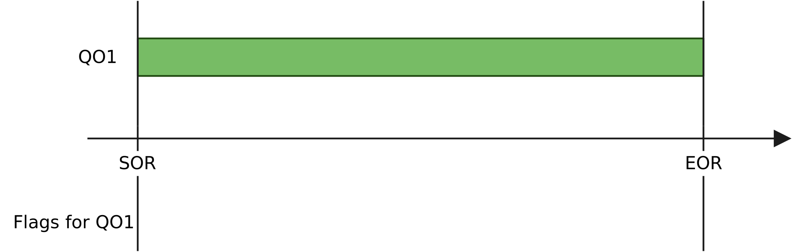
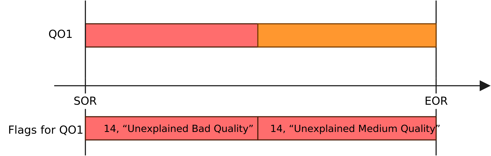
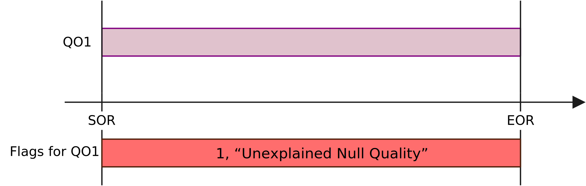
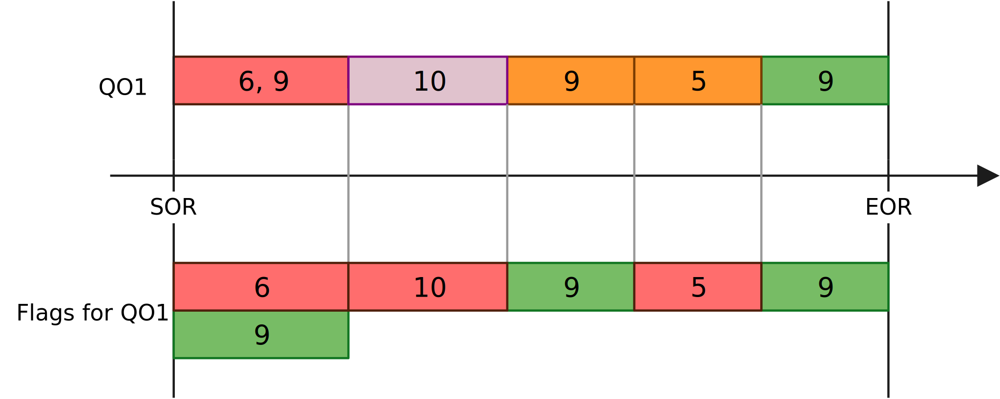
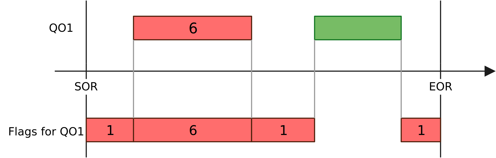
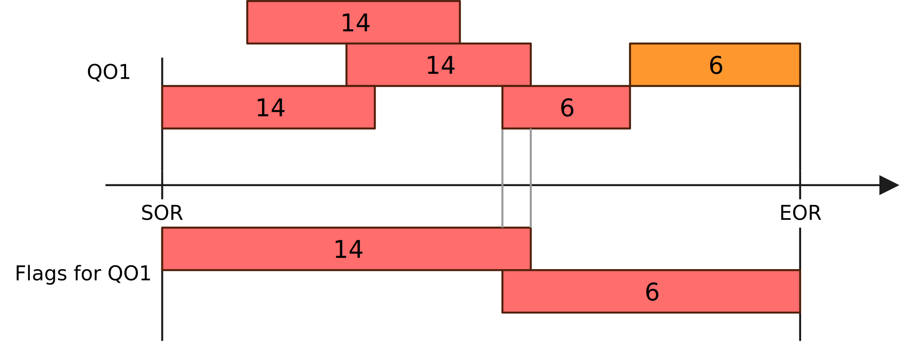
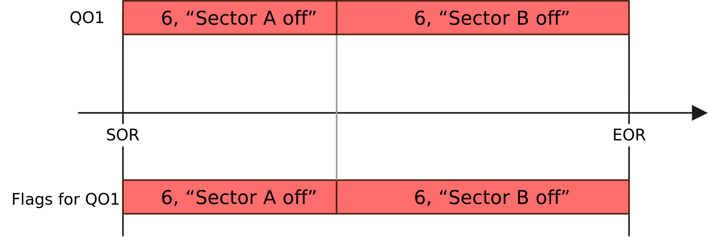
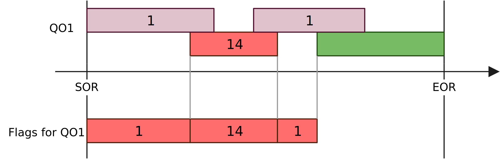
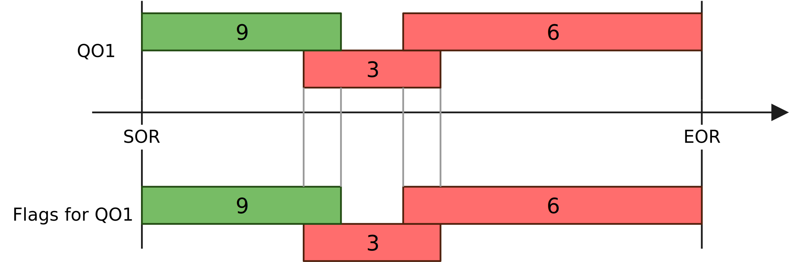
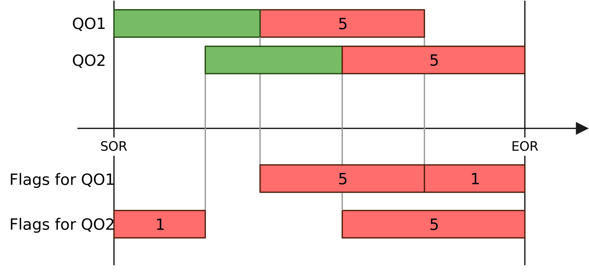

Framework
---

<!--TOC generated with https://github.com/ekalinin/github-markdown-toc-->
<!--./gh-md-toc --insert --no-backup --hide-footer --indent 3 QualityControl/doc/Advanced.md -->
<!--ts-->
   * [Plugging the QC to an existing DPL workflow](#plugging-the-qc-to-an-existing-dpl-workflow)
   * [Production of QC objects outside this framework](#production-of-qc-objects-outside-this-framework)
   * [Multi-node setups](#multi-node-setups)
   * [Batch processing](#batch-processing)
   * [Moving window](#moving-window)
   * [Monitor cycles](#monitor-cycles)
   * [Custom merging](#custom-merging)
   * [Critical, resilient and non-critical tasks](#critical-resilient-and-non-critical-tasks)
   * [QC with DPL Analysis](#qc-with-dpl-analysis)
   * [Propagating Check results to RCT in Bookkeeping](#propagating-check-results-to-rct-in-bookkeeping)
   * [Solving performance issues](#solving-performance-issues)
   * [Understanding and reducing memory footprint](#understanding-and-reducing-memory-footprint)
   * [Monitoring](#monitoring)
<!--te-->

## Plugging the QC to an existing DPL workflow

Your existing DPL workflow can simply be considered a publisher. Therefore, you can simply replace `o2-qc-run-producer` with your own workflow in the examples we have seen so far. 

As an example, if TPC wants to monitor the workflow `o2-qc-run-tpcpid`, modify the config file to point to the correct data and do :

```
o2-qc-run-tpcpid | o2-qc --config json://${QUALITYCONTROL_ROOT}/etc/tpcQCPID.json
```

The config file `tpcQCPID.json` has to specify what output we want to monitor. E.g. if the tpc workflow has the output `{"TPC", "CLUSTERS"}`, we should add a dataSamplingPolicy for it and refer to it in a task : 

```
  "dataSamplingPolicies": [
    {
      "id": "tpc-cluster",              "":"ID we refer to"
      "active": "true",
      "machines": [],
      "query" : "data:TPC/CLUSTERS",    "":"The query to match the output in the workflow"
      "samplingConditions": [
        {
          "condition": "random",
          "fraction": "0.1",
        }
      ],
      "blocking": "false"
    },
(...)    
    "someTask": {
        "active": "true",
        "className": "o2::quality_control_modules::skeleton::SkeletonTask",
        "moduleName": "QcSkeleton",
        "detectorName": "TST",
        "cycleDurationSeconds": "60",
        "dataSource": {
          "type": "dataSamplingPolicy",
          "name": "tpc-cluster",          "":"Refer to the ID of the policy"
        }
      }
```
The "query" syntax of the policy is the same as the one used in the DPL. It must match the output of another device, whether it is in the same workflow or in a piped one.
The `binding` (first part, before the colon) is used in the path of the stored objects and thus we encourage to use the task name to avoid confusion. Moreover, the `origin` (first element after the colon) is used as detectorName.

## Production of QC objects outside this framework

QC objects (e.g. histograms) are typically produced in a QC task.
This is however not the only way. Some processing tasks such as the calibration
might have already processed the data and produced histograms that should be
monitored. Instead of re-processing and doing twice the work, one can simply
push this QC object to the QC framework where it will be checked and stored.

### Configuration

Let be a device in the main data flow that produces a histogram on a channel defined as `TST/HISTO/0`. To get this histogram in the QC and check it, add to the configuration file an "external device":

```yaml
    "externalTasks": {
      "External-1": {
        "active": "true",
        "query": "External-1:TST/HISTO/0" ,  "":"Query specifying where the objects to be checked and stored are coming from. Use the task name as binding. The origin (e.g. TST) is used as detector name for the objects."
      }
    },
    "checks": {
```

### Example 1: basic

As a basic example, we are going to produce histograms with the HistoProducer and collect them with the QC. The configuration is in [basic-external-histo.json](https://github.com/AliceO2Group/QualityControl/blob/master/Framework/basic-external-histo.json). An external task is defined and named "External-1" (see subsection above). It is then used in the Check QCCheck :

```yaml
      "QcCheck": {
        "active": "true",
        "className": "o2::quality_control_modules::skeleton::SkeletonCheck",
        "moduleName": "QcSkeleton",
        "policy": "OnAny",
        "detectorName": "TST",
        "dataSource": [{
          "type": "ExternalTask",
          "name": "External-1",
          "MOs": ["hello"]
        }]
      }
```

When using this feature, make sure that the name of the MO in the Check definition matches the name of the object you are sending from the external device.

To run it, do:

```yaml
o2-qc-run-histo-producer | o2-qc --config  json://${QUALITYCONTROL_ROOT}/etc/basic-external-histo.json
```

The object is visible in the QCG or the CCDB at `qc/TST/MO/External-1/hello_0`. In general we publish the objects of an external device at `qc/<detector>/MO/<binding>/object`.

The check results are stored at `qc/<detector>/QO/<binding>/object`.

### Example 2: advanced

This second, more advanced, example mixes QC tasks and external tasks. It is defined in [advanced-external-histo.json](https://github.com/AliceO2Group/QualityControl/blob/master/Framework/advanced-external-histo.json). It is represented here:


First, it runs 1 QC task (QC-TASK-RUNNER-QcTask) getting data from a data producer (bottom boxes, typical QC worfklow).

On top we see 3 histogram producers. `histoProducer-2` is not part of the QC, it is not an external device defined in the configuration file. The two other histogram producers are configured as external devices in the configuration file.

`histoProducer-0` produces an object that is used in a check (`QcCheck-External-1`). `histoProducer-1` objects are not used in any check but we generate one automatically to take care of the storage in the database.

To run it, do:

```yaml
o2-qc-run-producer | o2-qc-run-histo-producer --producers 3 --histograms 3 | o2-qc --config  json://${QUALITYCONTROL_ROOT}/etc/advanced-external-histo.json 
```

### Limitations

1. Objects sent by the external device must be either a TObject or a TObjArray. In the former case, the object will be sent to the checker encapsulated in a MonitorObject. In the latter case, each TObject of the TObjArray is encapsulated in a MonitorObject and is sent to the checker.

## Multi-node setups

During the data-taking, Quality Control runs on a distributed computing system. Some QC Tasks are
executed on dedicated QC servers, while others run on FLPs and EPNs. In the latter case, messages
coming from Data Sampling should reach QC servers where they are processed. In the first case,
locally produced Monitor Objects should be merged on QC servers and then have Checks run on them.
By **remote QC tasks** we mean those which run on QC servers (**remote machines**), while **local QC Tasks**
run on FLPs and EPNs (**local machines**).

Setting up a multinode setup to run standalone or with AliECS requires different amount of parameters,
as some of them are overwritten by AliECS anyway. Such parameters are marked accordingly. Please note
that for now we support cases with one or more local machines, but just only one remote machine.

In our example, we assume having two local processing nodes (`localnode1`, `localnode2`) and one
QC node (`qcnode`). There are two types of QC Tasks declared:
* `MultiNodeLocal` which are executed on the local nodes and their results are merged and checked
  on the QC server.
* `MultiNodeRemote` which runs on the QC server, receiving a small percent of data from
  `localnode2` only. Mergers are not needed in this case, but there is a process running Checks against
  Monitor Objects generated by this Task.

We use the `SkeletonTask` class for both, but any Task can be used of course. Should a Task be local,
all its `MonitorObject`s need to be mergeable - they should be one of the mergeable ROOT types (histograms, TTrees)
or inherit [MergeInterface](https://github.com/AliceO2Group/AliceO2/blob/dev/Utilities/Mergers/include/Mergers/MergeInterface.h).

These are the steps to follow to get a multinode setup:

1. Prepare a configuration file.

In this example we will use the `Framework/multiNode.json` config file. A config file should look
almost like the usual one, but with a few additional parameters. In case of a local task, these parameters should be
added:

```json
    "tasks": {
      "MultiNodeLocal": {
        "active": "true",
        ...
        "location": "local",
        "localMachines": [
          "localnode1",
          "localnode2"
        ],
        "remoteMachine": "qcnode",     "":"not needed with FLP+QC, needed with EPN+QC",
        "remotePort": "30132",         "":"not needed with FLP+QC, needed with EPN+QC",
        "localControl": "aliecs",      "":"if absent, aliecs is default",
        "mergingMode": "delta",        "":"if absent, delta is default",
        "mergersPerLayer": ["3", "1"], "":"if absent, one Merger is used" 
      }
    },
```

List the local processing machines in the `localMachines` array. `remoteMachine` should contain the host name which
will serve as a QC server and `remotePort` should be a port number on which Mergers will wait for upcoming MOs. Make
sure it is not used by other service. If different QC Tasks are run in parallel, use separate ports for each. The
`localControl` parameter allows to properly configure QC with respect to the control software it is run with. It can
be either `aliecs` (on FLPs) or `odc` (EPNs). It has no influence when running the software by hand.

One also may choose the merging mode - `delta` is the default and recommended (tasks are reset after each cycle, so they
send only updates), but if it is not feasible, Mergers may expect `entire` objects - tasks are not reset, they
always send entire objects and the latest versions are combined in Mergers.
With the `delta` mode, one can cheat by specifying just one local machine name and using only that one during execution.
This is not possible with `entire` mode, because then Mergers need identifiable data sources to merge objects correctly.
If one merger process is not enough to sustain the input data throughput, one may define multiple Merger layers with
`mergersPerLayer` option.

In case of a remote task, choosing `"remote"` option for the `"location"` parameter is needed. In standalone setups
and those controlled by ODC, one should also specify the `"remoteMachine"`, so sampled data reaches the right node.
Also, `"localControl"` should be specified to generate the correct AliECS workflow template.

```json
    "tasks": {
      ...
      "MultiNodeRemote": {
        "active": "true",
        ...
        "dataSource": {
          "type": "dataSamplingPolicy",
          "name": "rnd-little"
        },
        "taskParameters": {},
        "location": "remote",
        "remoteMachine": "qcnode",   "":"not needed with FLP+QC, needed with EPN+QC",
        "localControl": "aliecs",    "":"aliecs is default, not needed with FLP+QC, needed with EPN+QC"
      }
    }
```

In case the task is running remotely, data should be sampled. The minimal-effort approach requires adding a port number
(see the example below). Use separate ports for each Data Sampling Policy. If the same configuration file will be used
on many nodes, but only some of them should apply a given sampling policy, one should also specify the list of
machines to match (or generalized aliases, e.g. "flp", "epn").

```json
{
  "dataSamplingPolicies": [
    ...
    {
      "id": "rnd-little",
      "active": "true",
      "machines": [        "","only needed when the policy should run on a subgroup of nodes",
        "localnode2"
      ],
      "port": "30333",     "":"compulsory on standalone and ODC setups (EPN), not needed for FLPs",
      ...
    }
  ]
}
```

By default, the channel is bound on the QC Task side. If this is not what you need, add `"bindLocation" : "local"` in
the policy configuration (`"remote"` is the default value) and make sure to use valid host names.

2. Make sure that the firewalls are properly configured. If your machines block incoming/outgoing connections by
   default, you can add these rules to the firewall (run as sudo). Consider enabling only concrete ports or a small
   range of those.

```
# localnode1 and localnode2 :
iptables -I INPUT -p tcp -m conntrack --ctstate NEW,ESTABLISHED -s qcnode -j ACCEPT
iptables -I OUTPUT -p tcp -m conntrack --ctstate NEW,ESTABLISHED -d qcnode -j ACCEPT
# qcnode:
iptables -I INPUT -p tcp -m conntrack --ctstate NEW,ESTABLISHED -s localnode1 -j ACCEPT
iptables -I OUTPUT -p tcp -m conntrack --ctstate NEW,ESTABLISHED -d localnode1 -j ACCEPT
iptables -I INPUT -p tcp -m conntrack --ctstate NEW,ESTABLISHED -s localnode2 -j ACCEPT
iptables -I OUTPUT -p tcp -m conntrack --ctstate NEW,ESTABLISHED -d localnode2 -j ACCEPT
```

If your network is isolated, you might consider disabling the firewall as an alternative. Be wary of the security risks.

```
systemctl stop firewalld     # to disable until reboot
systemctl disable firewalld  # to disable permanently
```

3. Install the same version of the QC software on each of these nodes. We cannot guarantee that different QC versions will talk to each other without problems. Also, make sure the configuration file that you will use is the same everywhere.

4. Run each part of the workflow. In this example `o2-qc-run-producer` represents any DPL workflow, here it is just a process which produces some random data.
   The `--host` argument is matched against the `machines` lists in the configuration files.

```
# On localnode1:
o2-qc-run-producer | o2-qc --config json:/${QUALITYCONTROL_ROOT}/etc/multiNode.json --local --host localnode1 -b
# On localnode2:
o2-qc-run-producer | o2-qc --config json:/${QUALITYCONTROL_ROOT}/etc/multiNode.json --local --host localnode2 -b
# On qcnode:
o2-qc --config json:/${QUALITYCONTROL_ROOT}/etc/multiNode.json --remote
```

If there are no problems, on QCG you should see the `example` histogram updated under the paths `qc/TST/MO/MultiNodeLocal`
and `qc/TST/MO/MultiNodeRemote`, and corresponding Checks under the path `qc/TST/QO/`.

When using AliECS, one has to generate workflow templates and upload them to the corresponding repository. Please
contact the QC or AliECS developers to receive assistance or instructions on how to do that.

## Batch processing

In certain cases merging results of parallel QC Tasks cannot be performed in form of message passing.
An example of this are the simulation workflows, which exchange data between processing stages via files
and produce (and process) consecutive TimeFrames in different directories in parallel.
Then, one can run QC Tasks on incomplete data and save the results to a file.
If the file already exists, the new objects will be merged with those obtained so far.
At the end, one can run the rest of processing chain (Checks, Aggregators) on the complete objects.

Here is a simple example:

```bash
# Remove any existing results
rm results.root
# Run the Tasks 3 times, merge results into the file.
o2-qc-run-producer --message-amount 100 | o2-qc --config json:/${QUALITYCONTROL_ROOT}/etc/basic.json --local-batch results.root
o2-qc-run-producer --message-amount 100 | o2-qc --config json:/${QUALITYCONTROL_ROOT}/etc/basic.json --local-batch results.root
o2-qc-run-producer --message-amount 100 | o2-qc --config json:/${QUALITYCONTROL_ROOT}/etc/basic.json --local-batch results.root
# Run Checks and Aggregators, publish results to QCDB
o2-qc --config json:/${QUALITYCONTROL_ROOT}/etc/basic.json --remote-batch results.root
```

Please note, that the local batch QC workflow should not work on the same file at the same time.
A semaphore mechanism is required if there is a risk they might be executed in parallel.

The file is organized into directories named after 3-letter detector codes and sub-directories representing Monitor Object Collections for specific tasks.
To browse the file, one needs the associated Quality Control environment loaded, since it contains QC-specific data structures.
It is worth remembering, that this file is considered as intermediate storage, thus Monitor Object do not have Checks applied and cannot be considered the final results.
The quick and easy way to inspect the contents of the file is to load a recent environment (e.g. on lxplus) and open it with ROOT's `TBrowser`:

```shell
alienv enter O2PDPSuite/nightly-20221219-1
root
TBrowser t; // a browser window will pop-up 
```

...or by browsing the file manually:

```shell
alienv enter O2PDPSuite/nightly-20221219-1
root
root [0] auto f = new TFile("QC_fullrun.root")
(TFile *) @0x7ffe84833dc8
root [1] f->ls()
TFile**  QC_fullrun.root 
 TFile*  QC_fullrun.root 
  KEY: TDirectoryFile CPV;1 CPV
  KEY: TDirectoryFile EMC;1 EMC
  KEY: TDirectoryFile FDD;1 FDD
  KEY: TDirectoryFile FT0;1 FT0
  KEY: TDirectoryFile FV0;1 FV0
  KEY: TDirectoryFile GLO;1 GLO
  KEY: TDirectoryFile ITS;1 ITS
...
root [2] f->cd("GLO")
(bool) true
root [3] f->ls()
TFile**  QC_fullrun.root 
 TFile*  QC_fullrun.root 
  TDirectoryFile*  GLO GLO
   KEY: o2::quality_control::core::MonitorObjectCollection MTCITSTPC;1 
   KEY: o2::quality_control::core::MonitorObjectCollection Vertexing;1 
  KEY: TDirectoryFile CPV;1 CPV
...
root [4] auto vtx = dynamic_cast<o2::quality_control::core::MonitorObjectCollection*>(f->Get("GLO/Vertexing"))
(o2::quality_control::core::MonitorObjectCollection *) @0x7ffe84833dc8
root [5] auto vtx_x = dynamic_cast<o2::quality_control::core::MonitorObject*>(vtx->FindObject("vertex_X"))
(o2::quality_control::core::MonitorObject *) @0x7ffe84833dc8
root [6] vtx_x->getObject()->ClassName()
(const char *) "TH1F"
```

To merge several incomplete QC files, one can use the `o2-qc-file-merger` executable.
It takes a list of input files, which may or may not reside on alien, and produces a merged file.
One can select whether the executable should fail upon any error or continue for as long as possible.
Please see its `--help` output for usage details.

## Moving window

### Moving window for all plots generated by a task

By default QC Tasks are never reset, thus the MOs they produce contain data from the full run.
However, if objects should have a shorter validity range, one may add the following options to QC Task configuration:

```json
  "MovingWindowTaskA": {
    ...
    "resetAfterCycles": "10",
  }
```

In the case above the QC Task will have the `TaskInterface::reset()` method invoked each 10 cycles.
Thus, all the plots generated by this task will by affected.

If the QC Task runs in parallel on many nodes and its results are merged, the effects will be different
depending on the chosen merging mode:
* If `"delta"` mode is used, the Merger in the last layer will implement the moving window, while the QC Tasks will
  still reset after each cycle. Please note, that QC Tasks will fall out of sync during data acquisition, so the moving
  window might contain slightly misaligned data time ranges coming from different sources. Also, due to fluctuations of
  the data transfer, objects coming from different sources might appear more frequently than others. Thus, one might
  notice higher occupancy on stave A one time, but the next object might contain less than average data for the same stave.
* In the `"entire"` mode, QC Tasks will reset MOs, while Mergers will use the latest available object version from each
  Task. Please note that if one of the Tasks dies, an old version of MO will be still used over and over. Thus, `"delta"`
  mode is advised in most use cases.

In setups with Mergers one may also extend the Mergers cycle duration, which can help to even out any data fluctuations:

```json
   "MovingWindowTaskB": {
     ...
     "cycleDurationSeconds" : "60",
     "mergingMode" : "delta",
     "mergerCycleMultiplier": "10",  "": "multiplies cycleDurationSeconds in Mergers",
     "resetAfterCycles": "1",        "": "it could be still larger than 1"
   }
 ```

In the presented case, the Merger will publish one set of complete MOs per 10 minutes, which should contain all deltas
received during this last period. Since the QC Tasks cycle is 10 times shorter, the occupancy fluctuations should be
less apparent. Please also note, that using this parameter in the `"entire"` merging mode does not make much sense,
since Mergers would use every 10th incomplete MO version when merging.

### Moving windows of selected plots only

The following applies to synchronous setups which use Mergers in the delta mode and all asynchronous setups.
One can obtain objects containing data from one cycle alongside the ones covering the whole run.
These are saved in QCDB in the task subdirectory `mw` and also can be requested by Checks.
To specify which objects should get a moving window variant, add a `"movingWindows"` list to the task configuration:

```json
   "MyTask": {
     ...
     "cycleDurationSeconds" : "60",
     "mergingMode" : "delta",
     "movingWindows" : [ "plotA", "plotB" ]
   }
```

To request these objects in a Check, use `TaskMovingWindow` data source, as in the example:

```json
      "QcCheckMW": {
        "dataSource": [{
          "type": "TaskMovingWindow",
          "name": "MyTask",
          "MOs": ["plotA"], "": "MOs can be omitted if all moving windows of a task are requested" 
        }]
      }
```

It is possible to request both the integrated and single cycle plots by the same Check.

To test it in a small setup, one can run `o2-qc` with `--full-chain` flag, which creates a complete workflow with a Merger for **local** QC tasks, even though it runs just one instance of them.
Please remember to use `"location" : "local"` in such case.

In asynchronous QC, the moving window plots will appear in the intermediate QC file in the directory `mw` and will be uploaded to QCDB to `<task_name>/mw`.
When testing, please make sure to let DPL know that it has to run in Grid mode, so that QC can compute object validity based on timestamps in the data:

```
export O2_DPL_DEPLOYMENT_MODE=Grid && o2-qc --local-batch QC.root ...
```

## Monitor cycles

The QC tasks monitor and process data continuously during a so-called "monitor cycle". At the end of such a cycle they publish the QC objects that will then continue their way in the QC data flow.
Since v1.178.0 cycles are stored in the metadata of QOs and MOs under the key `CycleNumber` inside the QCDB.

A monitor cycle lasts typically between **1 and 5 minutes**, some reaching 10 minutes but never less than 1 minute for performance reasons.
It is defined in the config file this way:

```
    "tasks": {
      "dataSizeTask": {
        "cycleDurationSeconds": "60",
       ...
```

It is possible to specify various durations for different period of times. It is particularly useful to have shorter cycles at the beginning of the run and longer afterwards:

```
    "tasks": {
      "dataSizeTask": {
        "cycleDurations": [
          {"cycleDurationSeconds": 60, "validitySeconds": 300},
          {"cycleDurationSeconds": 180, "validitySeconds": 600},
          {"cycleDurationSeconds": 300, "validitySeconds": 1}
        ],
        ...
```

In this example, a cycle of 60 seconds is used for the first 5 minutes (300 seconds), then a cycle of 3 minutes (180 seconds) between 5 minutes and 10 minutes after SOR, and finally a cycle of 5 minutes for the rest of the run. The last `validitySeconds` is not used and is just applied for the rest of the run.


## Custom merging

When needed, one may define their own algorithm to merge a Monitor Object.
To do so, inherit the [MergeInterface](https://github.com/AliceO2Group/AliceO2/blob/dev/Utilities/Mergers/include/Mergers/MergeInterface.h) class and override the corresponding methods.
Please pay special attention to delete all the allocated resources in the destructor to avoid any memory leaks.
Feel free to consult the existing usage examples among other modules in the QC repository.

Once a custom class is implemented, one should let QCG know how to display it correctly, which is explained in the subsection [Display a non-standard ROOT object in QCG](#display-a-non-standard-root-object-in-qcg).

## Critical, resilient and non-critical tasks

DPL devices can be marked as expendable, resilient or critical. Expendable tasks can die without affecting the run.
Resilient tasks can survive having one or all their inputs coming from an expendable task but they will stop the system if they themselves die.
Critical tasks (default) will stop the system if they die and will not accept input from expendable tasks.

In QC we use these `labels`.

### QC tasks

In QC, one can mark a task as critical or non-critical:

```json
    "tasks": {
      "QcTask": {
        "active": "true",
        "critical": "false",     "": "if false the task is allowed to die without stopping the workflow, default: true",
```

By default they are `critical` meaning that their failure will stop the run.
If they are not critical, they will be `expendable` and will not stop the run if they die.

### Auto-generated proxies

They adopt the criticality of the task they are proxying.

### QC mergers

Mergers are `resilient`.

### QC check runners

CheckRunners are `resilient`.

### QC aggregators

Aggregators are `resilient`.

### QC post-processing tasks

Post-processing tasks can be marked as critical or non-critical:

```json
    "postprocessing": {
      "ExamplePostprocessing": {
        "active": "true",
        "critical": "false",     "": "if false the task is allowed to die without stopping the workflow, default: true",
```

By default, they are critical meaning that their failure will stop the run.
If they are not critical, they will be `expendable` and will not stop the run if they die.

### QC late tasks

Late tasks can be marked as critical or non-critical:
```json
    "lateTasks": {
      "LateTaskExample": {
        "active": "true",
        "critical": "false",   "": "if false the task is allowed to die without stopping the workflow, default: true",
```

## QC with DPL Analysis

### Uploading objects to QCDB

To upload objects written to a file by an Analysis Task to QCDB, one may use the following command:

```shell script
o2-qc-upload-root-objects \
  --input-file ./QAResults.root \
  --qcdb-url ccdb-test.cern.ch:8080 \
  --task-name AnalysisFromFileTest \
  --detector-code TST \
  --provenance qc_mc \
  --pass-name passMC \
  --period-name SimChallenge \ 
  --run-number 49999
```

See the `--help` message for explanation of the arguments.
If everything went well, the objects should be accessible in [the test QCG instance](https://qcg-test.cern.ch) under
the directories listed in the logs:

```
2021-10-05 10:59:41.408998     QC infologger initialized
2021-10-05 10:59:41.409053     Input file './QAResults.root' successfully open.
...
2021-10-05 10:59:41.585893     Storing MonitorObject qc_mc/TST/MO/AnalysisFromFileTest/hMcEventCounter
2021-10-05 10:59:41.588649     Storing MonitorObject qc_mc/TST/MO/AnalysisFromFileTest/hGlobalBcFT0
2021-10-05 10:59:41.591542     Storing MonitorObject qc_mc/TST/MO/AnalysisFromFileTest/hTimeT0Aall
2021-10-05 10:59:41.594386     Storing MonitorObject qc_mc/TST/MO/AnalysisFromFileTest/hTimeT0Call
2021-10-05 10:59:41.597743     Successfully uploaded 10 objects to the QCDB.
```

Notice that by default the executable will ignore the directory structure in the input file and upload all objects to one directory.
If you need the directory structure preserved, add the argument `--preserve-directories`.

## Propagating Check results to RCT in Bookkeeping

The framework allows to propagate Quality Objects (QOs) produced by Checks and Aggregators to RCT in Bookkeeping.
The synchronisation is done once, at the end of workflow runtime, i.e. at the End of Run or in the last stage of QC merging on Grid.
Check results are converted into Flags, which are documented in [O2/DataFormats/QualityControl](https://github.com/AliceO2Group/AliceO2/tree/dev/DataFormats/QualityControl).
Information about the object validity is preserved, which allows for time-based flagging of good/bad data.

### Configuration details

Propagation can be enabled by adding the following key-value pair to Check/Aggregator configuration:

```json
    "exportToBookkeeping": "true"
```

Using it for Aggregators is discouraged, as the information on which exact Check failed is lost or at least obfuscated.

To allow QC to connect to Bookkeeping, include the its URL in the QC configuration file, e.g.:

```json
{
  "qc": {
    "config": {
      "bookkeeping": {
        "url": "bookkeeping.cern.ch:12345"
      }
    }
  }
}
```

For setups external to P2, one also needs to provide a BKP client token.
It can be done by creating a file named `qc_bkp_client_token.txt` in the working directory, containing just the token.
In such case, please ensure minimal permissions for the file, so that it is not readable by other users.
Alternatively, it can be provided as an environment variable `QC_BKP_CLIENT_TOKEN`.
Then, avoid printing the environment variable in the logs.

### Conversion details

Below we describe some details of how the conversion is done.
Good QOs are marked with green, Medium QOs are marked with orange and Bad QOs are marked with red.
Null QOs are marked with purple.

* **Good QOs with no Flags associated are not converted to any Flags.**
  According to the preliminary design for Data Tagging, "bad" Flags always win, thus there is no need for explicit "good" Flags.
  It also implies that there is no need to explicitly add Good Flag to Good Quality.



* **Bad and Medium QOs with no Flags are converted to Flag 14 (Unknown).**
  This means that Medium Quality data is by default bad for Analysis.



* **Null QOs with no Flags are converted to Flag 1 (Unknown Quality).**



* **All QOs with Flags are converted to Flags, while the Quality is ignored.**
  As a consequence, one can customize the meaning of any Quality (Medium in particular) in terms of data usability.
  A warning is printed if a Check associates a good Flag to bad Quality or a bad Flag to good Quality.



* **Timespans not covered by a given QO are filled with Flag 1 (Unknown Quality).**
  In other words, if an object was missing during a part of the run, we can state that the data quality is not known.



* **Overlapping or adjacent Flags with the same ID, comment and source (QO name) are merged.**.
  This happens even if they were associated with different Qualities, e.g. Bad and Medium.
  Order of Flag arrival does not matter.




* **Flag 1 (Unknown Quality) is overwritten by any other Flag.**
  This allows us to return Null Quality when there is not enough statistics to determine data quality, but it can be suppressed later, once we can return Good/Medium/Bad.



* **Good and Bad flags do not affect each other, they may coexist.**



* **Flags for different QOs (QO names) do not affect each other.
  Flag 1 (Unknown Quality) is added separately for each.**



## Registration of QC devices into the BookKeeping

By default, the QC tasks, PP tasks, check runners, and aggregators are registered in the BK. 
To disable this behaviour, pass the following environment variable : `O2_QC_DONT_REGISTER_IN_BK` (in the ECS). 

## Solving performance issues

Problems with performance in message passing systems like QC usually manifest in backpressure seen in input channels of processes which are too slow.
QC processes usually use one worker thread, thus one can also observe that they use a full CPU core when struggling to consume incoming data.
When observing performance issues with QC setups, consider the following actions to improve it.

### Dispatcher

Dispatcher will usually cause backpressure when it is requested to sample too much data.
In particular, copying many small messages takes more time than less messages of equivalent size.
To improve the performance:
* reduce the sampling rate
* disable unused sampling policies
* adapt the data format to pack data in fewer messages
* when in need of 100% data, do not use Data Sampling, but connect to the data source directly

### QC Tasks

QC Tasks are implemented by the users, thus the maximum possible input data throughput largely depends on the task implementation.
If a QC Task cannot cope with the input messages, consider:
* sampling less data
* using performance measurement tools (like `perf top`) to understand where the task spends the most time and optimize this part of code
* if one task instance processes data, spawn one task per machine and merge the result objects instead

### Mergers

The performance of Mergers depends on the type of objects being merged, as well as their number and size.
The following points might help avoid backpressure:
* increase QC tasks cycle duration
* use less or smaller objects
* if an object has its custom Merge() method, check if it could be optimized
* enable multi-layer Mergers to split the computations across multiple processes (config parameter "mergersPerLayer")

## Understanding and reducing memory footprint

When developing a QC module, please be considerate in terms of memory usage.
Large histograms could be optionally enabled/disabled depending on the context that the QC is ran.
Investigate if reducing the bin size (e.g. TH2D to TH2F) would still provide satisfactory results.
Consider loading only the parts of detector geometry which are being used by a given task.

### Analysing memory usage with valgrind

0) Install valgrind, if not yet installed

1) Run the QC workflow with argument `--child-driver 'valgrind --tool=massif'` (as well as any file reader / processing workflow you need to obtain data in QC)

2) The workflow will run and save files massif.out.<pid>

3) Generate a report for the file corresponding to the PID of the QC task:

```
ms_print massif.out.976329 > massif_abc_task.log
```

4) The generated report contains:
* the command used to run the process
* graph of the memory usage
* grouped call stacks of all memory allocations on the heap (above certain threshold) within certain time intervals.
  The left-most call contains all the calls which lead to it, represented on the right.
  For example, the call stack below means that the AbcTask created a TH2F histogram in the initalize method at the line
  AbcTask.cxx:82, which was 51,811,760B. In total, 130,269,568B worth of TH2F histograms were created in this time interval.

```
98.56% (256,165,296B) (heap allocation functions) malloc/new/new[], --alloc-fns, etc.
->50.12% (130,269,568B) 0xFCBD1A6: TArrayF::Set(int) [clone .part.0] (TArrayF.cxx:111)
| ->50.12% (130,269,568B) 0xEC1DB1C: TH2F::TH2F(char const*, char const*, int, double, double, int, double, double) (TH2.cxx:3573)
|   ->19.93% (51,811,760B) 0x32416518: make_unique<TH2F, char const (&)[16], char const (&)[22], unsigned int const&, int, unsigned int const&, int, int, int> (unique_ptr.h:1065)
|   | ->19.93% (51,811,760B) 0x32416518: o2::quality_control_modules::det::AbcTask::initialize(o2::framework::InitContext&) (AbcTask.cxx:82)
```

5) To get a lightweight and more digestible output, consider running the massif report through the following command to get the summary of the calls only within a QC module. This essentially tells you how much memory a given line allocates.

```
[O2PDPSuite/latest] ~/alice/test-rss $> grep quality_control_modules massif_abc_task.log | sed 's/^.*[0-9][0-9]\.[0-9][0-9]\% //g' | sort | uniq
(242,371,376B) 0x324166B2: o2::quality_control_modules::det::AbcTask::initialize(o2::framework::InitContext&) (AbcTask.cxx:88)
(4,441,008B) 0x3241633F: o2::quality_control_modules::det::AbcTask::initialize(o2::framework::InitContext&) (AbcTask.cxx:76)
(4,441,008B) 0x32416429: o2::quality_control_modules::det::AbcTask::initialize(o2::framework::InitContext&) (AbcTask.cxx:79)
(51,811,760B) 0x32416518: o2::quality_control_modules::det::AbcTask::initialize(o2::framework::InitContext&) (AbcTask.cxx:82)
(51,811,760B) 0x324165EB: o2::quality_control_modules::det::AbcTask::initialize(o2::framework::InitContext&) (AbcTask.cxx:85)
```

6) Consider reducing the size and number of the biggest histogram. Consider disabling histograms which will not be useful for async QC (no allocations, no startPublishing).

## Monitoring

The QC uses the [O2 Monitoring](https://github.com/AliceO2Group/Monitoring/) library to monitor metrics.
The user code has access to an instance of the Monitoring via the variable `mMonitoring`.
It can be used this way:
```
mMonitoring->send({ 42, "my/metric" }); // send the value 42 keyed with "my/metric" 
```
By default the Monitoring will be printed in the terminal. If a proper Monitoring system
is setup, one can update the monitoring url in the config file to point to it.

---

[← Go back to Modules development](ModulesDevelopment.md) | [↑ Go to the Table of Content ↑](../README.md) | [Continue to Configuration →](Configuration.md)
