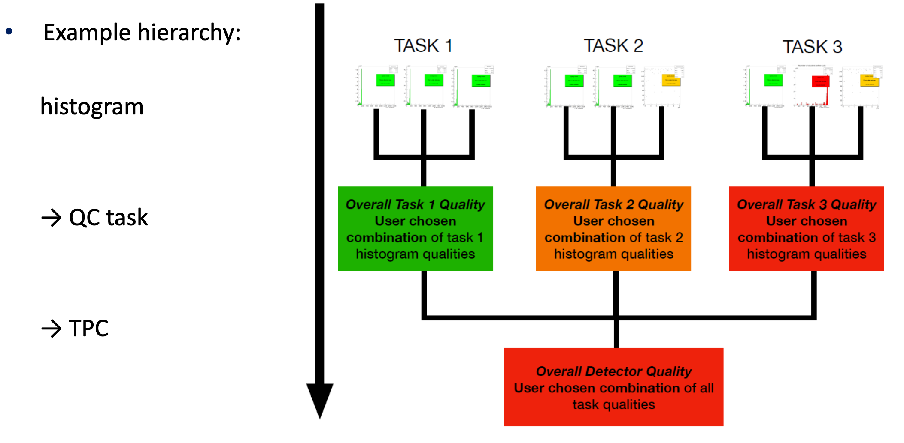

# Modules development

<!--TOC generated with https://github.com/ekalinin/github-markdown-toc-->
<!--./gh-md-toc --insert /path/to/README.md-->
<!--ts-->
   * [Modules development](#modules-development)
      * [Context](#context)
         * [QC architecture](#qc-architecture)
         * [DPL](#dpl)
         * [Data Sampling](#data-sampling)
            * [Custom Data Sampling Condition](#custom-data-sampling-condition)
            * [Bypassing the Data Sampling](#bypassing-the-data-sampling)
         * [Code Organization](#code-organization)
         * [Developing with aliBuild/alienv](#developing-with-alibuildalienv)
         * [User-defined modules](#user-defined-modules)
         * [Repository](#repository)
            * [Paths](#paths)
      * [Module creation](#module-creation)
      * [Test run](#test-run)
         * [Saving the QC objects in a local file](#saving-the-qc-objects-in-a-local-file)
      * [Modification of the Task](#modification-of-the-task)
      * [Check](#check)
         * [Configuration](#configuration)
         * [Implementation](#implementation)
      * [Quality Aggregation](#quality-aggregation)
         * [Quick try](#quick-try)
         * [Configuration](#configuration-1)
         * [Implementation](#implementation-1)
      * [Committing code](#committing-code)
      * [Data sources](#data-sources)
         * [Readout](#readout)
         * [DPL workflow](#dpl-workflow)
      * [A more advanced example](#a-more-advanced-example)
      * [Monitoring](#monitoring)

<!-- Added by: bvonhall, at:  -->

<!--te-->

[← Go back to Quickstart](QuickStart.md) | [↑ Go to the Table of Content ↑](../README.md) | [Continue to Post-processing →](PostProcessing.md)

## Context

Before developing a module, one should have a bare idea of what the QualityControl is and how it is designed. The following sections explore these aspects.

### QC architecture


The main data flow is represented in blue. Data samples are selected by the Data Sampling (not represented) and sent to the QC tasks, either on the same machines or on other machines. The tasks produce TObjects, usually histograms, encapsulated in a MonitorObject that are merged (if needed) and then checked. The checkers output a QualityObject along with the MonitorObjects which might have been modified. The MonitorObjects and the QualityObjects are stored in the repository. The QualityObjects can also optionally be aggregated by the Aggregators to produce additional QualityObjects that are also saved in the database. 

Asynchronously, the Post-processing can retrieve MonitorObjects from the database when certain events happen (new version of an object, new run) and produce new TObjects such as a trending plot.

### DPL

[Data Processing Layer](https://github.com/AliceO2Group/AliceO2/blob/dev/Framework/Core/README.md) is a software framework developed as a part of O2 project. It structurizes the computing into units called _Data Processors_ - processes that communicate with each other via messages. DPL takes care of generating and running the processing topology out of user declaration code, serializing and deserializing messages, providing the data processors with all the anticipated messages for a given timestamp and much more. Each piece of data is characterized by its `DataHeader`, which consists (among others) of `dataOrigin`, `dataDescription` and `SubSpecification` - for example `{"MFT", "TRACKS", 0}`.

An example of a workflow definition which describes the processing steps (_Data Processors_), their inputs and their outputs can be seen in [runBasic.cxx](https://github.com/AliceO2Group/QualityControl/blob/master/Framework/src/runBasic.cxx). In the QC we define the workflows in files whose names are prefixed with `run`.

### Data Sampling

The Data Sampling provides the possibility to sample data in DPL workflows, based on certain conditions ( 5% randomly, when payload is greater than 4234 bytes or others, including custom conditions). The job of passing the right data is done by a data processor called `Dispatcher`. A desired data stream is specified in the form of Data Sampling Policies, defined in the QC JSON configuration file. Please refer to the main [Data Sampling readme](https://github.com/AliceO2Group/AliceO2/blob/dev/Framework/Core/README.md#data-sampling) for more details.

Data Sampling is used by Quality Control to feed the tasks with data. Below we present an example of a configuration file. It instructs Data Sampling to provide a QC task with 10% randomly selected data that has the header `{"ITS", "RAWDATA", 0}`. The data will be accessible inside the QC task by the binding `"raw"`.
```json
{
  "qc": {
    ...
    "tasks": {
      "QcTask": {
        ...
        "dataSource": {
          "type": "dataSamplingPolicy",
          "name": "its-raw"
        },
        ...
      }
    }
  },
  "dataSamplingPolicies": [
    {
      "id": "its-raw",
      "active": "true",
      "machines": [],
      "query_comment" : "query is in the format of binding1:origin1/description1/subSpec1[;binding2:...]",
      "query": "raw:ITS/RAWDATA/0",
      "samplingConditions": [
        {
          "condition": "random",
          "fraction": "0.1",
          "seed": "1234"
        }
      ],
      "blocking": "false"
    }
  ]
}
```

An example of using the data sampling in a DPL workflow is visible in [runAdvanced.cxx](https://github.com/AliceO2Group/QualityControl/blob/master/Framework/src/runAdvanced.cxx).

#### Custom Data Sampling Condition

If needed, a custom data selection can be performed by inheriting the `DataSamplingCondition` class and implementing the `configure` and `decide` methods. Then, to use it, one needs to specify the library and class names in the config file.

The class [ExampleCondition](https://github.com/AliceO2Group/QualityControl/blob/master/Modules/Example/include/Example/ExampleCondition.h) presents the how to write one's own condition, while in [example-default.json](https://github.com/AliceO2Group/QualityControl/blob/master/Framework/example-default.json) the policy `ex1` shows how it should be configured.

#### Bypassing the Data Sampling

In case one needs to sample at a very high rate, or even monitor 100% of the data, the Data Sampling can be omitted altogether. As a result the task is connected directly to the the Device producing the data to be monitored. To do so, change the _dataSource's_ type in the config file from `dataSamplingPolicy` to `direct`. In addition, add the information about the type of data that is expected (dataOrigin, binding, etc...) and remove the dataSamplingPolicies :  

```json
{
  "qc": {
    ...
    "tasks": {
      "QcTask": {
        ...
        "dataSource": {
          "type": "direct",
          "query_comment" : "query is in the format of binding1:origin1/description1/subSpec1[;binding2:...]",
          "query" : "its-raw-data:ITS/RAWDATA/0"
        },
        ...
      }
    }
  },
  "dataSamplingPolicies": [
  ]
}
```

The file `basic-no-sampling.json` is provided as an example. To test it, you can run `o2-qc` with that configuration file instead of `basic.json`.

To use multiple direct data sources, just place them one after another in the value of `"query"`, separated with a semicolon. For example:
```
"query" : "emcal-digits:EMC/DIGITS/0;emcal-triggers:EMC/TRIGGERS/0"
```

### Code Organization

The repository QualityControl contains the _Framework_  and the _Modules_ in the respectively named directories.

The Data Sampling code is part of the AliceO2 repository.

### Developing with aliBuild/alienv

One can of course build using `aliBuild` (`aliBuild build --defaults o2 QualityControl`). However, that will take quite some time as it checks all dependencies and builds everything. 

After the initial use of `aliBuild`, which is necessary, the correct way of building is to load the environment with `alienv` and then go to the build directory and run `make` or `ninja`.

```
alienv load QualityControl/latest
cd sw/BUILD/QualityControl-latest/QualityControl
make -j8 install # or ninja -j8 install , also adapt to the number of cores available
```

If you need to use the QCG or Readout, load `O2Suite` instead of `QualityControl`.

### User-defined modules

The Quality Control uses _plugins_ to load the actual code to be executed by the _Tasks_, the _Checks_, the _Aggregators_ and the _PostProcessing_. A module, or plugin, can contain one or several of these classes. They must subclass the corresponding interfaces, for example `TaskInterface.h` or `CheckInterface.h`. We use the Template Method Design Pattern.

The same code, the same class, can be run many times in parallel. It means that one can run several copies of the same qc Task in parallel, each executing the same code but on different data samples, typically on different nodes. 

### Repository

QC results (MonitorObjects and QualityObjects) are stored in a repository that we usually call the QCDB. Indeed, the underlying technology is the one of the CCDB (Condition and Calibration DataBase). As a matter of fact we use the test instance of the CCDB for the tests and development (ccdb-test.cern.ch:8080). In production, we will have a different instance distinct from the CCDB. 

#### Paths

We use a consistent system of path for the objects we store in the QCDB:
* MonitorObjects: ```qc/<detectorCode>/MO/<taskName>/<moName>```
* QualityObjects: ```qc/<detectorCode>/QO/<checkName>[/<moName>]```  
The last, optional, part depends on the policy (read more about that [later](#Check)).

## Module creation

Before starting to develop the code, one should create a new module if it does not exist yet. Typically each detector team should prepare a module.

The script `o2-qc-module-configurator.sh`, in the directory _Modules_, is able to prepare a new module or to add a new _Task_, _Check_, _Aggregator_ or PostProcessing task to an existing module. It must be run from __within QualityControl/Modules__. See the help message below:
```
Usage: ./o2-qc-module-configurator.sh -m MODULE_NAME [OPTION]

Generate template QC module and/or tasks, checks, aggregators and postprocessing.
If a module with specified name already exists, new tasks, checks, aggregators and postprocessing are inserted to the existing module.
Please follow UpperCamelCase convention for modules', tasks' and checks' names.

Example:
# create new module and some task
./o2-qc-module-configurator.sh -m MyModule -t SuperTask
# add one task and two checks
./o2-qc-module-configurator.sh -m MyModule -t EvenBetterTask -c HistoUniformityCheck -c MeanTest

Options:
 -h               print this message
 -m MODULE_NAME   create a module named MODULE_NAME or add there some task/checker
 -t TASK_NAME     create a task named TASK_NAME
 -c CHECK_NAME    create a check named CHECK_NAME
 -p PP_NAME       create a postprocessing task named PP_NAME
 -a AGG_NAME      create an aggregator named AGG_NAME
```

For example, if your detector 3-letter code is TST you might want to do
```
# we are in ~/alice
cd QualityControl/Modules
./o2-qc-module-configurator.sh -m TST -t RawDataQcTask # create the module and a task
```

IMPORTANT: Make sure that your detector code is listed in TaskRunner::validateDetectorName. If it is not, feel free to add it. 

We will refer in the following section to the module as `Tst` and the task as `RawDataQcTask`. Make sure to use your own code and names. 

## Test run

Now that there is a module, we can build it and test it. First let's build it :
```
# We are in ~/alice, call alienv if not already done
alienv enter QualityControl/latest
# Go to the build directory of QualityControl.
cd sw/BUILD/QualityControl-latest/QualityControl
make -j8 install # or ninja, replace 8 by the number of cores on your machine
```

To test whether it works, we are going to run a basic workflow made of a producer and the qc, which corresponds to the one we saw in the [QuickStart](QuickStart.md#basic-workflow).

We are going to duplicate the config file we used previously, i.e. `basic.json`: 
```
cp ~/alice/QualityControl/Framework/basic.json ~/alice/QualityControl/Modules/TST/basic-tst.json
```

We need to modify it slightly to indicate our freshly created module and classes.
Change the lines as indicated below :

```
"tasks": {
  "MyRawDataQcTask": {
    "active": "true",
    "className": "o2::quality_control_modules::abc::RawDataQcTask",
    "moduleName": "QcTST",
    "detectorName": "TST",
    ...
```
and 
```
"checks": {
  "QcCheck": {
     ...
     "detectorName": "TST",
     "dataSource": [{
       "type": "Task",
       "name": "MyRawDataQcTask",
     ...
```

Now we can run it

```
o2-qc-run-producer | o2-qc --config json://$HOME/alice/QualityControl/Modules/TST/basic-tst.json
```

You should see an object `example` in `/qc/TST/MO/MyRawDataQcTask` at qcg-test.cern.ch.

### Saving the QC objects in a local file

When debugging and developping, and only in this case, it can be handy to save the objects being produced to a file. Simply add the parameter `saveObjectsToFile` to the task definition and set it to file name with or without a path. For example: 

```
"saveObjectsToFile": "test.root",      "": "For debugging, path to the file where to save. If empty it won't save."
``` 

## Modification of the Task

We are going to modify our task to make it publish a second histogram. Objects must be published only once and they will then be updated automatically every cycle (10 seconds for our example, 1 minute in general). Modify `RawDataQcTask.cxx` and its header to add a new histogram, build it and publish it with `getObjectsManager()->startPublishing(mHistogram);`.
Once done, recompile it (see section above, `make -j8 install` in the build directory) and run it (same as above). You should see the second object published in the qcg.

## Check

A Check is a function that determines the quality of the Monitor Objects produced in the previous step - Task. It can receive multiple Monitor Objects from several Tasks.

### Configuration

```json
{
  "qc" : {
    "config" : { ... },
    "tasks" : { ... },

    "checks": {
      "CheckName": {
        "active": "true",
        "className": "o2::quality_control_modules::skeleton::SkeletonCheck",
        "moduleName": "QcSkeleton",
        "policy": "OnAny",
        "dataSource": [{
          "type": "Task",
          "name": "TaskName"
        },
        {
          "type": "Task",
          "name": "QcTask",
          "MOs": ["example", "other"]
        }]
      },
      "QcCheck": {
         ...
      }
   }

}
```

* __active__ - Boolean to indicate whether the checker is active or not
* __moduleName__ - Name of the module which implements the check class (like in tasks)
* __className__ - Name and namespace of the class, which is part of the module specified above (like in tasks)
* __policy__ - Policy for triggering the _check_ function defined in the class:
    * _OnAny_ (default) - Triggers if ANY of the listed monitor objects changes.
    * _OnAnyNonZero_ - Triggers if ANY of the declared monitor objects changes, but only after all listed objects have been received at least once.
    * _OnAll_ - Triggers if ALL the listed monitor objects have changed.
    * _OnEachSeparately_ - Triggers separately for EACH of the listed objects whenever one of them changes.
    * In case the list of monitor objects is empty, the policy is simply ignored and the `check` will be triggered whenever a new MonitorObject is received.
* __dataSource__ - declaration of the `check` input
    * _type_ - currently only supported is _Task_
    * _name_ - name of the _Task_
    * _MOs_ - list of MonitorObjects names or can be omitted to mean that all objects should be taken.

### Implementation
After the creation of the module described in the above section, every Check functionality requires a separate implementation. The module might implement several Check classes.
```c++
Quality check(std::map<std::string, std::shared_ptr<MonitorObject>>* moMap) {}

void beautify(std::shared_ptr<MonitorObject> mo, Quality = Quality::Null) {}

```

The `check` function is called whenever the _policy_ is satisfied. It gets a map with all declared MonitorObjects. It is expected to return Quality of the given MonitorObjects.

The `beautify` function is called after the `check` function if there is a single `dataSource` of type `Task` in the configuration of the check. If there is more than one, the `beautify()` is not called in this check. 

## Quality Aggregation

The _Aggregators_ are able to collect the QualityObjects produced by the checks or other _Aggregators_ and to produce new Qualities. This is especially useful to determine the overall quality of a detector or a set of detectors. 



### Quick try

One can try it with this simple example: 

```c++
o2-qc-run-basic --config-path ${QUALITYCONTROL_ROOT}/etc/basic-aggregator.json
```

Notice the AggregatorRunner after the CheckRunner.

A more complex example with a producer and the `o2-qc`: 

```c++
o2-qc-run-advanced --no-qc --no-debug-output | o2-qc --config json://${QUALITYCONTROL_ROOT}/etc/advanced-aggregator.json
```

### Configuration

```json
{
  "qc": {
    "config": {...},
    "tasks": {...},
    "checks": {...},
    "aggregators": {
      "MyAggregator": {
        "active": "true",
        "className": "o2::quality_control_modules::skeleton::SkeletonAggregator",
        "moduleName": "QcSkeleton",
        "policy": "OnAll",
        "detectorName": "TST",
        "dataSource": [{
          "type": "Check",
          "name": "QcCheck", "": "If the check produces multiple objects, specify \"QOs\""
        }, 
        {
          "type": "Aggregator",
          "name": "MyOtherAggregator",
          "QOs": ["newQuality", "another"]
        }]
      }
    }
  },
  "dataSamplingPolicies": [...]
}
```

* __active__ - Boolean to indicate whether the aggregator is active or not
* __moduleName__ - Name of the module which implements the aggregator class (like in tasks)
* __className__ - Name and namespace of the class, which is part of the module specified above (like in tasks)
* __policy__ - Policy for triggering the _check_ function defined in the class:
    * _OnAny_ (default) - Triggers if ANY of the listed quality objects changes.
    * _OnAll_ - Triggers if ALL the listed quality objects have changed.
    * In case the list of QualityObject is empty for any of the data sources, the policy is simply ignored for all sources and the `check` will be triggered whenever a new QualityObject is received.
* __dataSource__ - declaration of the `check` input
    * _type_ - _Check_ or _Aggregator_
    * _names_ - name of the Check or Aggregator
    * _QOs_ - list of QualityObjects names or can be omitted to mean that all objects should be taken.

### Implementation

With `o2-qc-module-configurator.sh` (see [here](#module-creation)), create a new Aggregator that can be then used in the config file. 

An aggregator inherits from `AggregatorInterface` and in particular this method: 
```c++
  virtual std::vector<Quality> aggregate(std::map<std::string, std::shared_ptr<const o2::quality_control::core::QualityObject>>& qoMap) = 0;
```

The `aggregate` method is called whenever the _policy_ is satisfied. It gets a map with all the declared QualityObjects. It is expected to return a new Quality based on the inputs.

## Committing code

To commit your new or modified code, please follow this procedure
1. Fork the [QualityControl](github.com/AliceO2Group/QualityControl) repo using github webpage or github desktop app.
1. Clone it : `git clone https://github.com/<yourIdentifier>/QualityControl.git`
1. Before you start working on your code, create a branch in your fork : `git checkout -b feature-new-stuff`
2. Push the branch : `git push --set-upstream origin feature-new-stuff`
2. Add and commit your changes onto this branch : `git add Abc.cxx ; git commit Abc.cxx`
3. Push your commits : `git push`
4. Once you are satisfied with your changes, make a _Pull Request_ (PR). Go to your branches on the github webpage, and click "New Pull Request". Explain what you did. If you only wanted to share the progress, but your PR is not ready for a review yet, please put **[WIP]** (Work In Progress) in the beginning of its name.
5. One of the QC developers will check your code. It will also be automatically tested.
6. Once approved the changes will be merged in the main repo. You can delete your branch.

For a new feature, just create a new branch for it and use the same procedure. Do not fork again. You can work on several features at the same time by having parallel branches.

General ALICE Git guidelines can be accessed [here](https://alisw.github.io/git-tutorial/).

## Data sources

In the final system, the qc gets real data from the DPL devices or the readout processes. During development a number of possibilities are available for the detector teams to develop their QC. We list them below. 

### Readout

When connecting the QC directly to the readout using the `o2-qc-run-readout` proxy, remember to add this consumer to the config file of the readout and to enable it: 
```json
[consumer-fmq-qc]
consumerType=FairMQChannel
enableRawFormat=1
fmq-name=readout-qc
fmq-address=ipc:///tmp/readout-pipe-1
fmq-type=pub
fmq-transport=zeromq
unmanagedMemorySize=2G
memoryPoolNumberOfPages=500
memoryPoolPageSize=1M
enabled=1
```

__Random data__

Add one or several dummy equipments:
```
[equipment-dummy-1]
name=dummy-1
equipmentType=dummy
enabled=1
eventMaxSize=200
eventMinSize=100
memoryPoolNumberOfPages=100
memoryPoolPageSize=128k
fillData=1
```

__Live detector data__

If a part or the whole detector is ready and connected to 1 or several CRUs in the FLP, configure the readout to get data from there. The exact configuration items should be discussed with the readout experts. 

This is the most realistic test one can do but it is also not very practical as you have to control the data taking and be on the machine equipped with a CRU. See the next section to alleviate this situation.

__Detector data file__

To record a data file with readout while getting data from a CRU, add the following piece to the readout configuration file:
```
[consumer-rec]
enabled=1
consumerType=fileRecorder
fileName=/tmp/dataRecorder_flp1.raw
```

To read it back with readout, for instance on another machine, add: 
```
[equipment-player-1]
equipmentType=player
memoryPoolPageSize=1M
memoryPoolNumberOfPages=1000
filePath=/path/to/dataRecorder_flp1.raw 
autoChunk=1
```

### DPL workflow

When plugging the QC on a DPL workflow to monitor the output of one or several devices, one should of course have some data producer in the workflow itself. Several options exist, listed below. 

__Random data__

As shown earlier in this documentation we provide a random data generator. The binary is called `o2-qc-run-producer` and many options are available (use `--help` to see them).

__Data file__

To write and read data files in the DPL, please refer to the [RawFileWriter](https://github.com/AliceO2Group/AliceO2/tree/dev/Detectors/Raw#rawfilewriter) and [RawFileReader](https://github.com/AliceO2Group/AliceO2/tree/dev/Detectors/Raw#rawfilereader).

On the same page, there are instructions to write such file from Simulation. 

Another option to read a raw data file, produced by Simulation or recorded with `o2-readout-exe` per instance, is to use directly the program `o2-raw-file-reader-workflow` in O2 as described [here](https://github.com/AliceO2Group/AliceO2/tree/dev/Detectors/Raw#raw-data-file-reader-workflow) (the config file is described [earlier in the page](https://github.com/AliceO2Group/AliceO2/tree/dev/Detectors/Raw#rawfilereader)). 
```
o2-raw-file-reader-workflow --conf myConf.cfg | o2-qc --config json://${QUALITYCONTROL_ROOT}/etc/readout.json
```

__Live detector data__

If the detector is ready and connected to the CRU(s), one can of course start the full data taking workflow, including the SubTimeFrameBuilder and the DPL processing and plug the QC onto it.

## Run number

When running with the aliECS the run number is automatically provided to the modules' code: 
```c++
void ExampleTask::startOfActivity(Activity& activity)
{
  ILOG(Info, Support) << "startOfActivity : " << activity.mId << ENDM;
```

To set a run number in an "uncontrolled" environment such as a development setup, one can set it in the config file. Note that we call it `Activity` and not `Run` in this context: 
```yaml
      "Activity": {
        "number": "42",
        "type": "2"
      },
```
The way we compute it is :
1. Pick the run number from aliECS, if it is not there
2. Pick the run number from the config file, if it is not there
3. Set it to `0`

## A more advanced example

A more complete example is available. The config file is called [advanced.json](../Framework/advanced.json). The workflow is made of 3 sources, intermediate processing steps, 3 sinks and a Dispatcher connecting two QC tasks to a number of these steps and 2 checks. The topology doesn't mean to represent any particular physics processing, it is just an example with multiple data processors.


To run it do either
```
o2-qc-run-advanced
```
or 
```
o2-qc-run-advanced --no-qc | o2-qc --config json://${QUALITYCONTROL_ROOT}/etc/advanced.json
```

## Monitoring

The QC uses the [O2 Monitoring](https://github.com/AliceO2Group/Monitoring/) library to monitor metrics. 
The user code has access to an instance of the Monitoring via the variable `mMonitoring`. 
It can be used this way: 
```
mMonitoring->send({ 42, "my/metric" }); // send the value 42 keyed with "my/metric" 
```
By default the Monitoring will be printed in the terminal. If a proper Monitoring system 
is setup, one can update the monitoring url in the config file to point to it. 

---

[← Go back to Quickstart](QuickStart.md) | [↑ Go to the Table of Content ↑](../README.md) | [Continue to Post-processing →](PostProcessing.md)
