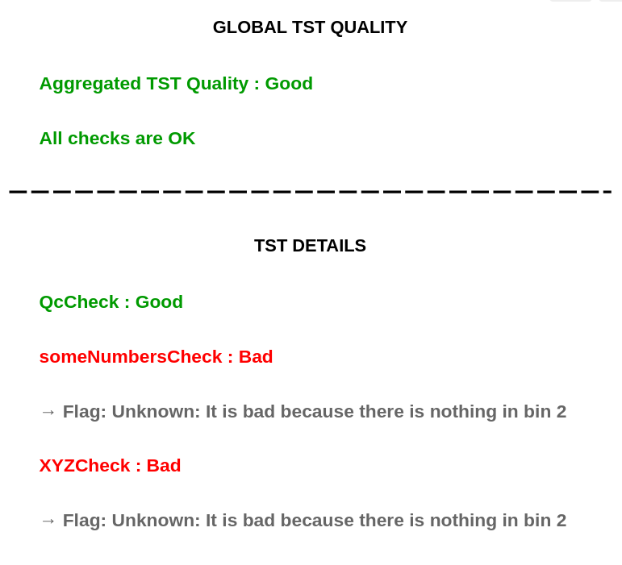

# Post-processing

<!--TOC generated with https://github.com/ekalinin/github-markdown-toc-->
<!--./gh-md-toc --insert --no-backup --hide-footer --indent 3 /path/to/README.md-->
<!--ts-->
* [Post-processing](#post-processing)
   * [The post-processing framework](#the-post-processing-framework)
      * [Post-processing interface](#post-processing-interface)
      * [Configuration](#configuration)
         * [Triggers configuration](#triggers-configuration)
      * [Running it](#running-it)
   * [Convenience classes](#convenience-classes)
      * [The TrendingTask class](#the-trendingtask-class)
         * [Configuration](#configuration-1)
      * [The SliceTrendingTask class](#the-slicetrendingtask-class)
         * [Configuration](#configuration-2)
      * [The QualityTask class](#the-qualitytask-class)
         * [Configuration](#configuration-3)
      * [The TRFCollectionTask class](#the-trfcollectiontask-class)
   * [More examples](#more-examples)
<!--te-->


[← Go back to Modules Development](ModulesDevelopment.md) | [↑ Go to the Table of Content ↑](../README.md) | [Continue to Advanced Topics →](Advanced.md)


## The post-processing framework

This framework is intended for planned post-processing of objects generated by QC Tasks, Checks and correlating them with other data. The most common use-cases include correlation and trending of different properties of the detectors.
 
 The users can write their own Post-processing Tasks or use the ones provided by the framework (see [Convenience classes](#convenience-classes)) which are supposed to cover the usual needs. Post-processing Tasks run asynchronously to data-taking, but can be triggered by a set of selected events.  

### Post-processing interface

Any Post-processing Task should inherit PostProcessingInterface, which includes four methods:

  * `configure` (optional) - provides the task with configuration.
  * `initialize` - initializes the task and its data, given the event which it was triggered by.
  * `update` - updates the task and its data, given the event which it was triggered by.
  * `finalize` - finalizes the processing, given the event which it was triggered by.
  
Interfaces to databases and other services are accesible via `ServiceRegistry`, which is an argument to the last three methods. They are invoked when any of the specified triggers is up, which can be:
 * Start Of Run (SOR, not implemented yet)
 * End Of Run (EOR, not implemented yet)
 * Start Of Fill (SOF, not implemented yet)
 * End Of Fill (EOF, not implemented yet)
 * Periodic - triggers when a specified period of time passes 
 * New Object - triggers when an object in QCDB is updated
 * For Each Object - triggers for each object in QCDB which matches an Activity
 * For Each Latest - trggers for the latest object in QCDB for each matching Activity, sorted by Period, Pass and Run
 * Once - triggers only first time it is checked
 * Always - triggers each time it is checked

Triggers are complemented with:
- timestamps which correspond the time when trigger started to be valid, in form of ms since epoch, just like in CCDB and QCDB,
- `last` flag, being `true` if it is the last time trigger will fire,
- `Activity` object, which contains metadata such as run type and number, pass name, period name, data provenance.

For example, the periodic trigger will provide evenly spaced timestamps, even if the trigger is checked more rarely.
The New Object trigger provide the timestamp of the updated object. The timestamps and Activites should be used to
access databases, so any Post-processing Task can be rerun at any time for any run and reconstruction pass.

The Activity specified at the top of the configuration file is used to for triggers to match objects which belong to 
certain run, pass, period. A lack of a parameter or a default value are treated as a wildcard. Since AliECS overwrites
the run number during initialization, one may force the run number wildcard by adding the following key-value pair:
```json
{
  "qc": {
    "config": {
      "postprocessing": {
        "matchAnyRunNumber": "true"
      }
    },
```

  
MonitorObjects may be saved by registering them in ObjectManager, similarly to normal QC Tasks (recommended, see
 examples linked below), or by using DatabaseInterface directly. Please note, that created objects have to
  registered in ObjectManager to make them accessible by Checks.

Please refer to [`SkeletonPostProcessing`](https://github.com/AliceO2Group/QualityControl/blob/master/Modules/Skeleton/include/Skeleton/SkeletonPostProcessing.h) for a minimal illustration of inheriting the interface, or to [`TrendingTask`](https://github.com/AliceO2Group/QualityControl/blob/master/Framework/include/QualityControl/TrendingTask.h) for a fully functional example. One can generate their own post-processing task by using the `o2-qc-module-configurator` helper, as described in the [Module Creation](ModulesDevelopment.md#module-creation) chapter.

### Configuration

Running the post-processing is configured in a similar manner as it is for QC Tasks and Checks - the configuration parameters are stored in a JSON file or in the Configuration database (at later development stage). The configuration's path should be passed to the application running a task.

This is a snippet of a JSON structure which configures a post-processing task:

```json
{
  "qc": {
    "config": {
      ...
      "postprocessing": {
        "periodSeconds": 10.0
      }
    },
    "postprocessing": {
      "MyPostProcessingTaskID": {
        "active": "true",
        "taskName": "MyPostProcessingTask",
        "className": "o2::quality_control_modules::my_module::MyPPTask",
        "moduleName": "QcMyModule",
        "detectorName": "TST",
        "initTrigger": [
          "SOR"
        ],
        "updateTrigger": [
          "10mins"
        ],
        "stopTrigger": [
          "EOR",
          "10hours"
        ]
      },
      ...
    }
  }
}
```
Each task is uniquely identified by its id (`MyPostProcessingTaskID`). One can activate it by setting the `"active"` field to `"true"`. The task is loaded given its full `"className"` and a `"moduleName"` where it is located. The `"detectorName"` might be used by tasks to store generated data in correct paths in QCDB. The `"initTrigger"`, `"updateTrigger"` and `"stopTrigger"` lists contain triggers which should invoke corresponding interface methods. The `"periodSeconds"` parameter in the common section defines how often should the triggers be checked. Values larger than 10 seconds should be applied when running synchronously to data taking, while very small periods can be used when processing batches of already existing objects.

Checks can be applied to the results of Post-processing Tasks just as for normal QC Tasks. However, one should use
 data source type of `"PostProcessing"` instead of `"Task"`:
 
```
...
    "checks": {
      "ExamplePPCheck": {
        "active": "true",
        "className": "o2::quality_control_modules::skeleton::SkeletonCheck",
        "moduleName": "QcSkeleton",
        "policy": "OnAny",
        "detectorName": "TST",
        "dataSource": [{
          "type": "PostProcessing",
          "name": "ExampleTrend",
          "MOs": ["mean_of_histogram"]
        }]
      }
    },
...
```

#### Triggers configuration

Each of the three methods can be invoked by one or more triggers. Below are listed the possible options (case insensitive).

 * `"sor"` or `"startofrun"` - Start Of Run
 * `"eor"` or `"endofrun"` - End Of Run
 * `"sof"` or `"startoffill"` - Start Of Fill
 * `"eof"` or `"endoffill"` - End Of Fill
 * `"<x><sec/min/hour>"` - Periodic - triggers when a specified period of time passes. For example: "5min", "0.001 seconds", "10sec", "2hours".
 * `"newobject:[qcdb/ccdb]:<path>"` - New Object - triggers when an object in QCDB or CCDB is updated (applicable for synchronous processing). For example: `"newobject:qcdb:qc/TST/MO/QcTask/Example"`
 * `"foreachobject:[qcdb/ccdb]:<path>"` - For Each Object - triggers for each object in QCDB or CCDB which matches the activity indicated in the QC config file (applicable for asynchronous processing).
 * `"foreachlatest:[qcdb/ccdb]:<path>"` - For Each Latest - triggers for the latest object version in QCDB or CCDB 
   for each matching activity (applicable for asynchronous processing). It sorts objects in ascending order by period, 
   pass and run.
 * `"once"` - Once - triggers only first time it is checked
 * `"always"` - Always - triggers each time it is checked

### Running it

The post-processing tasks can be run in three ways. First uses the usual `o2-qc` executable which relies on DPL and
 it is the only one which allows to run checks over objects generated in post-processing tasks. This is will be one
 of two ways to run PP tasks in production.
To try it out, use it like for any other QC configuration:
```
o2-qc -b --config json://${QUALITYCONTROL_ROOT}/etc/postprocessing.json
```
All declared and active tasks in the configuration file will be run in parallel.
To change how often triggers are evaluated, modify the value for `qc.config.postprocessing.periodSeconds` in the config file.

To run a different configuration which trends all the `qc/TST/MO/QcTask/example` objects existing in QCDB, try the following:
```
o2-qc -b --config json://${QUALITYCONTROL_ROOT}/etc/postprocessing-async.json
```

Debugging post-processing tasks might be easier when using the `o2-qc-run-postprocessing` application (only for
 development) or with `o2-qc-run-postprocessing-occ` (both development and production), as they are one-process
  executables, running only one, chosen task.

To run the basic example, use the command below. The `--config` parameter should point to the configuration file.

```
o2-qc-run-postprocessing --config json://${QUALITYCONTROL_ROOT}/etc/postprocessing.json --id ExamplePostprocessing
```

As it is configured to invoke each method only `"once"`, you will see it initializing, entering the update method, then finalizing the task and exiting.

This executable also allows to run a Post-processing task in batch mode, i.e. with selected timestamps (see the
 `--timestamps` argument). This way, one can rerun a task over old data, if such a task actually respects given
  timestamps.

To have more control over the state transitions or to run a standalone post-processing task in production, one should
 use `o2-qc-run-postprocessing-occ`. It is run almost exactly as the previously mentioned application, however one has
 to use [`peanut`](https://github.com/AliceO2Group/Control/tree/master/occ#single-process-control-with-peanut) to drive
 its state transitions and push the configuration.

To try it out locally, run the following in the first terminal window (we will try out a different task this time):
```
o2-qc-run-postprocessing-occ --name ExampleTrend --period 10
```
In the logs you will see a port number which listens for RPC commands. Remember it. 
```
no control port configured, defaulting to 47100
no role configured, defaulting to default-role
gRPC server listening on port 47100
```
In the second window, run the following. Use the port number from the output of the QC executable.
```
# If you haven't built it:
# aliBuild build Coconut --defaults o2-dataflow
alienv enter coconut/latest
OCC_CONTROL_PORT=47100 peanut
```
A simple terminal user interface will open, which will allow you to trigger state transitions. Use it to load the configuration by entering the path to the configuration file. The usual transition sequence, which you might want to try out, is CONFIGURE, START, STOP, RESET, EXIT.

## Convenience classes

We aim to provide some convenience classes which should cover the most common post-processing use-cases. Everyone is free to propose extensions to them or write their own tasks for more specific usages taking these as a starting point.

### The TrendingTask class

`TrendingTask` is a post-processing task which uses a TTree to trend objects in the QC database and produce basic plots. The [Post-processing example](QuickStart.md#post-processing-example) in the QuickStart showcases the possibilities of this class.

The following scheme shows how the class is designed. It can access **data sources** which are Monitor Objects and Quality Objects from the Quality Control Database - anything that is generated by other Tasks and Checks. In the future we will also support access to the CCDB.

The objects' characteristics which should be tracked are extracted by **Reductors** - simple plugins. The framework provides a set of Reductors for commonly used data structures, but any custom Reductor might be used as well.

All the values are stored in a **TTree**.Each data source forms a separate branch, with its leaves being the individual values. Additionally added columns include a `time` branch and a `metadata` branch (now consisting only of `runNumber`).

The TTree is stored back to the **QC database** each time it is updated. In addition, the class exposes the [`TTree::Draw`](https://root.cern/doc/master/classTTree.html#a73450649dc6e54b5b94516c468523e45) interface, which allows to instantaneously generate **plots** with trends, correlations or histograms that are also sent to the QC database. 
 


#### Configuration

As this class is a post-processing task, it inherits also its configuration JSON template. It extends it, though, 
some additional parameters.

``` json
{
  "qc": {
    ...
    "postprocessing": {
      "ExampleTrend": {
        "active": "true",
        "className": "o2::quality_control::postprocessing::TrendingTask",
        "moduleName": "QualityControl",
        "detectorName": "TST",
        "resumeTrend": "false",
        "producePlotsOnUpdate": "true",
        "dataSources": [],
        "plots": [],
        "initTrigger": [ "once" ],
        "updateTrigger": [ "5 seconds" ],
        "stopTrigger": []
      }
    }
  }
}
```

Data sources are defined by filling the corresponding structure, as in the example below. For the key `"type"` use the value `"repository"` if you access a Monitor Object and `"repository-quality"` if that should be a Quality (this will be unified in the future). The `"names"` array should point to one or more objects under a common `"path"` in the repository. The values of `"reductorName"` and `"moduleName"` should point to a full name of a data Reductor and a library where it is located. One can use the Reductors available in the `Common` module or write their own by inheriting the interface class.

``` json
{
        ...
        "dataSources": [
          {
            "type": "repository",
            "path": "TST/MO/QcTask",
            "names": [ "example" ],
            "reductorName": "o2::quality_control_modules::common::TH1Reductor",
            "moduleName": "QcCommon"
          },
          {
            "type": "repository-quality",
            "path": "TST/QO",
            "names": [ "QcCheck" ],
            "reductorName": "o2::quality_control_modules::common::QualityReductor",
            "moduleName": "QcCommon"
          }
        ],
        ...
}
```

Similarly, plots are defined by adding proper structures to the `"plots"` list, as shown below. The plot will be
 stored under the `"name"` value and it will have the `"title"` value shown on the top. The `"varexp"`, `"selection"` and `"option"` fields correspond to the arguments of the [`TTree::Draw`](https://root.cern/doc/master/classTTree.html#a73450649dc6e54b5b94516c468523e45) method.
Optionally, one can use `"graphError"` to add x and y error bars to a graph, as in the first plot example.
The `"name"` and `"varexp"` are the only compulsory arguments, others can be omitted to reduce configuration files size.
`"graphAxisLabel"` allows the user to set axis labels in the form of `"Label Y axis: Label X axis"`. With `"graphYRange"` numerical values for fixed ranges of the y axis can be provided in the form of `"Min:Max"`.
``` json
{
        ...
        "plots": [
          {
            "name": "mean_of_histogram",
            "title": "Mean trend of the example histogram",
            "varexp": "example.mean:time",
            "selection": "",
            "option": "*L",
            "graphErrors": "5:example.stddev",
            "graphAxisLabel": "Mean X:time",
            "graphYRange": "-2.3:6.7"
          },
          {
            "name": "histogram_of_means",
            "title": "Distribution of mean values in the example histogram",
            "varexp": "example.mean",
            "selection": "",
            "option": ""
          },
          {
            "name": "example_quality",
            "title": "Trend of the example histogram's quality",
            "varexp": "QcCheck.name:time",
            "selection": "",
            "option": "*"
          }
        ],
        ...
}
```

To decide whether plots should be generated during each update or just during finalization, 
use the boolean flag `"producePlotsOnUpdate"`.

To pick up the last existing trend which matches the specified Activity, set `"resumeTrend"` to `"true"`.

### The SliceTrendingTask class
The `SliceTrendingTask` is a complementary task to the standard `TrendingTask`. This task allows the trending of canvas objects that hold multiple histograms (which have to be of the same dimension, e.g. TH1) and the slicing of histograms. The latter option allows the user to divide a histogram into multiple subsections along one or two dimensions which are trended in parallel to each other. The task has specific reductors for `TH1` and `TH2` objects which are `o2::quality_control_modules::common::TH1SliceReductor` and `o2::quality_control_modules::common::TH2SliceReductor`.

#### Configuration
Similar to the `TrendingTask`, the configuration of the `SliceTrendingTask` is divided into `"dataSources"` and `"plots"`, where both parts have been extended in respect to the standard trending. Here, only changes in respect to the standard trending task are highlighted.

The data sources are extended by `"axisDivision"` which configures the slicing of the histograms. The inner most brackets relate the the actual axis. Its configuration can be understood as `"axisDivision": [ [x-Axis], [y-Axis] ]` where `[y-Axis]` does not need to be provided in case of one-dimensional objects. The values provided in `[x(y)-Axis]` are the numerical boundaries of the x(y)-axis. For *n* slices, one thus needs to provide *n*+1 values in ascending order. Protections are added such that each bin is part of only one slice. If the outer brackets are left empty (i.e. `"axisDivision": [ ]`), no slicing is applied and the whole histogram is trended as in the standard trending task.

```
{
        ...
        "dataSources": [
          {
            "type": "repository",
            "path": "TST/MO/QcTask",
            "names": [ "example" ],
            "reductorName": "o2::quality_control_modules::common::TH1SliceReductor",
            "axisDivision": [ [ "0", "4500", "10500" ] ],
            "moduleName": "QcCommon"
          }
        ],
        ...
}
```
The `"plot"` configuration has changed in respect to the standard trending task as follows:
The `"varexp"` selection is still set up as `"Histogram.Var:TrendingType"` where `"Histogram.Var"` is trended vs `"TrendingType"`. The options for `"Var"`are:
- `"entries"`: Number of entries of the slice
- `"meanX"`: Mean along the x-axis of the slice
- `"stddevX"`: Stddev along the x-axis of the slice
- `"errMeanX"`: Error of the mean along the x-axis of the slice
- `"meanY"`: Mean along the y-axis of the slice.
- `"stddevY"`: Stddev along the y-axis of the slice
- `"errMeanY"`: Error of the mean along the y-axis of the slice

In case of 1 dimensional objects, `"meanY"` is calculated as the arithmetic mean of all the bin values in the slice. The respective `"stddevY"` and `"errMeanY"` are provided as well.

The options for `"TrendingType"` are limited to:
- `"time"`: The quantity `"Histogram.Var"` of all slices is trended as a function of time. Each slice-trending has its own graph which are all published on one canvas.
- `"multigraphtime"`:  The quantity `"Histogram.Var"` of all slices is trended as a function of time. All slice-trendings are published on one `"TMultiGraph"`. A legend is provided which contains the numerical boundaries of the slices.
- `"slices"`:  The quantity `"Histogram.Var"` of all slices is trended as a function of the geometrical center of the slices. Always the latest timestamp is plotted.
- `"slices2D"`:  The quantity `"Histogram.Var"` of all slices is trended as a function of the geometrical center of the slices in two dimensions. Always the latest timestamp is plotted. Errors (if used) are stored per bin but are not visualized.

The field `"graphErrors"` is set up as `"graphErrors":"Var1:Var2"` where `Var1` is the error along y and `Var2` the error along x. For `Var1(2)` numerical values or the options listed for `Var` above can be set. The original histogram does not need to be provided as the task will take the histogram specified in `"varexp": "Histogram.Var:TrendingType"`. In `"graphYRange"` and `"graphXRange"` numerical values for fixed ranges of the x and y axis can be provided in the form of `"Min:Max"`. If provided, the task will set all x (or y) axis on the canvas to this range. `"graphAxisLabel"` allows the user to set axis labels in the form of `"Label Y axis: Label X axis"`.
```  
{
        ...
        "plots": [
          {
            "name": "ExtendedTrending_meanX_of_histogram",
            "title": "Mean X trend of the example histogram",
            "varexp": "example.meanX:time",
            "selection": "",
            "option": "*L",
            "graphErrors": "errMeanX:0.5",
            "graphYRange": "",
            "graphXRange": "",
            "graphAxisLabel": "Mean X:time"
          },
          {
            "name": "ExtendedTrending_meanY_of_histogram_slices",
            "title": "Mean Y trend of the example histogram",
            "varexp": "example.meanY:slices",
            "selection": "",
            "option": "*L",
            "graphErrors": "errMeanY:errMeanX",
            "graphYRange": "",
            "graphXRange": "-500.0:10000",
            "graphAxisLabel": "Mean Y:Center of slices along x"
          },
          {
            "name": "ExtendedTrending_meanY_of_histogram_timeMultigraph",
            "title": "Mean Y trend of the example histogram",
            "varexp": "example.meanY:multigraphtime",
            "selection": "",
            "option": "*L",
            "graphErrors": "errMeanY:0.5",
            "graphYRange": "",
            "graphXRange": "",
            "graphAxisLabel": "Mean Y:time"
          }
        ],
        ...
}
```

### The QualityTask class

This task allows to trend a set of QualityObjects (QO) stored in the QCDB, and to display their name and value in human-readable format on a canvas (see the figure below).
For each QualityObject, it also creates a 1-D distribution of the corresponding quality values (*Good/Medium/Bad/Null*).
Each Quality can be optionally accompanied by a message that can provide instructions or further details based on the quality value.
Each time the post-processing task is triggered, the QualityObjects are fetched from the CCDB and the canvas is updated with the current values.
Moreover, the trending plot and 1-D distribution associated to each QO is updated accordingly.
Hence, the trending and 1-D distribution can be used to estimate the fraction of good data for a given run.



#### Configuration
The QualityObjects to be monitored and displayed are passed as **qualityGroups**, each containing **inputObjects** for a specific, line-separated group. 
Each group requires a **name** and **path** to the contained objects.
A **title** can be added optionally, which appears at the top of the group in the canvas.
By listing certain qualities in **ignoreQualitiesDetails** one can ask to ignore FlagReasons associated to QualityObjects. 

The **inputObjects** list should contain Quality Object names in a given group.
A **title** can be added, which is used in the summary canvas to denote given Quality Object.
If it is absent, **name** is used instead.
Optionally, one can add **messageBad**, **messageMedium**, **messageGood**, **messageNull** to add a message when a particular Quality is seen.

Here is a complete example of `QualityTask` configuration:
```json
{
  "qc": {
    "config": {
      "": "The usual global configuration variables"
    },
    "postprocessing": {
      "ExampleQualityTask": {
        "active": "true",
        "className": "o2::quality_control_modules::common::QualityTask",
        "moduleName": "QualityControl",
        "detectorName": "TST",
        "qualityGroups": [
          {
            "name" : "global",
            "title" : "GLOBAL TST QUALITY",
            "path": "TST/QO",
            "ignoreQualitiesDetails" : ["Null", "Good", "Medium", "Bad"],
            "inputObjects": [
              {
                "name" : "QcCheck",
                "title" : "Aggregated TST Quality",
                "messageBad" : "Inform XYZ on-call immediately",
                "messageMedium": "Add bookkeeping entry",
                "messageGood": "All checks are OK",
                "messageNull": "Some histograms are empty!!!"
              }
            ]
          },
          {
            "name" : "details",
            "title" : "TST DETAILS",
            "path": "TST/QO",
            "ignoreQualitiesDetails" : [],
            "inputObjects": [
              {
                "name" : "QcCheck",
                "title" : ""
              },
              {
                "name" : "someNumbersCheck",
                "title" : ""
              },
              {
                "name" : "XYZCheck",
                "title" : ""
              }
            ]
          }
        ],
        "initTrigger": [
          "userorcontrol"
        ],
        "updateTrigger": [
          "60 seconds"
        ],
        "stopTrigger": [
          "userorcontrol", "10 minutes"
        ]
      }
    }
  }
}
```

### The TRFCollectionTask class

This task allows to transform a set of QualityObjects stored QCDB across certain timespan (usually for the duration of a data acquisition run) into a TimeRangeFlagCollection.
It is meant to be run after for each detector/subsystem separately and when all QualityObjects for a run are generated.
After generating timestamps, final data tags can be computed as the next step.
The data formats for tagging data quality are described [here](https://github.com/AliceO2Group/AliceO2/tree/dev/DataFormats/QualityControl/README.md).

The task should be run asynchronously to data-taking and should be given the start and end of a time range to process.
For example:

```bash
o2-qc-run-postprocessing --config json://${QUALITYCONTROL_ROOT}/Modules/Common/etc/trfcollection-example.json \
                         --name TRFCollectionQcCheck --timestamps 1612707603626 1613999652000
```

The task is configured as follows:
```json
{
  "qc": {
    "config": {
      "": "The usual global configuration variables"
    },
    "postprocessing": {
      "TRFCollectionQcCheck": {
        "active": "true",
        "className": "o2::quality_control_modules::common::TRFCollectionTask",
        "moduleName": "QcCommon",
        "detectorName": "TST",    "": "One task should concatenate Qualities from detector, defined here.",
        "initTrigger": [],        "": "The triggers can be left empty,",
        "updateTrigger": [],      "": "because we run the task with a defined set of timestamps.",
        "stopTrigger": [],
                                  "": "The list of Quality Object to process.",
        "QOs": [
          "QcCheck"
        ]
      }
    }
  }
}
```

TimeRangeFlagCollections are meant to be used as a base to derive Data Tags for analysis (WIP).

### The BigScreen class

This task allows to display the aggregated quality flags of each system (detectors + global QC) in a single canvas, arranged as a matrix of colored boxes.
The system names are displayed above each box, while the quality flag is displayed inside the box. The box color follows the usual convention:

* Good: green
* Medium: orange
* Bad: red
* Null: magenta

In addition, the boxes are filled with a grey color is the corresponding QualityObjects cannot be retrieved or are too old.

The task is configured as follows:
```json
{
  "qc": {
    "config": {
      "": "The usual global configuration variables"
    },
    "postprocessing": {
      "BigScreen": {
        "active": "true",
        "className": "o2::quality_control_modules::common::BigScreen",
        "moduleName": "QualityControl",
        "detectorName": "GLO",
        "customization": [
          {
            "name": "NRows",
            "value": "4"
          },
          {
            "name": "NCols",
            "value": "5"
          },
          {
            "name": "BorderWidth",
            "value": "5"
          },
          {
            "name": "NotOlderThan",
            "value": "3600"
          },
          {
            "name": "IgnoreActivity",
            "value": "0"
          }
        ],
        "dataSources": [
          {
            "names": [
              "CPV:MCH/QO/CPVQuality/CPVQuality",
              "EMC:MCH/QO/EMCQuality/EMCQuality",
              "FDD:MCH/QO/FDDQuality/FDDQuality",
              "FT0:MCH/QO/FT0Quality/FT0Quality",
              "FV0:MCH/QO/FV0Quality/FV0Quality",
              "HMP:MCH/QO/HMPQuality/HMPQuality",
              "ITS:MCH/QO/ITSQuality/ITSQuality",
              "MCH:MCH/QO/MCHQuality/MCHQuality",
              "MFT:MCH/QO/MFTQuality/MFTQuality",
              "MID:MCH/QO/MIDQuality/MIDQuality",
              "PHS:MCH/QO/PHSQuality/PHSQuality",
              "TOF:MCH/QO/TOFQuality/TOFQuality",
              "TPC:MCH/QO/TPCQuality/TPCQuality",
              "TRD:MCH/QO/TRDQuality/TRDQuality",
              "ZDC:MCH/QO/ZDCQuality/ZDCQuality",
              "TRK:MCH/QO/TRKQuality/TRKQuality",
              "MTK:MCH/QO/MTKQuality/MTKQuality",
              "VTX:MCH/QO/VTXQuality/VTXQuality",
              "PID:MCH/QO/PIDQuality/PIDQuality"
            ]
          }
        ],
        "initTrigger": [
          "userorcontrol"
        ],
        "updateTrigger": [
          "60 seconds"
        ],
        "stopTrigger": [
          "userorcontrol"
        ]
      }
    }
  }
}
```

The following options allow to configure the appearence and behavior of the task:

* `NRows`/`NCols`: size of the X-Y grid
* `BorderWidth`: size of the border around the boxes
* `NotOlderThan`: ignore quality objects that are older than a given number of seconds. A value of -1 means "no limit".
* `IgnoreActivity`: if diferent from 0, the task will fetch objects regardless of their activity number and type.

The names in the data sources are composed of two parts, separated by a colon:
```
SYSTEM_NAME:OBJECT_PATH
```
The grid of colored boxes is built from the list of data sources, and the corresponding `SYSTEM_NAME` is displayed above each box.

## More examples

This section contains examples of how to approach usual use-cases.

### I want to run postprocessing alongside of synchronous QC and trend some object parameters

Use either Periodic or NewObject as the update trigger:
```json
        "updateTrigger": [ "5 seconds" ],
```
```json
        "updateTrigger": [ "newobject:qcdb:TST/MO/QcTask/example" ],
```

Be sure to match the run number and other Activity metadata to isolate the QC run you need.
Leaving values empty will match anything available (which might be also what you want).
```json
      "Activity": {
        "number": "3212",
        "type": "",
        "passName": "",
        "periodName" : "",
        "provenance" : "qc"
      },
```

If the post-processing runs in a different AliECS environment than the acquisition run, one should add the following 
flag. Since AliECS adds a concrete run number to the workflow, the triggers would match only objects from the same run.
```json
  "qc": {
    "config": {
      ...
      "postprocessing": {
        "matchAnyRunNumber": "true"
      }
    }
```

### I want to run postprocessing on all already existing objects for a run

Use ForEachObject as the update trigger:
```json
        "updateTrigger": [ "foreachobject:qcdb:TST/MO/QcTask/example" ],
```
Since objects are usually published in collections at the same time, you can use a path for one object to be triggered 
 for a collection of them (all objects produced by a QC Task).

Use the Activity which matches the run, and (optionally) period and pass name:
```json
      "Activity": {
        "number": "3212",
        "type": "",
        "passName": "apass2",
        "periodName" : "OCT",
        "provenance" : "qc"
      },
      "postprocessing": {
        "periodSeconds": 0.01
      }
```

### I want to run postprocessing for all objects in all the runs of a given reconstruction pass and period

Use ForEachObject as the update trigger:
```json
        "updateTrigger": [ "foreachobject:qcdb:TST/MO/QcTask/example" ],
```
Use the Activity which leaves the run number empty, but indicate the pass and period names.
```json
      "Activity": {
        "number": "",
        "type": "",
        "passName": "apass2",
        "periodName" : "OCT",
        "provenance" : "qc"
      },
      "postprocessing": {
        "periodSeconds": 0.01
      }
```

### I want to run postprocessing for all objects in all the runs of a given reconstruction pass and period which are valid in given time interval

Use ForEachObject as the update trigger:
```json
        "updateTrigger": [ "foreachobject:qcdb:TST/MO/QcTask/example" ],
```
Use the Activity which leaves the run number empty, but indicate the pass and period names.
Add `start` and `end` values in ms since epoch to restrict the validity start of objects.
```json
      "Activity": {
        "number": "",
        "type": "",
        "passName": "apass2",
        "periodName" : "OCT",
        "provenance" : "qc",
        "start" : "1649417693630",
        "end" : "1649417800000"
      },
      "postprocessing": {
        "periodSeconds": 0.01
      }
```

### I want to run postprocessing for the latest object for each available run in a given pass and period

Use ForEachObject as the update trigger:
```json
        "updateTrigger": [ "foreachlatest:qcdb:TST/MO/QcTask/example" ],
```
This way you will avoid iterating on potential duplicates and intermediate objects, and get only the final versions instead.

Use the Activity which leaves the run number empty, but indicate the pass and period names.
```json
      "Activity": {
        "number": "",
        "type": "",
        "passName": "apass2",
        "periodName" : "OCT",
        "provenance" : "qc"
      },
      "postprocessing": {
        "periodSeconds": 0.01
      }
```

[← Go back to Modules Development](ModulesDevelopment.md) | [↑ Go to the Table of Content ↑](../README.md) | [Continue to Advanced Topics →](Advanced.md)
