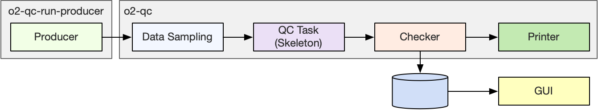
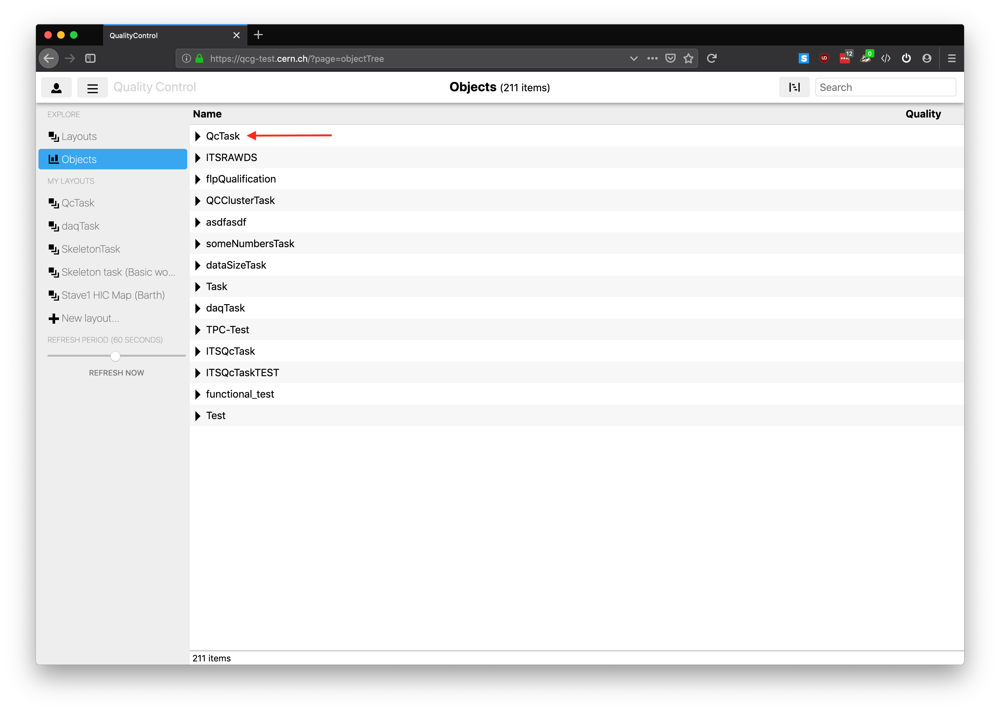
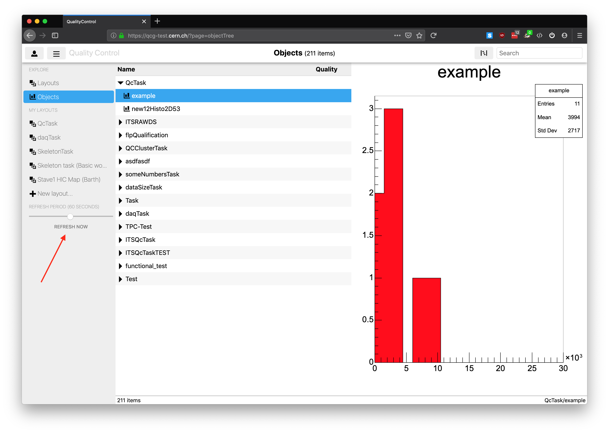

# QuickStart

<!--TOC generated with https://github.com/ekalinin/github-markdown-toc-->
<!--./gh-md-toc --insert /path/to/README.md-->
<!--ts-->
   * [QuickStart](#quickstart)
      * [Requirements](#requirements)
      * [Setup](#setup)
         * [Environment loading](#environment-loading)
      * [Execution](#execution)
         * [Basic workflow](#basic-workflow)
         * [Readout chain](#readout-chain)
            * [Getting real data from readout](#getting-real-data-from-readout)
            * [Readout data format as received by the Task](#readout-data-format-as-received-by-the-task)

<!-- Added by: bvonhall, at:  -->

<!--te-->

[↑ Go to the Table of Content ↑](../README.md) | [Continue to Modules Development →](ModulesDevelopment.md)

## Requirements

A Linux machine (CC7 or Ubuntu) or a Mac. See the O2 instructions below for the exact supported versions.

## Setup

1. Setup O2 environment and tools <br>We use alibuild, see complete instructions [here](https://alice-doc.github.io/alice-analysis-tutorial/building/), in particular make sure to follow these steps :
   1. Install GLFW to have GUIs in the DPL (optional, DPL GUIs do not work in containers nor over SSH).
        * CC7 : `sudo yum install -y glfw-devel --enablerepo=epel`
        * Mac : `brew install glfw`
   2. Prerequisites  
        * [CC7](https://alice-doc.github.io/alice-analysis-tutorial/building/prereq-centos7.html)
        * [Mac](https://alice-doc.github.io/alice-analysis-tutorial/building/prereq-macos.html)
        * [Ubuntu](https://alice-doc.github.io/alice-analysis-tutorial/building/prereq-ubuntu.html)
   3. [Install aliBuild](https://alice-doc.github.io/alice-analysis-tutorial/building/custom.html#get-or-upgrade-alibuild)
   4. [Check installation and build O2](https://alice-doc.github.io/alice-analysis-tutorial/building/build.html)

2. Prepare the QualityControl development package
    * `aliBuild init QualityControl@master --defaults o2`
    
3. If you don't plan on developing O2, you can delete it
    * `rm -rf O2`

4. Build/install the QualityControl, its GUI (qcg) and the readout. The simplest is to use the metapackage `O2Suite`.
    * `aliBuild build O2Suite --defaults o2`
    * At this point you might encounter a message about missing system requirements. Run `aliDoctor O2Suite` to get a full information about what is missing and how to install it.

Note : on non-CC7 systems, you can also use the alibuild "defaults" called `o2-dataflow` to avoid building simulation related packages.

### Environment loading

Whenever you want to work with O2 and QualityControl, do either `alienv enter O2Suite/latest` or `alienv load O2Suite/latest`.

## Execution

To make sure that your system is correctly setup, we are going to run a basic QC workflow attached to a simple data producer. We will use central services for the repository and the GUI. If you want to set them up on your computer or in your lab, please have a look [here](#local-ccdb-setup) and [here](#local-qcg-setup).

### Basic workflow

We are going to run a basic workflow whose various processes are shown in the following schema. 


The _Producer_ is a random data generator. In a more realistic setup it would be a processing device or the _Readout_. The _Data Sampling_ is the system in charge of dispatching data samples from the main data flow to the _QC tasks_. It can be configured to dispatch different proportion or different types of data. The __tasks__ are in charge of analyzing the data and preparing QC objects, often histograms, that are then pushed forward every cycle. A cycle is 10 second in this example. In production it is closer to 1 minute. The _Checker_ is in charge of evaluating the _MonitorObjects_ produced by the _QC tasks_. It runs _Checks_ defined by the users, for example checking that the mean is above a certain limit. It can also modify the aspect of the histogram, e.g. by changing the background color or adding a PaveText. Finally the _Checker_ is also in charge of storing the resulting _MonitorObject_ into the repository where it will be accessible by the web GUI. It also pushes it to a _Printer_ for the sake of this tutorial.

To run it simply do:

    o2-qc-run-basic

Thanks to the Data Processing Layer (DPL, more details later) it is a single process that steers all the _devices_, i.e. processes making up the workflow. A window should appear that shows a graphical representation of the workflow. The output of any of the processes is available by double clicking a box. If a box is red it means that the process has stopped, probably abnormally.


The example above consists of one DPL workflow which has both the main processing and the QC infrastructure declared inside. In the real case, we would usually prefer to attach the QC without modifying the original topology. It can be done by merging two (or more) workflows, as shown below:

    o2-qc-run-producer | o2-qc --config json://${QUALITYCONTROL_ROOT}/etc/basic.json
 


This command uses two executables. The first one contains only the _Producer (see Figure above), which represents the data flow to which we want to apply the QC. The second executable generates the QC infrastructure based on the given configuration file (more details in a few sections). These two workflows are joined together using the pipe `|` character. This example illustrates how to add QC to any DPL workflow by using `o2-qc-run-qc` and passing it a configuration file. 

__Repository and GUI__

The data is stored in the [ccdb-test](ccdb-test.cern.ch:8080/browse) at CERN. If everything works fine you should see the objects being published in the QC web GUI (QCG) at this address : [https://qcg-test.cern.ch/?page=objectTree](https://qcg-test.cern.ch/?page=objectTree). The link brings you to the hierarchy of objects (see screenshot below). Open "/qc/TST/QcTask" (the task you are running) and click on "example" which is the name of your histogram. 

<!---
The plot should be displayed on the right. If you wait a bit and hit "REFRESH NOW" in the far left menu you should see it changing from time to time (see second screenshot below). 
Please note that anyone running o2-qc-run-basic publishes the object under the same name and you might see the one published by someone else. -->


<!----->

TODO add a link to the user documentation of the QCG when it is written.

__Configuration file__

In the example above, the devices are configured in the config file named `basic.json`. It is installed in `$QUALITYCONTROL_ROOT/etc`. Each time you rebuild the code, `$QUALITYCONTROL_ROOT/etc/basic.json` is overwritten by the file in the source directory (`~/alice/QualityControl/Framework/basic.json`).

The configuration for the QC is made of many parameters described in an [advanced section of the documentation](https://github.com/AliceO2Group/QualityControl/blob/master/doc/Advanced.md#configuration-files-details). For now we can just see below the definition of a task. `moduleName` and `className` specify respectively the library and the class to load and instantiate to do the actual job of the task. 
```json
(...)
"tasks": {
  "QcTask": {
    "active": "true",
    "className": "o2::quality_control_modules::skeleton::SkeletonTask",
    "moduleName": "QcSkeleton",
    "cycleDurationSeconds": "10",
(...)
```
Try and change the name of the task by replace `QcTask` by a name of your choice. Relaunch the workflows. You should now see the object published under a different directory in the QCG.

### Readout chain

In this second example, we are going to use the Readout as our data source.


This workflow is a bit different from the basic one. The _Readout_ is not a DPL, nor a FairMQ, device and thus we have to have a _proxy_ to get data from it. This is the extra box going to the _Data Sampling_, which then injects data to the task. This is handled in the _Readout_ as long as you enable the corresponding configuration flag.

To do so, open the readout config file located at `$READOUT_ROOT/etc/readout.cfg` and make sure that the following properties are correct :

```
# First make sure we never exit
[readout]
(...)
exitTimeout=-1
(...)
# And enable the data sampling
[consumer-data-sampling]
consumerType=DataSampling
enabled=1
(...)
```

Start Readout :
```
readout.exe file://$READOUT_ROOT/etc/readout.cfg
```

Start the proxy, DataSampling and QC workflows :
```
o2-qc-run-readout | o2-qc --config json://${QUALITYCONTROL_ROOT}/etc/readout.json
```

The data sampling is configured to sample 1% of the data as the readout should run by default at full speed.

#### Getting real data from readout

The first option is to configure readout.exe to connect to a cru. Please refer to the [Readout documentation](https://github.com/AliceO2Group/Readout/blob/master/doc/README.md). 

A more practical approach is to record a data file with Readout and then replay it on your development setup to develop and test your QC. The configuration options are described [here](https://github.com/AliceO2Group/Readout/blob/master/doc/configurationParameters.md), in particular : 

```
equipment-player-* 	filePath 	string 	
	Path of file containing data to be injected in readout.
equipment-player-* 	preLoad 	int 	1 	If 1, data pages preloaded with file content on startup. If 0, data is copied at runtime.
equipment-player-* 	fillPage 	int 	1 	If 1, content of data file is copied multiple time in each data page until page is full (or almost full: on the last iteration, there is no partial copy if remaining space is smaller than full file size). If 0, data file is copied exactly once in each data page.
```

#### Readout data format as received by the Task

The header is an O2 header populated with data from the header built by the Readout. 
The payload received is a 2MB (configurable) data page made of CRU pages (8kB).

__Configuration file__

The configuration file is installed in `$QUALITYCONTROL_ROOT/etc`. Each time you rebuild the code, `$QUALITYCONTROL_ROOT/etc/readout.json` is overwritten by the file in the source directory (`~/alice/QualityControl/Framework/readout.json`).
To avoid this behaviour and preserve the changes you do to the configuration, you can copy the file and specify the path to it with the parameter `--config` when launch `o2-qc`.

To change the fraction of the data being monitored, change the option `fraction`.

```
"fraction": "0.01",
```

---

[↑ Go to the Table of Content ↑](../README.md) | [Continue to Modules Development →](ModulesDevelopment.md)
