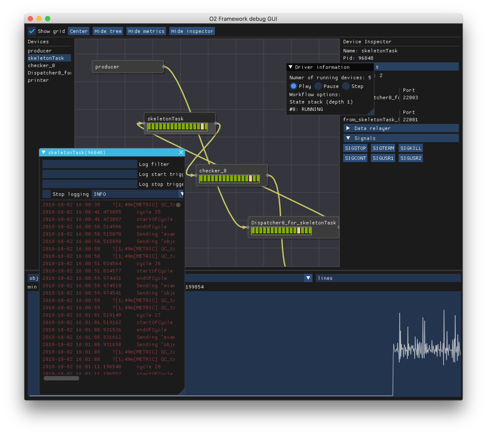
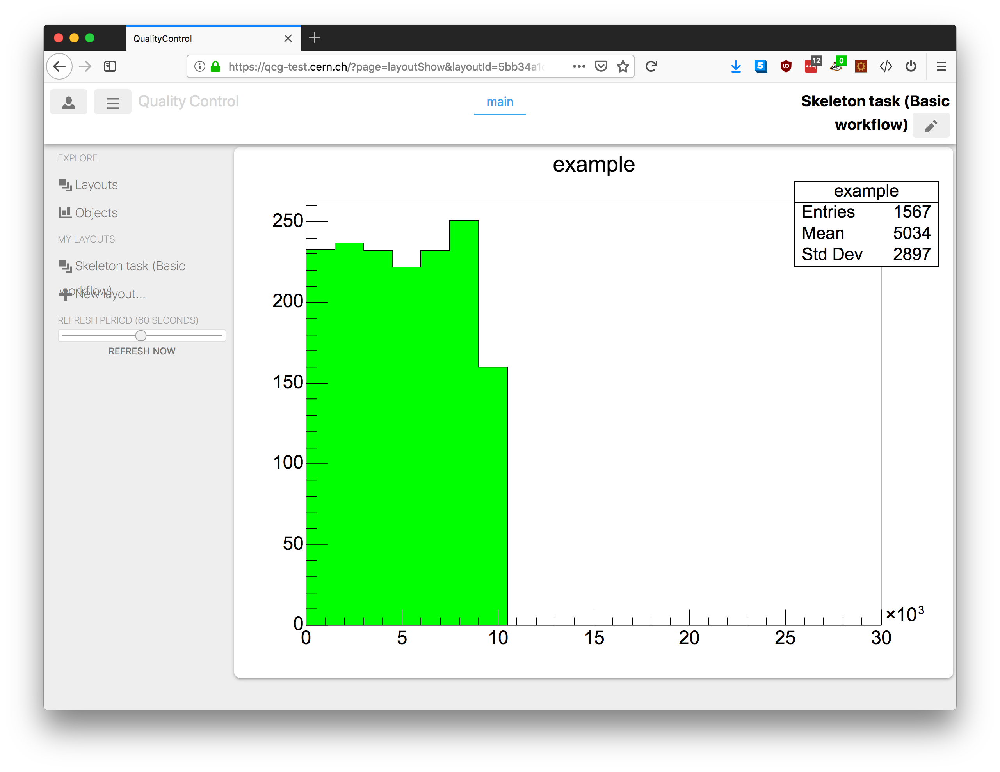
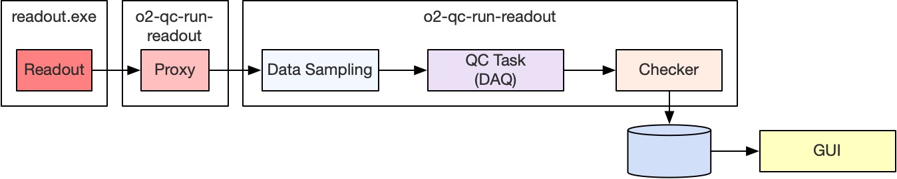

# QuickStart

<!--TOC generated with https://github.com/ekalinin/github-markdown-toc-->
<!--./gh-md-toc --insert /path/to/README.md-->
<!--ts-->
   * [QuickStart](#quickstart)
      * [Requirements](#requirements)
      * [Setup](#setup)
         * [Environment loading](#environment-loading)
      * [Execution](#execution)
         * [Basic workflow](#basic-workflow)
         * [Readout chain](#readout-chain)

<!-- Added by: bvonhall, at:  -->

<!--te-->

[↑ Go to the Table of Content ↑](../README.md) | [Continue to Modules Development →](ModulesDevelopment.md)

## Requirements

A Linux machine (CC7 or Ubuntu) or a Mac. See the O2 instructions below for the exact supported versions.

## Setup

2. Install O2
     * We use alibuild, see complete instructions [here](https://alice-doc.github.io/alice-analysis-tutorial/building/).

3. Prepare the QualityControl development package
    * `aliBuild init QualityControl@master`

4. Build/install the QualityControl, its GUI (qcg) and the readout. The simplest is to use the metapackage `flpproto`.
    * `aliBuild build flpproto --default o2`

5. Install GLFW to have GUIs in the DPL (optional, DPL GUIs do not work in containers).
    * On CC7 : `sudo yum install glfw-devel --enablerepo=epel`
    * On Mac : `brew install glfw`

Note :  you can also use the alibuild "defaults" called `o2-dataflow` to avoid building simulation related packages.

### Environment loading

Whenever you want to work with O2 and QualityControl, do either `alienv enter flpproto/latest` or `alienv load flpproto/latest`.

## Execution

To make sure that your system is correctly setup, we are going to run a basic QC workflow. We will use central services for the repository and the GUI. If you want to set them up on your computer or in your lab, please have a look [here](#local-ccdb-setup) and [here](#local-qcg-setup).

### Basic workflow

We will run a basic workflow described in the following schema.


The _Producer_ is a random data generator. In a more realistic setup it would be a processing device or the _Readout_. The _Data Sampling_ is the system in charge of dispatching data samples from the main data flow to the _QC tasks_. It can be configured to dispatch different proportion or different types of data. The _Checker_ is in charge of evaluating the _MonitorObjects_ produced by the _QC tasks_, for example by checking that the mean is above a certain limit. It can also modify the aspect of the histogram, e.g. by changing the background color or adding a PaveText. Finally the _Checker_ is also in charge of storing the resulting _MonitorObject_ into the repository where it will be accessible by the web GUI. It also pushes it to a _Printer_ for the sake of this tutorial.

To run it simply do

    qcRunBasic

Thanks to the Data Processing Layer (DPL, more details later) it is a single process that steers all the _devices_, i.e. processes making up the workflow. A window should appear that shows a graphical representation of the workflow. The output of any of the processes is available by double clicking a box. If a box is red it means that the process has stopped, probably abnormaly.



__Repository and GUI__

The data is stored in the [ccdb-test](ccdb-test.cern.ch:8080/browse) at CERN. If everything works fine you should see the objects being published in the QC web GUI (QCG) at this address : [https://qcg-test.cern.ch](https://qcg-test.cern.ch/?page=layoutShow&layoutId=5bb34a1d18a82bb283a487bd). The link actually brings you to a "layout" that shows the object (a histo titled "example") published by the task.

TODO add a link to the user documentation of the QCG



__Configuration file__

The devices are configured in the config file named `basic.json`. It is installed in `$QUALITYCONTROL_ROOT/etc`. Each time you rebuild the code, `$QUALITYCONTROL_ROOT/etc/basic.json` is overwritten by the file in the source directory (`~/alice/QualityControl/Framework/basic.json`).

### Readout chain

In this second example, we are going to use the Readout as data source.



This workflow is a bit different from the basic one. The _Readout_ is not a device and thus we have to have a _proxy_ to get data from it. This is the extra box going to the dispatcher, which then injects data to the task. This is handled in the _Readout_ if you enable the corresponding configuration flag.

TODO make the qc task use the daq code

To do so, open the readout config file located at `$READOUT_ROOT/etc/readout.cfg` and make sure that the following properties are correct :

```
# First make sure we never exit
[readout]
(...)
exitTimeout=-1
(...)
# And enable the data sampling
[consumer-data-sampling]
consumerType=DataSampling
enabled=1
(...)
```

Start Readout :
```
readout.exe file://$READOUT_ROOT/etc/readout.cfg
```

Start the QC and DS (DataSampling) workflow :
```
qcRunReadout
```

The data sampling is configured to sample 1% of the data as the readout should run by default at full speed.

#### Readout data received by the Task

The header is a O2 header populated with data from the header built by the Readout. 
The payload received is a 2MB (configurable) data page made of CRU pages (8kB).

__Configuration file__

The configuration file is installed in `$QUALITYCONTROL_ROOT/etc`. Each time you rebuild the code, `$QUALITYCONTROL_ROOT/etc/readout.json` is overwritten by the file in the source directory (`~/alice/QualityControl/Framework/readout.json`).
To avoid this behaviour and preserve the changes you do to the configuration, you can copy the file and specify the path to it with the parameter `--config-path` when launch `qcRunReadout`.

To change the fraction of the data being monitored, change the option `fraction`.

```
"fraction": "0.01",
```

---

[↑ Go to the Table of Content ↑](../README.md) | [Continue to Modules Development →](ModulesDevelopment.md)