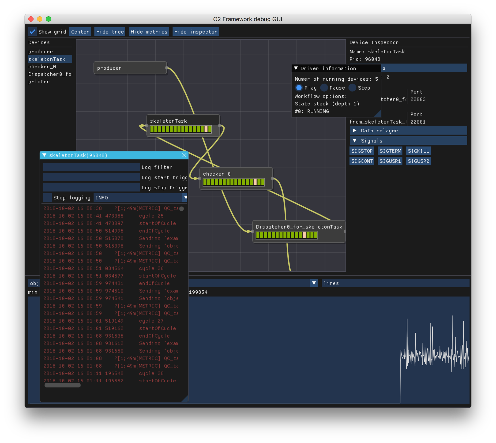
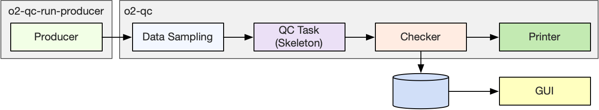
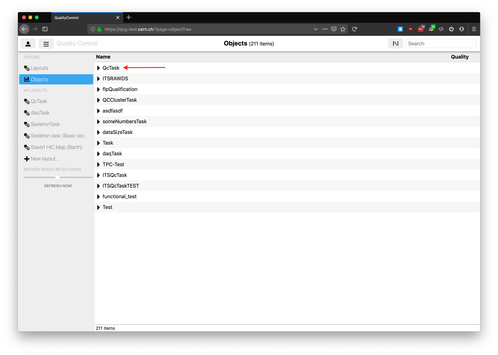

# QuickStart

<!--TOC generated with https://github.com/ekalinin/github-markdown-toc-->
<!--./gh-md-toc --no-backup --hide-footer --indent 3  /path/to/README.md-->
<!--ts-->
* [Read this first!](#read-this-first)
* [Requirements](#requirements)
* [Setup](#setup)
   * [Environment loading](#environment-loading)
* [Execution](#execution)
   * [Basic workflow](#basic-workflow)
   * [Post-processing example](#post-processing-example)
<!--te-->

## Read this first!

This page will give you a basic idea of the QC and how to run it. Please read it *in its entirety* and run the commands along the way. Do not start developing your module before you have reached the next section called "Modules Development". Also, make sure you have pulled the latest QC version.

We would be very grateful if you could report to us any error or inaccuracy you find. 

Thanks!

## Requirements

A RHEL9 or RHEL10 machine or a Mac (although you might have some issues running Readout). Ubuntu is only supported on a best-effort basis. 

## Setup

1. Setup O2 environment and tools <br>We use aliBuild, **follow the complete instructions** [here](https://alice-doc.github.io/alice-analysis-tutorial/building/). Make sure to:
   1. Install GLFW to have GUIs in the DPL (optional, **the DPL GUI do not work in containers nor over SSH**).
        * RHEL: should come with the standard installation
        * Mac: `brew install glfw`

2. Prepare the QualityControl development package
    * `aliBuild init QualityControl@master --defaults o2`

3. Build/install the QualityControl.
    * `aliBuild build QualityControl --defaults o2`
    * At this point you might encounter a message about missing system requirements. Run `aliDoctor --defaults o2 QualityControl` to get a full information about what is missing and how to install it.
    * Note: you can also use the alibuild "defaults" called `o2-dataflow` to avoid building simulation related packages. If you plan to use `Readout`, you can build both with one `aliBuild` command by listing them one after another, space-separated.

### Environment loading

Whenever you want to work with O2 and QualityControl, do  
```alienv enter QualityControl/latest```  

To load multiple independent packages, list them one after the other, space-separated (e.g. `alienv enter QualityControl/latest Readout/latest`). O2 is automatically pulled by QualityControl, thus no need to specify it explicitly.

### Repository 

In this guide we use a repository centrally hosted at CERN and called `ali-qcdb-test`. 

To access it from CERN, one can simply use the URL `ali-qcdb-test.cern.ch:8083`. However, many people develop and test their QC from outside, and therefore, we recommend the following approach. 

1. Create a tunnel (**always keep it running while working on your QC**)

   ssh -L 8083:ali-qcdb-test.cern.ch:8083 <your_username>@lxplus.cern.ch
2. Check that it worked by accessing `http://localhost:8083/browse` in your browser.
3. Use the URL `localhost:8083` to access the repository, whether in your config files or in the browser to access its web interface.

*It is a test and development instance. Data is regularly cleaned up and there is no guarantee on the data!*

#### Alternatives

1. the `ccdb-test`, if you have a working grid certificate (`ccdb-test.cern.ch:8080`),
2. a local instance ([easy installation instructions](QCDB.md#local-ccdb-setup)).

## Execution

To make sure that your system is correctly setup, we are going to run a basic QC workflow attached to a simple data producer. 

### Basic workflow

This is the workflow we want to run: 


- The _Producer_ is a random data generator. In a more realistic setup it would be a processing device or the _Readout_. 
- The _Data Sampling_ is the system in charge of dispatching data samples from the main data flow to the _QC tasks_. It can be configured to dispatch different proportion or different types of data. 
- The __QC tasks__ are in charge of analyzing the data and preparing QC objects, often histograms, that are then pushed forward every cycle. A cycle is 10 second in this example. In production it is at least 1 minute. 
- The _Checker_ is in charge of evaluating the _MonitorObjects_ produced by the _QC tasks_. It runs _Checks_ defined by the users, for example checking that the mean is above a certain limit. It can also modify the aspect of the histogram, e.g. by changing the background color or adding a PaveText. 
- Finally the _Checker_ is also in charge of storing the resulting _MonitorObject_ into the repository where it will be accessible by the web GUI. 
- It also pushes it to a _Printer_ for the sake of this tutorial.

Then in another terminal, simply run:

    o2-qc-run-basic

Thanks to the _Data Processing Layer_ (DPL, more details later) it is a single process that steers all the processes in the workflow. Processes are called _devices_. 

When running on your computer, locally, a window should appear that shows a graphical representation of the workflow. If you are running remotely via ssh, the DPL Debug GUI will not open. In some cases, it then requires to run with `-b`. 

The output of any of the processes is available by double clicking a box. If a box is red it means that the process has stopped, probably abnormally.

This is not the GUI we will use to see the histograms. 



The example above consists of a single DPL workflow containing both the main processing and the QC infrastructure. In a more real case, we would prefer attaching the QC without modifying the original topology. It can be done by merging two (or more) workflows with a pipe (`|`), as shown below:

    o2-qc-run-producer | o2-qc --config json://${QUALITYCONTROL_ROOT}/etc/basic.json



This command uses two executables. The first one contains only the _Producer_ (see Figure above), which represents the data flow to which we want to apply the QC. The second executable generates the QC workflow based on the given configuration file (more details in a few sections). These two workflows are joined together using the pipe `|` character. 

This example illustrates how to add QC to any DPL workflow by using `o2-qc` and passing it a configuration file. 

#### QC web GUI

We have already seen how to access the `ali-qcdb-test` from your computer. However, there is a better tool to see your plots: the QC web GUI (QCG). 

From CERN, simply go to [https://ali-qcg-test.cern.ch/?page=objectTree](https://ali-qcg-test.cern.ch/?page=objectTree). 

From outside CERN, follow [these instructions](https://alice-flp.docs.cern.ch/Developers/KB/dynamic_forwarding/) before accessing [https://ali-qcg-test.cern.ch/?page=objectTree](https://ali-qcg-test.cern.ch/?page=objectTree).

The link brings you to the hierarchy of objects (see screenshot below). Open "qc/TST/MO/QcTask" (the task you are running) and click on "example" which is the name of your histogram. 

If you click on the item in the tree again, you will see an updated version of the plot.



#### Configuration file

In the example above, the devices are configured in the config file named `basic.json`. It is installed in `$QUALITYCONTROL_ROOT/etc`. Each time you rebuild the code, `$QUALITYCONTROL_ROOT/etc/basic.json` is overwritten by the file in the source directory (`~/alice/QualityControl/Framework/basic.json`).

The configuration for the QC is made of many parameters described in an [this chapter of the documentation](Configuration.md). 

For now we can see below the definition of a task. `moduleName` and `className` specify respectively the library and the class to load and instantiate to do the actual job of the task. 
```json
(...)
"tasks": {
  "QcTask": {
    "active": "true",
    "className": "o2::quality_control_modules::skeleton::SkeletonTask",
    "moduleName": "QcSkeleton",
    "cycleDurationSeconds": "60",     "": "60 seconds minimum",
(...)
```
Try and change the name of the task by replacing `QcTask` by a name of your choice (there are 2 places to update in the config file!). Relaunch the workflows. You should now see the object published under a different directory in the QCG.

### Post-processing example

Now we will run an additional application performing further processing of data generated by the basic workflow. Run it again in one terminal window:

```
o2-qc-run-basic
```

In another terminal window run the ExampleTrend post-processing task, as follows:

```
o2-qc-run-postprocessing --config json://${QUALITYCONTROL_ROOT}/etc/postprocessing.json --id ExampleTrend
```

On the [QCG website](#qc-web-gui) you will see a TTree and additional plots visible under the path `/qc/TST/MO/ExampleTrend`. They show how different properties of the Example histogram change during time. The longer the applications are running, the more data will be visible.

The [post-processing component](doc/PostProcessing.md) and its convenience classes allow to trend and correlate various characteristics of histograms and other data structures generated by QC tasks and checks. One can create their own post-processing tasks or use the ones included in the framework and configure them for one's own needs.

[↑ Go to the Table of Content ↑](../README.md) | [Continue to Modules Development →](ModulesDevelopment.md)
