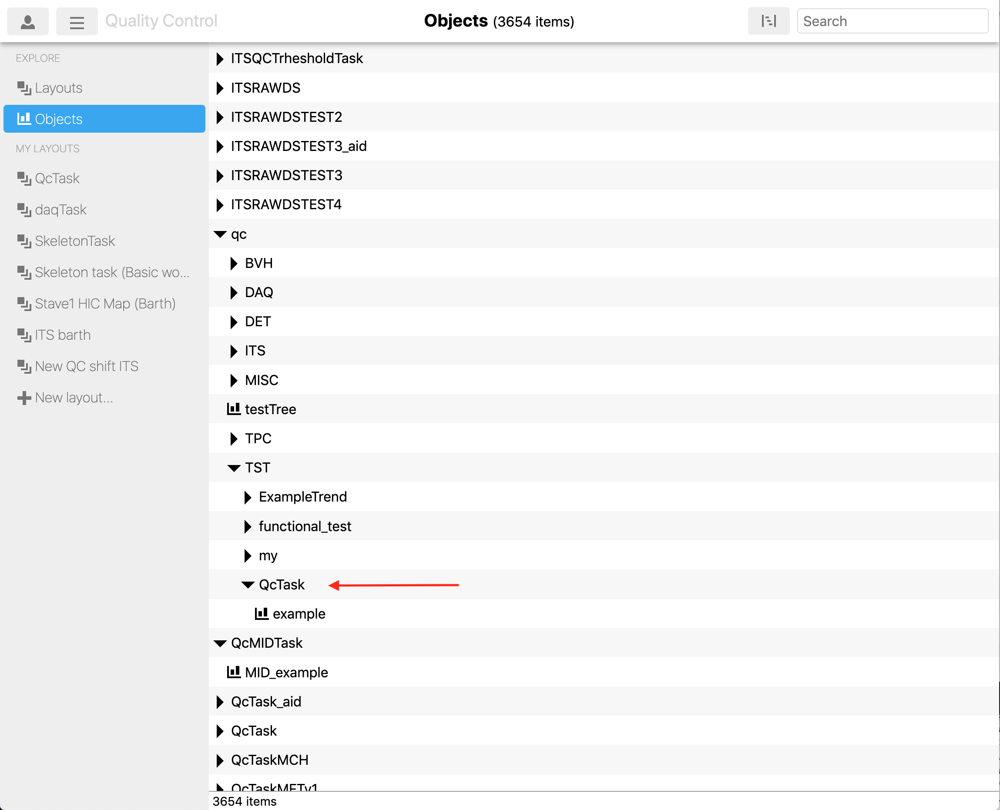
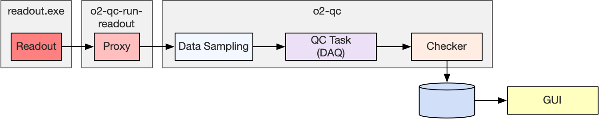

# QuickStart

<!--TOC generated with https://github.com/ekalinin/github-markdown-toc-->
<!--./gh-md-toc --no-backup --hide-footer --indent 3  /path/to/README.md-->
<!--ts-->
* [QuickStart](#quickstart)
   * [Read this first!](#read-this-first)
   * [Requirements](#requirements)
   * [Setup](#setup)
      * [Environment loading](#environment-loading)
   * [Execution](#execution)
      * [Basic workflow](#basic-workflow)
      * [Readout chain](#readout-chain)
         * [Getting real data from readout](#getting-real-data-from-readout)
         * [Readout data format as received by the Task](#readout-data-format-as-received-by-the-task)
      * [Post-processing example](#post-processing-example)
<!--te-->

[↑ Go to the Table of Content ↑](../README.md) | [Continue to Modules Development →](ModulesDevelopment.md)

## Read this first!

This page will give you a basic idea of the QC and how to run it. Please read it *in its entirety* and run the commands along the way. Do not start developing your module before you have reached the next section called "Modules Development". Also, make sure you have pulled the latest QC version.

We would be very grateful if you could report to us any error or inaccuracy you found. 

Thanks!

## Requirements

A CC7 machine (Mac, and in particular Ubuntu, are only supported on a best effort basis, some packages might not build properly).

## Setup

1. Setup O2 environment and tools <br>We use alibuild, see complete instructions [here](https://alice-doc.github.io/alice-analysis-tutorial/building/) (prefer the second option, not alidock). In particular make sure to follow these steps:
   1. Install GLFW to have GUIs in the DPL (optional, **DPL GUIs do not work in containers nor over SSH**).
        * CC7: `sudo yum install -y glfw-devel --enablerepo=epel`
        * Mac: `brew install glfw`
   2. Prerequisites  
        * [CC7](https://alice-doc.github.io/alice-analysis-tutorial/building/prereq-centos7.html)
        * [Mac](https://alice-doc.github.io/alice-analysis-tutorial/building/prereq-macos.html) (best effort)
        * [Ubuntu](https://alice-doc.github.io/alice-analysis-tutorial/building/prereq-ubuntu.html) (best effort)
   3. [Install aliBuild](https://alice-doc.github.io/alice-analysis-tutorial/building/custom.html#get-or-upgrade-alibuild)
   4. [Check setup and build O2](https://alice-doc.github.io/alice-analysis-tutorial/building/build.html)

2. Prepare the QualityControl development package
    * `aliBuild init QualityControl@master --defaults o2`

4. Build/install the QualityControl and the readout. The simplest is to use the metapackage `O2Suite`.
    * `aliBuild build O2Suite --defaults o2`
    * At this point you might encounter a message about missing system requirements. Run `aliDoctor O2Suite` to get a full information about what is missing and how to install it.

Note: you can also use the alibuild "defaults" called `o2-dataflow` to avoid building simulation related packages. Moreover, you can build `QualityControl` instead of `O2Suite` if you don't plan to use the readout (remember to substitute `O2Suite` with `QualityControl` when loading the environment).

### Environment loading

Whenever you want to work with O2 and QualityControl, do either `alienv enter O2Suite/latest` or `alienv load O2Suite/latest`. 

You can also load a package instead of the whole O2Suite, i.e. `alienv enter QualityControl/latest` or `alienv enter qcg/latest`. 

## Execution

To make sure that your system is correctly setup, we are going to run a basic QC workflow attached to a simple data producer. We will use central services for the repository and the GUI. If you want to set them up on your computer or in your lab, please have a look [here](#local-ccdb-setup) and [here](#local-qcg-setup).

### Basic workflow

We are going to run a basic workflow whose various processes are shown in the following schema. 


The _Producer_ is a random data generator. In a more realistic setup it would be a processing device or the _Readout_. The _Data Sampling_ is the system in charge of dispatching data samples from the main data flow to the _QC tasks_. It can be configured to dispatch different proportion or different types of data. The __tasks__ are in charge of analyzing the data and preparing QC objects, often histograms, that are then pushed forward every cycle. A cycle is 10 second in this example. In production it is closer to 1 minute. The _Checker_ is in charge of evaluating the _MonitorObjects_ produced by the _QC tasks_. It runs _Checks_ defined by the users, for example checking that the mean is above a certain limit. It can also modify the aspect of the histogram, e.g. by changing the background color or adding a PaveText. Finally the _Checker_ is also in charge of storing the resulting _MonitorObject_ into the repository where it will be accessible by the web GUI. It also pushes it to a _Printer_ for the sake of this tutorial.

To run it simply do:

    o2-qc-run-basic

Thanks to the Data Processing Layer (DPL, more details later) it is a single process that steers all the _devices_, i.e. processes making up the workflow. A window should appear that shows a graphical representation of the workflow if you are running locally. If you are running remotely via ssh, the DPL Debug GUI will not open. In some cases, it then requires to run with `-b`. The output of any of the processes is available by double clicking a box. If a box is red it means that the process has stopped, probably abnormally.

This is not the GUI we will use to see the histograms. 


The example above consists of one DPL workflow which has both the main processing and the QC infrastructure declared inside. In the real case, we would usually prefer to attach the QC without modifying the original topology. It can be done by merging two (or more) workflows, as shown below:

    o2-qc-run-producer | o2-qc --config json://${QUALITYCONTROL_ROOT}/etc/basic.json
 


This command uses two executables. The first one contains only the _Producer (see Figure above), which represents the data flow to which we want to apply the QC. The second executable generates the QC infrastructure based on the given configuration file (more details in a few sections). These two workflows are joined together using the pipe `|` character. This example illustrates how to add QC to any DPL workflow by using `o2-qc` and passing it a configuration file. 

__Repository and GUI__

The data is stored in the [ccdb-test](ccdb-test.cern.ch:8080/browse) at CERN. If everything works fine you should see the objects being published in the QC web GUI (QCG) at this address: [https://qcg-test.cern.ch/?page=objectTree](https://qcg-test.cern.ch/?page=objectTree). The link brings you to the hierarchy of objects (see screenshot below). Open "qc/TST/MO/QcTask" (the task you are running) and click on "example" which is the name of your histogram. 

<!---
The plot should be displayed on the right. If you wait a bit and hit "REFRESH NOW" in the far left menu you should see it changing from time to time (see second screenshot below). 
Please note that anyone running o2-qc-run-basic publishes the object under the same name and you might see the one published by someone else. -->


<!----->

<!--- TODO add a link to the user documentation of the QCG when it is written. -->

__Configuration file__

In the example above, the devices are configured in the config file named `basic.json`. It is installed in `$QUALITYCONTROL_ROOT/etc`. Each time you rebuild the code, `$QUALITYCONTROL_ROOT/etc/basic.json` is overwritten by the file in the source directory (`~/alice/QualityControl/Framework/basic.json`).

The configuration for the QC is made of many parameters described in an [advanced section of the documentation](https://github.com/AliceO2Group/QualityControl/blob/master/doc/Advanced.md#configuration-files-details). For now we can just see below the definition of a task. `moduleName` and `className` specify respectively the library and the class to load and instantiate to do the actual job of the task. 
```json
(...)
"tasks": {
  "QcTask": {
    "active": "true",
    "className": "o2::quality_control_modules::skeleton::SkeletonTask",
    "moduleName": "QcSkeleton",
    "cycleDurationSeconds": "10",     "": "10 seconds minimum",
(...)
```
Try and change the name of the task by replacing `QcTask` by a name of your choice (there are 2 places to update in the config file!). Relaunch the workflows. You should now see the object published under a different directory in the QCG.

### Readout chain

In this second example, we are going to use the Readout as our data source.



This workflow is a bit different from the basic one. The _Readout_ is not a DPL, nor a FairMQ, device and thus we have to have a _proxy_ to get data from it. This is the extra box going to the _Data Sampling_, which then injects data to the task. This is handled in the _Readout_ as long as you enable the corresponding configuration flag. 

The first thing is to load the environment for the readout in a new terminal: `alienv enter Readout/latest`. 

Then enable the data sampling channel in readout by opening the readout config file located at `$READOUT_ROOT/etc/readout-qc.cfg` and make sure that the following properties are correct:

```
# Enable the data sampling
[consumer-fmq-qc]
consumerType=FairMQChannel
enableRawFormat=1
fmq-name=readout-qc
fmq-address=ipc:///tmp/readout-pipe-1
fmq-type=pub
fmq-transport=zeromq
unmanagedMemorySize=2G
memoryPoolNumberOfPages=500
memoryPoolPageSize=1M
enabled=1
(...)
```

Start Readout in a terminal:
```
o2-readout-exe file://$READOUT_ROOT/etc/readout-qc.cfg
```

Start in another terminal the proxy, DataSampling and QC workflows:
```
o2-qc-run-readout | o2-qc --config json://${QUALITYCONTROL_ROOT}/etc/readout.json
```

The data sampling is configured to sample 1% of the data as the readout should run by default at full speed.

#### Getting real data from readout

See [these instructions for readout](doc/ModulesDevelopment.md#readout) and [these for O2 utilities](doc/ModulesDevelopment.md#dpl-workflow).

#### Readout data format as received by the Task

The header is an O2 header populated with data from the header built by the Readout. 
The payload received is a 2MB (configurable) data page made of CRU pages (8kB).

__Configuration file__

The configuration file is installed in `$QUALITYCONTROL_ROOT/etc`. Each time you rebuild the code, `$QUALITYCONTROL_ROOT/etc/readout.json` is overwritten by the file in the source directory (`~/alice/QualityControl/Framework/readout.json`).
To avoid this behaviour and preserve the changes you do to the configuration, you can copy the file and specify the path to it with the parameter `--config` when launch `o2-qc`.

To change the fraction of the data being monitored, change the option `fraction`.

```
"fraction": "0.01",
```

---

### Post-processing example

Now we will run an additional application performing further processing of data generated by the basic workflow. Run it again in one terminal window:

```
o2-qc-run-basic
```

In another terminal window run the ExampleTrend post-processing task, as follows:

```
o2-qc-run-postprocessing --config json://${QUALITYCONTROL_ROOT}/etc/postprocessing.json --name ExampleTrend --period 10
```

On the [QCG website](https://qcg-test.cern.ch/?page=objectTree) you will see a TTree and additional plots visible under the path `/qc/TST/MO/ExampleTrend`. They show how different properties of the Example histogram change during time. The longer the applications are running, the more data will be visible.

The post-processing framework and its convenience classes allow to trend and correlate various characteristics of histograms and other data structures generated by QC tasks and checks. One can create their own post-processing tasks or use the ones included in the framework and configure them for one's own needs.


[↑ Go to the Table of Content ↑](../README.md) | [Continue to Modules Development →](ModulesDevelopment.md)
